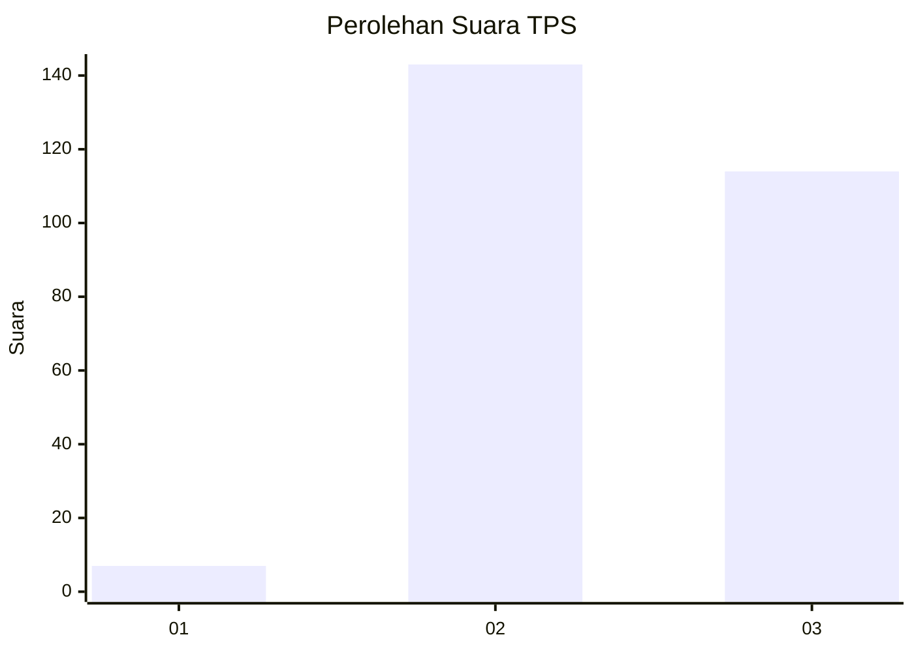
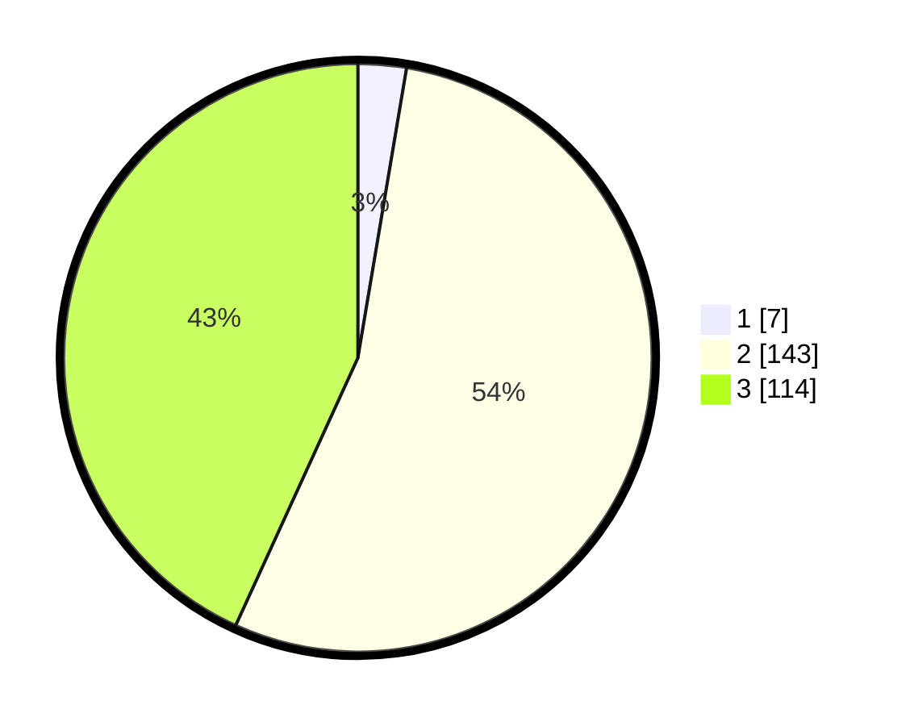

# Hasil

## Grafik

## Tabel

| No. | Nama Paslon    | Suara | Suara (raw) | Persentase |
|:--- |:-------------- | -----:| -----------:| ----------:|
| 1   | ANIES MUHAIMIN | 7     | [7][p-1]    | 2,65       |
| 2   | PRABOWO GIBRAN | 143   | [143][p-2]  | 54,17      |
| 3   | GANJAR MAHFUD  | 114   | [114][p-3]  | 43,18      |

[p-1]: https://github.com/gigit-pemilu/pemilu-2024-51-bali/blob/main/pilpres/hitung-suara/sub/51-bali/sub/03-badung/sub/05-kuta-selatan/sub/2002-ungasan/sub/009-tps/sub/paslon-1.txt
[p-2]: https://github.com/gigit-pemilu/pemilu-2024-51-bali/blob/main/pilpres/hitung-suara/sub/51-bali/sub/03-badung/sub/05-kuta-selatan/sub/2002-ungasan/sub/009-tps/sub/paslon-2.txt
[p-3]: https://github.com/gigit-pemilu/pemilu-2024-51-bali/blob/main/pilpres/hitung-suara/sub/51-bali/sub/03-badung/sub/05-kuta-selatan/sub/2002-ungasan/sub/009-tps/sub/paslon-3.txt

## Foto C Plano

https://sirekap-obj-formc.kpu.go.id/b6e9/pemilu/ppwp/51/03/05/20/02/5103052002009-20240215-004029--70a95f75-6931-46c4-a967-43bb6be22cb2.jpg

https://sirekap-obj-formc.kpu.go.id/b6e9/pemilu/ppwp/51/03/05/20/02/5103052002009-20240214-235456--36e7032f-ad37-4f3d-a453-7e3fa9ec4c90.jpg

https://sirekap-obj-formc.kpu.go.id/b6e9/pemilu/ppwp/51/03/05/20/02/5103052002009-20240214-235538--e72d8a5d-a7fc-48b4-b185-ed8037dca7fa.jpg

## Metadata

| Key        | Value               |
| ---------- | ------------------- |
| Time Stamp | 2024-02-24 22:31:28 |

