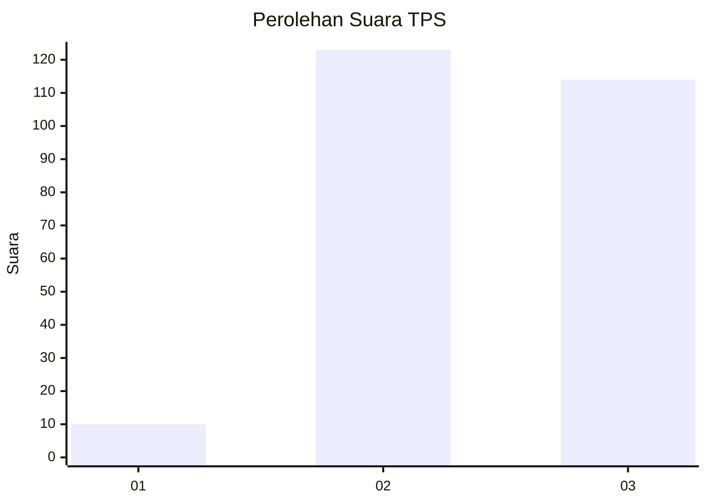
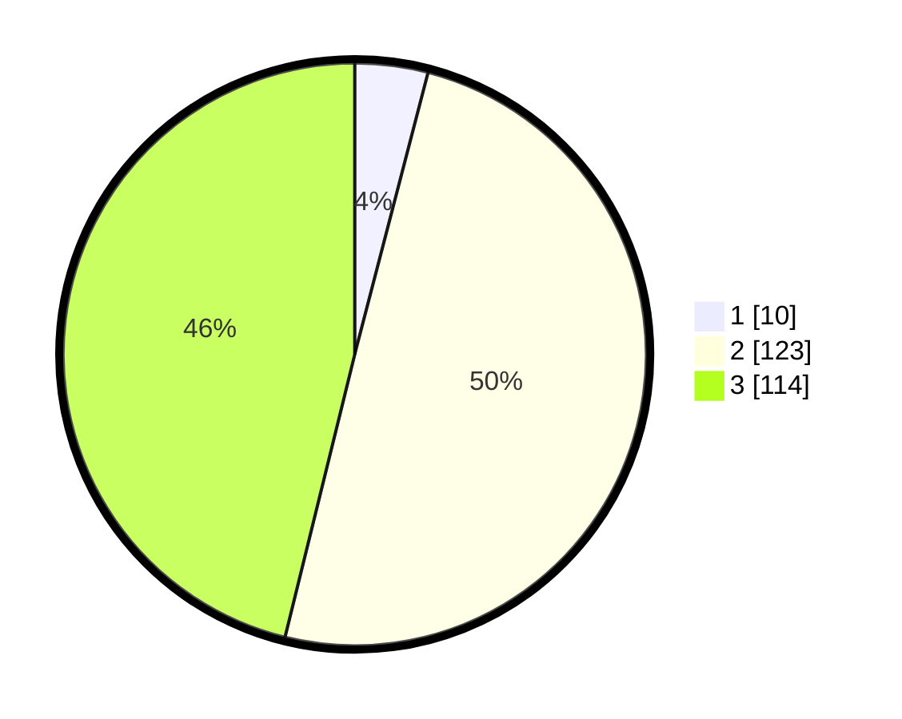

# Hasil

## Grafik

## Tabel

| No. | Nama Paslon    | Suara | Suara (raw) | Persentase |
|:--- |:-------------- | -----:| -----------:| ----------:|
| 1   | ANIES MUHAIMIN | 10    | [10][p-1]   | 4,05       |
| 2   | PRABOWO GIBRAN | 123   | [123][p-2]  | 49,80      |
| 3   | GANJAR MAHFUD  | 114   | [114][p-3]  | 46,15      |

[p-1]: https://github.com/gigit-pemilu/pemilu-2024-51-bali/blob/main/pilpres/hitung-suara/sub/51-bali/sub/03-badung/sub/05-kuta-selatan/sub/2002-ungasan/sub/010-tps/sub/paslon-1.txt
[p-2]: https://github.com/gigit-pemilu/pemilu-2024-51-bali/blob/main/pilpres/hitung-suara/sub/51-bali/sub/03-badung/sub/05-kuta-selatan/sub/2002-ungasan/sub/010-tps/sub/paslon-2.txt
[p-3]: https://github.com/gigit-pemilu/pemilu-2024-51-bali/blob/main/pilpres/hitung-suara/sub/51-bali/sub/03-badung/sub/05-kuta-selatan/sub/2002-ungasan/sub/010-tps/sub/paslon-3.txt

## Foto C Plano

https://sirekap-obj-formc.kpu.go.id/bb3e/pemilu/ppwp/51/03/05/20/02/5103052002010-20240214-215025--f7873fa9-4720-4f24-9a96-e73532b83383.jpg

https://sirekap-obj-formc.kpu.go.id/bb3e/pemilu/ppwp/51/03/05/20/02/5103052002010-20240214-215257--318143af-1d7a-45f8-b466-1858bd1dc11d.jpg

https://sirekap-obj-formc.kpu.go.id/bb3e/pemilu/ppwp/51/03/05/20/02/5103052002010-20240214-215522--c99a5886-cc99-424f-b959-b90f0a490d0c.jpg

## Metadata

| Key        | Value               |
| ---------- | ------------------- |
| Time Stamp | 2024-02-15 19:00:26 |

## DATA PEMILIH TETAP

Jumlah pemilih dalam DPT: **295**.
 * L: **131**.
 * P: **164**.

## DATA PENGGUNA HAK PILIH

Jumlah pengguna hak pilih dalam DPT: **251**.
 * L: **115**.
 * P: **136**.

Jumlah pengguna hak pilih dalam DPTb: **2**.
 * L: **1**.
 * P: **1**.

Jumlah pengguna hak pilih dalam DPK: **1**.
 * L: **0**.
 * P: **1**.

Jumlah pengguna hak pilih: **254**.
 * L: **116**.
 * P: **138**.

## JUMLAH SUARA SAH DAN TIDAK SAH

JUMLAH SELURUH SUARA SAH: **247**.

JUMLAH SUARA TIDAK SAH: **7**.

JUMLAH SELURUH SUARA SAH DAN SUARA TIDAK SAH: **254**.

