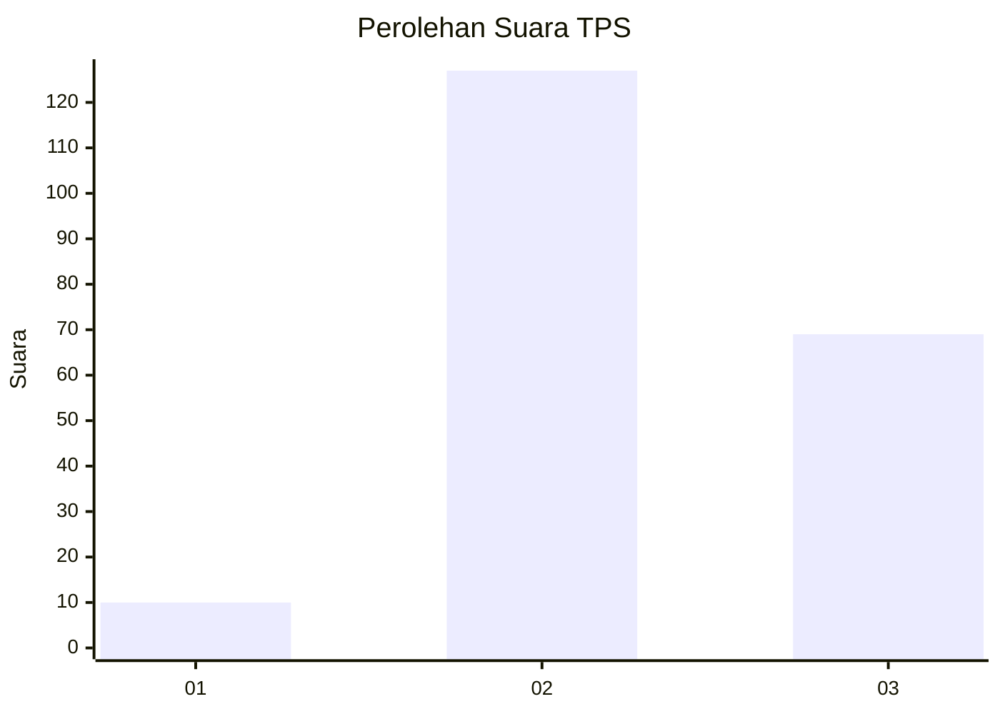
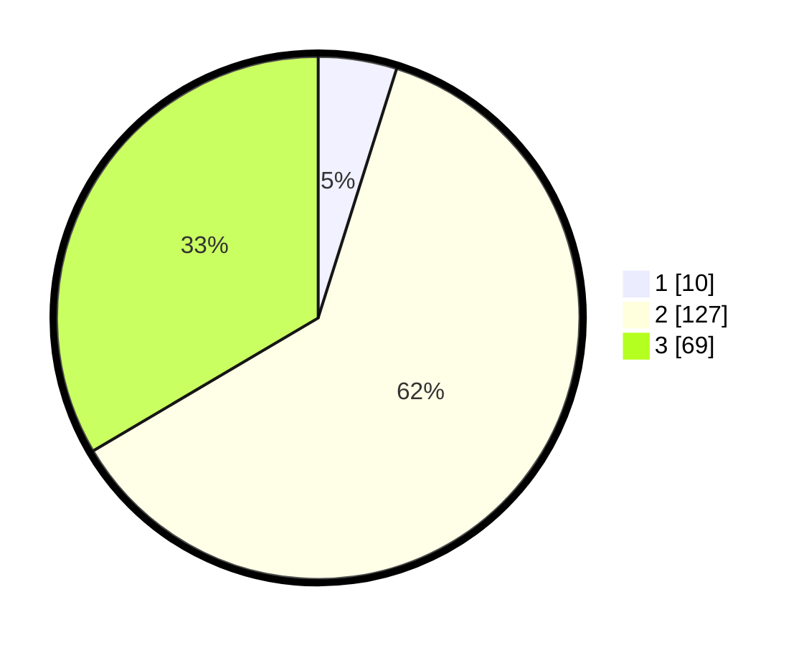

# Hasil

## Grafik

## Tabel

| No. | Nama Paslon    | Suara | Suara (raw) | Persentase |
|:--- |:-------------- | -----:| -----------:| ----------:|
| 1   | ANIES MUHAIMIN | 10    | [10][p-1]   | 4,85       |
| 2   | PRABOWO GIBRAN | 127   | [127][p-2]  | 61,65      |
| 3   | GANJAR MAHFUD  | 69    | [69][p-3]   | 33,50      |

[p-1]: https://github.com/gigit-pemilu/pemilu-2024-51-bali/blob/main/pilpres/hitung-suara/sub/51-bali/sub/03-badung/sub/05-kuta-selatan/sub/2002-ungasan/sub/014-tps/sub/paslon-1.txt
[p-2]: https://github.com/gigit-pemilu/pemilu-2024-51-bali/blob/main/pilpres/hitung-suara/sub/51-bali/sub/03-badung/sub/05-kuta-selatan/sub/2002-ungasan/sub/014-tps/sub/paslon-2.txt
[p-3]: https://github.com/gigit-pemilu/pemilu-2024-51-bali/blob/main/pilpres/hitung-suara/sub/51-bali/sub/03-badung/sub/05-kuta-selatan/sub/2002-ungasan/sub/014-tps/sub/paslon-3.txt

## Foto C Plano

https://sirekap-obj-formc.kpu.go.id/8353/pemilu/ppwp/51/03/05/20/02/5103052002014-20240214-222527--8584bff8-fba6-49f3-95aa-965ef651ac53.jpg

https://sirekap-obj-formc.kpu.go.id/8353/pemilu/ppwp/51/03/05/20/02/5103052002014-20240214-222940--f253c22b-0002-48ae-9e59-25caf9882fe4.jpg

https://sirekap-obj-formc.kpu.go.id/8353/pemilu/ppwp/51/03/05/20/02/5103052002014-20240214-223450--d23b7bac-4b5b-462f-b38b-4f9a4945d39b.jpg

## Metadata

| Key        | Value               |
| ---------- | ------------------- |
| Time Stamp | 2024-02-24 22:31:28 |

