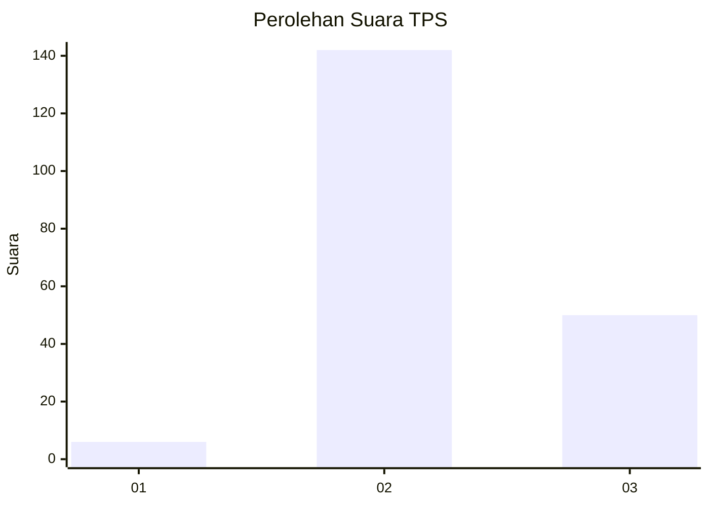
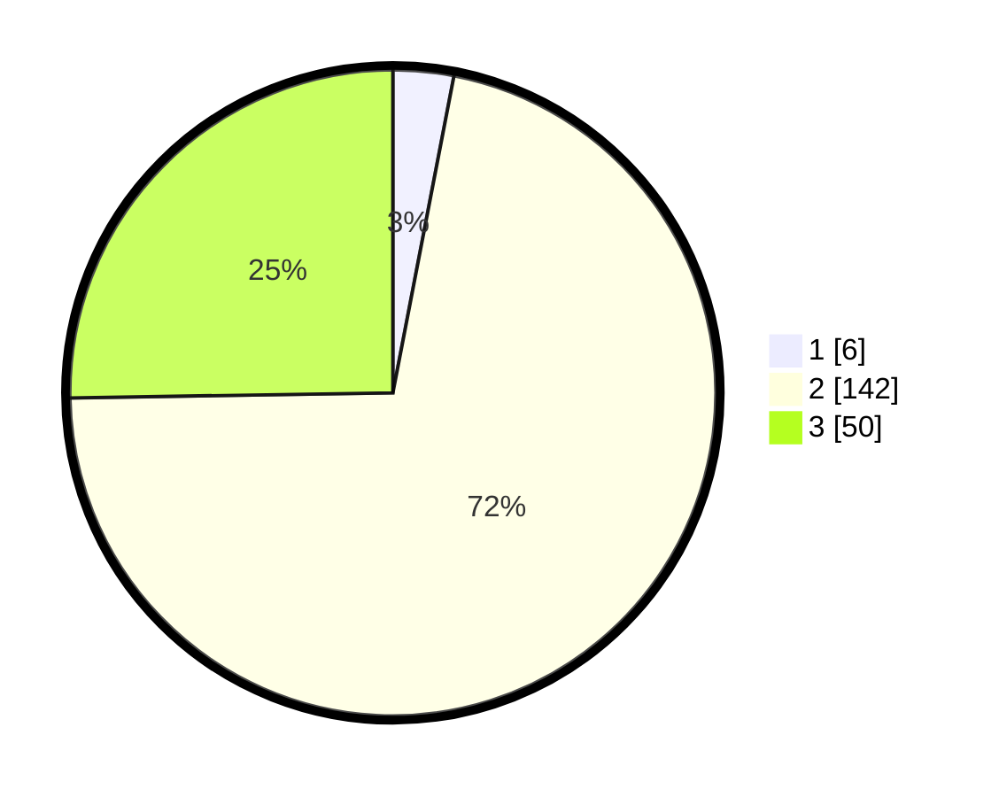

# Hasil

## Grafik

## Tabel

| No. | Nama Paslon    | Suara | Suara (raw) | Persentase |
|:--- |:-------------- | -----:| -----------:| ----------:|
| 1   | ANIES MUHAIMIN | 6     | [6][p-1]    | 3,03       |
| 2   | PRABOWO GIBRAN | 142   | [142][p-2]  | 71,72      |
| 3   | GANJAR MAHFUD  | 50    | [50][p-3]   | 25,25      |

[p-1]: https://github.com/gigit-pemilu/pemilu-2024-51-bali/blob/main/pilpres/hitung-suara/sub/51-bali/sub/03-badung/sub/05-kuta-selatan/sub/2002-ungasan/sub/017-tps/sub/paslon-1.txt
[p-2]: https://github.com/gigit-pemilu/pemilu-2024-51-bali/blob/main/pilpres/hitung-suara/sub/51-bali/sub/03-badung/sub/05-kuta-selatan/sub/2002-ungasan/sub/017-tps/sub/paslon-2.txt
[p-3]: https://github.com/gigit-pemilu/pemilu-2024-51-bali/blob/main/pilpres/hitung-suara/sub/51-bali/sub/03-badung/sub/05-kuta-selatan/sub/2002-ungasan/sub/017-tps/sub/paslon-3.txt

## Foto C Plano

https://sirekap-obj-formc.kpu.go.id/c1e3/pemilu/ppwp/51/03/05/20/02/5103052002017-20240214-221512--8494b29f-9681-4e3c-a97a-f1ba06dfde7b.jpg

https://sirekap-obj-formc.kpu.go.id/c1e3/pemilu/ppwp/51/03/05/20/02/5103052002017-20240214-221635--e18e8564-bea6-41e6-8d79-d24d78b81aeb.jpg

https://sirekap-obj-formc.kpu.go.id/c1e3/pemilu/ppwp/51/03/05/20/02/5103052002017-20240214-221741--42a84f17-d506-4daa-8df8-547545ec8fa8.jpg

## Metadata

| Key        | Value               |
| ---------- | ------------------- |
| Time Stamp | 2024-02-24 22:31:28 |

