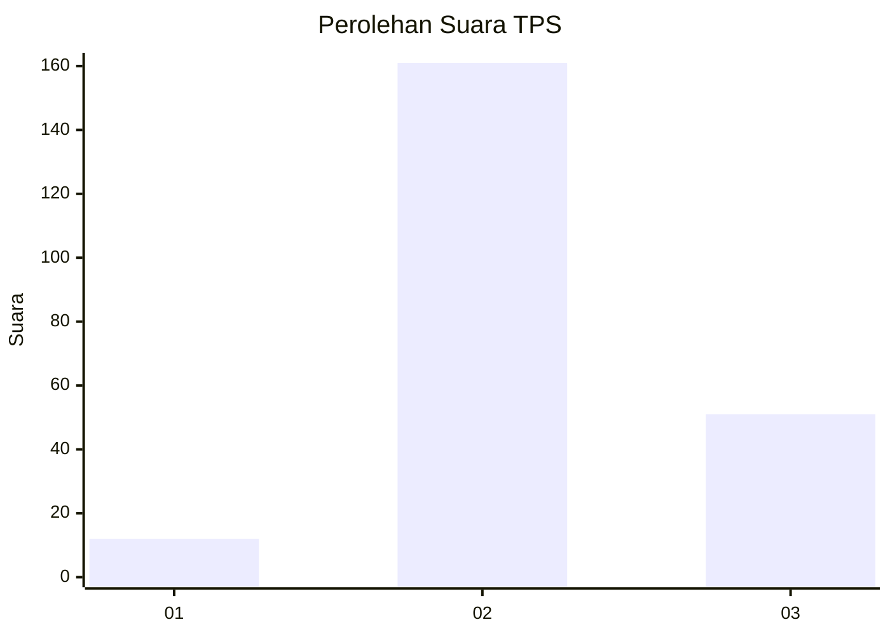
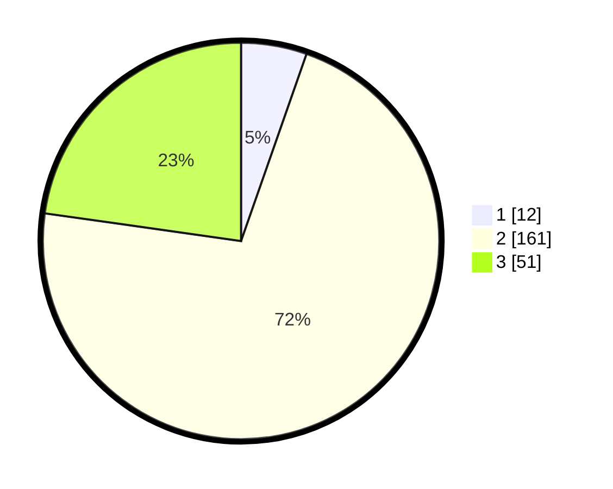

# Hasil

## Grafik

## Tabel

| No. | Nama Paslon    | Suara | Suara (raw) | Persentase |
|:--- |:-------------- | -----:| -----------:| ----------:|
| 1   | ANIES MUHAIMIN | 12    | [12][p-1]   | 5,36       |
| 2   | PRABOWO GIBRAN | 161   | [161][p-2]  | 71,88      |
| 3   | GANJAR MAHFUD  | 51    | [51][p-3]   | 22,77      |

[p-1]: https://github.com/gigit-pemilu/pemilu-2024-51-bali/blob/main/pilpres/hitung-suara/sub/51-bali/sub/03-badung/sub/05-kuta-selatan/sub/2002-ungasan/sub/021-tps/sub/paslon-1.txt
[p-2]: https://github.com/gigit-pemilu/pemilu-2024-51-bali/blob/main/pilpres/hitung-suara/sub/51-bali/sub/03-badung/sub/05-kuta-selatan/sub/2002-ungasan/sub/021-tps/sub/paslon-2.txt
[p-3]: https://github.com/gigit-pemilu/pemilu-2024-51-bali/blob/main/pilpres/hitung-suara/sub/51-bali/sub/03-badung/sub/05-kuta-selatan/sub/2002-ungasan/sub/021-tps/sub/paslon-3.txt

## Foto C Plano

https://sirekap-obj-formc.kpu.go.id/a420/pemilu/ppwp/51/03/05/20/02/5103052002021-20240216-165848--0dab5177-c770-43cf-bfc8-1a836a942f82.jpg

https://sirekap-obj-formc.kpu.go.id/a420/pemilu/ppwp/51/03/05/20/02/5103052002021-20240216-165849--2b2eb5b1-a475-4789-9ec1-e30fb4d1c083.jpg

https://sirekap-obj-formc.kpu.go.id/a420/pemilu/ppwp/51/03/05/20/02/5103052002021-20240216-165848--2923a0d8-3091-4a6f-aeb5-d92fc8f6c9b7.jpg

## Metadata

| Key        | Value               |
| ---------- | ------------------- |
| Time Stamp | 2024-02-21 11:00:00 |

## DATA PEMILIH TETAP

Jumlah pemilih dalam DPT: **278**.
 * L: **136**.
 * P: **142**.

## DATA PENGGUNA HAK PILIH

Jumlah pengguna hak pilih dalam DPT: **215**.
 * L: **103**.
 * P: **112**.

Jumlah pengguna hak pilih dalam DPTb: **3**.
 * L: **1**.
 * P: **2**.

Jumlah pengguna hak pilih dalam DPK: **9**.
 * L: **5**.
 * P: **4**.

Jumlah pengguna hak pilih: **227**.
 * L: **109**.
 * P: **118**.

## JUMLAH SUARA SAH DAN TIDAK SAH

JUMLAH SELURUH SUARA SAH: **224**.

JUMLAH SUARA TIDAK SAH: **3**.

JUMLAH SELURUH SUARA SAH DAN SUARA TIDAK SAH: **227**.

