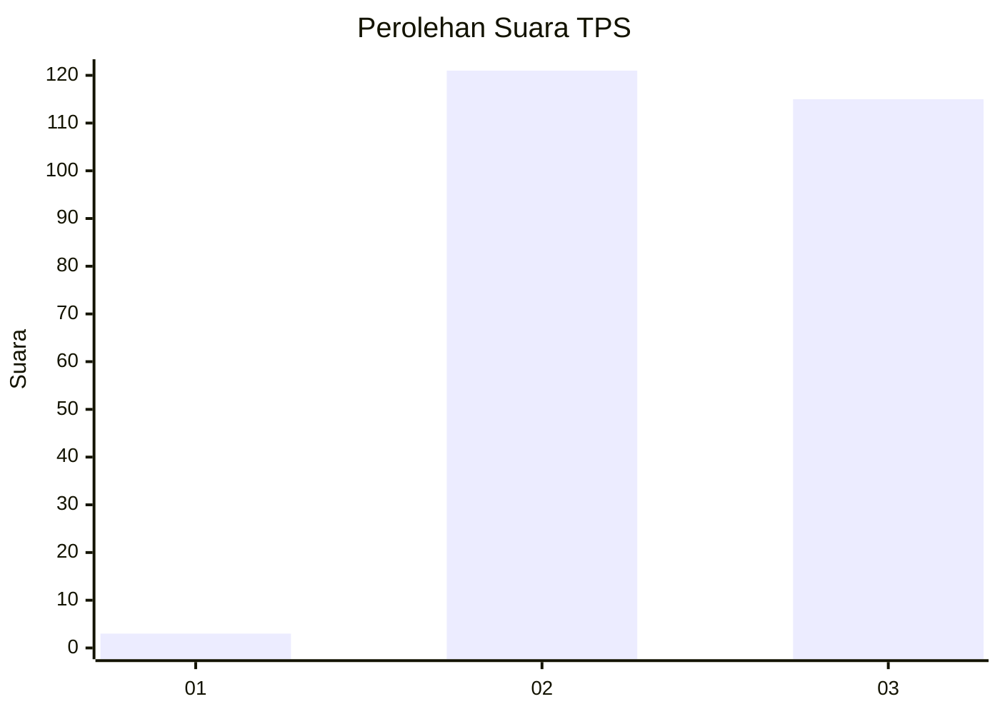
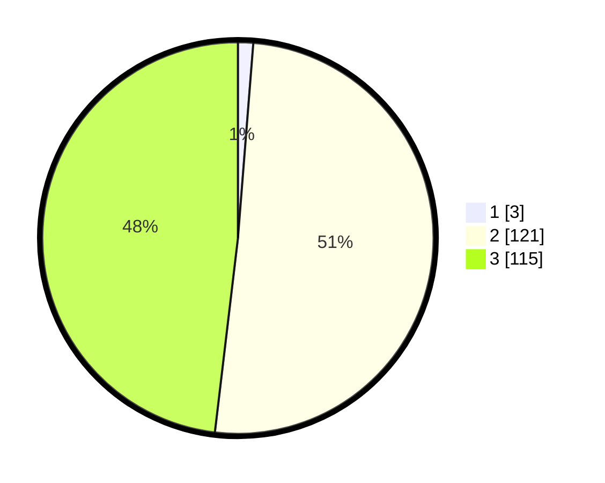

# Hasil

## Grafik

## Tabel

| No. | Nama Paslon    | Suara | Suara (raw) | Persentase |
|:--- |:-------------- | -----:| -----------:| ----------:|
| 1   | ANIES MUHAIMIN | 3     | [3][p-1]    | 1,26       |
| 2   | PRABOWO GIBRAN | 121   | [121][p-2]  | 50,63      |
| 3   | GANJAR MAHFUD  | 115   | [115][p-3]  | 48,12      |

[p-1]: https://github.com/gigit-pemilu/pemilu-2024-51-bali/blob/main/pilpres/hitung-suara/sub/51-bali/sub/03-badung/sub/05-kuta-selatan/sub/2002-ungasan/sub/025-tps/sub/paslon-1.txt
[p-2]: https://github.com/gigit-pemilu/pemilu-2024-51-bali/blob/main/pilpres/hitung-suara/sub/51-bali/sub/03-badung/sub/05-kuta-selatan/sub/2002-ungasan/sub/025-tps/sub/paslon-2.txt
[p-3]: https://github.com/gigit-pemilu/pemilu-2024-51-bali/blob/main/pilpres/hitung-suara/sub/51-bali/sub/03-badung/sub/05-kuta-selatan/sub/2002-ungasan/sub/025-tps/sub/paslon-3.txt

## Foto C Plano

https://sirekap-obj-formc.kpu.go.id/1350/pemilu/ppwp/51/03/05/20/02/5103052002025-20240214-141618--02f8fc51-0a4d-418a-b743-3d1a814d40a6.jpg

https://sirekap-obj-formc.kpu.go.id/1350/pemilu/ppwp/51/03/05/20/02/5103052002025-20240214-141705--29852720-5fba-49f9-8fd7-e55ecaaae7fd.jpg

https://sirekap-obj-formc.kpu.go.id/1350/pemilu/ppwp/51/03/05/20/02/5103052002025-20240216-000952--4e1cee81-f5dd-4c8d-a73c-9f20c6f16dfa.jpg

## Metadata

| Key        | Value               |
| ---------- | ------------------- |
| Time Stamp | 2024-02-16 00:30:27 |

## DATA PEMILIH TETAP

Jumlah pemilih dalam DPT: **255**.
 * L: **132**.
 * P: **123**.

## DATA PENGGUNA HAK PILIH

Jumlah pengguna hak pilih dalam DPT: **236**.
 * L: **125**.
 * P: **111**.

Jumlah pengguna hak pilih dalam DPTb: **7**.
 * L: **2**.
 * P: **5**.

Jumlah pengguna hak pilih dalam DPK: **0**.
 * L: **0**.
 * P: **0**.

Jumlah pengguna hak pilih: **243**.
 * L: **127**.
 * P: **116**.

## JUMLAH SUARA SAH DAN TIDAK SAH

JUMLAH SELURUH SUARA SAH: **239**.

JUMLAH SUARA TIDAK SAH: **4**.

JUMLAH SELURUH SUARA SAH DAN SUARA TIDAK SAH: **243**.

