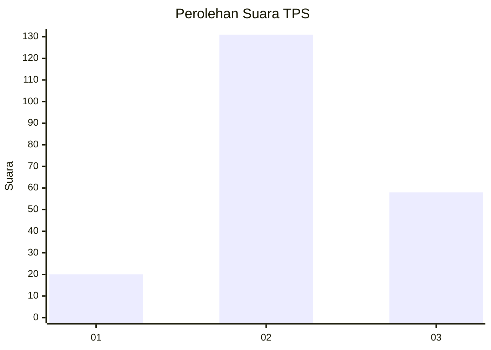
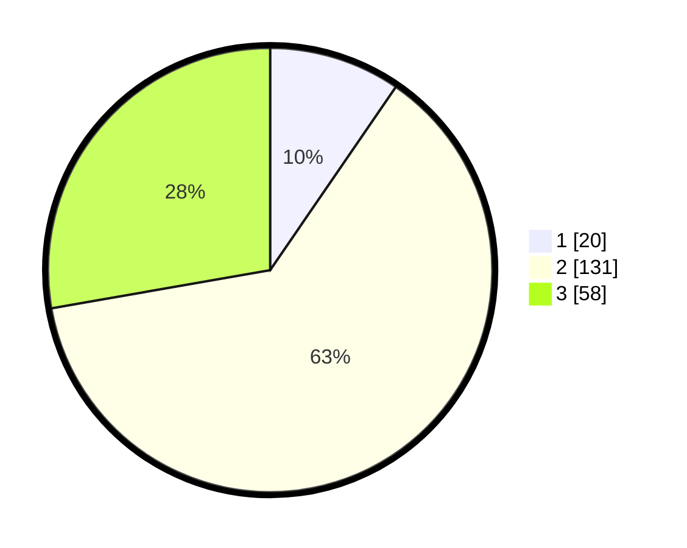

# Hasil

## Grafik

## Tabel

| No. | Nama Paslon    | Suara | Suara (raw) | Persentase |
|:--- |:-------------- | -----:| -----------:| ----------:|
| 1   | ANIES MUHAIMIN | 20    | [20][p-1]   | 9,57       |
| 2   | PRABOWO GIBRAN | 131   | [131][p-2]  | 62,68      |
| 3   | GANJAR MAHFUD  | 58    | [58][p-3]   | 27,75      |

[p-1]: https://github.com/gigit-pemilu/pemilu-2024-51-bali/blob/main/pilpres/hitung-suara/sub/51-bali/sub/03-badung/sub/05-kuta-selatan/sub/2002-ungasan/sub/027-tps/sub/paslon-1.txt
[p-2]: https://github.com/gigit-pemilu/pemilu-2024-51-bali/blob/main/pilpres/hitung-suara/sub/51-bali/sub/03-badung/sub/05-kuta-selatan/sub/2002-ungasan/sub/027-tps/sub/paslon-2.txt
[p-3]: https://github.com/gigit-pemilu/pemilu-2024-51-bali/blob/main/pilpres/hitung-suara/sub/51-bali/sub/03-badung/sub/05-kuta-selatan/sub/2002-ungasan/sub/027-tps/sub/paslon-3.txt

## Foto C Plano

https://sirekap-obj-formc.kpu.go.id/c4c8/pemilu/ppwp/51/03/05/20/02/5103052002027-20240215-003305--ec46138f-ae00-43f7-ad1c-1d5bef9d3913.jpg

https://sirekap-obj-formc.kpu.go.id/c4c8/pemilu/ppwp/51/03/05/20/02/5103052002027-20240215-003339--cc834a15-c00e-4df7-89a9-332224259f15.jpg

https://sirekap-obj-formc.kpu.go.id/c4c8/pemilu/ppwp/51/03/05/20/02/5103052002027-20240215-003422--a39d6fd2-4bf1-4ed2-b238-508be915930b.jpg

## Metadata

| Key        | Value               |
| ---------- | ------------------- |
| Time Stamp | 2024-02-21 17:00:00 |

## DATA PEMILIH TETAP

Jumlah pemilih dalam DPT: **265**.
 * L: **120**.
 * P: **145**.

## DATA PENGGUNA HAK PILIH

Jumlah pengguna hak pilih dalam DPT: **211**.
 * L: **96**.
 * P: **115**.

Jumlah pengguna hak pilih dalam DPTb: **6**.
 * L: **5**.
 * P: **1**.

Jumlah pengguna hak pilih dalam DPK: **2**.
 * L: **2**.
 * P: **0**.

Jumlah pengguna hak pilih: **219**.
 * L: **103**.
 * P: **116**.

## JUMLAH SUARA SAH DAN TIDAK SAH

JUMLAH SELURUH SUARA SAH: **209**.

JUMLAH SUARA TIDAK SAH: **10**.

JUMLAH SELURUH SUARA SAH DAN SUARA TIDAK SAH: **219**.

