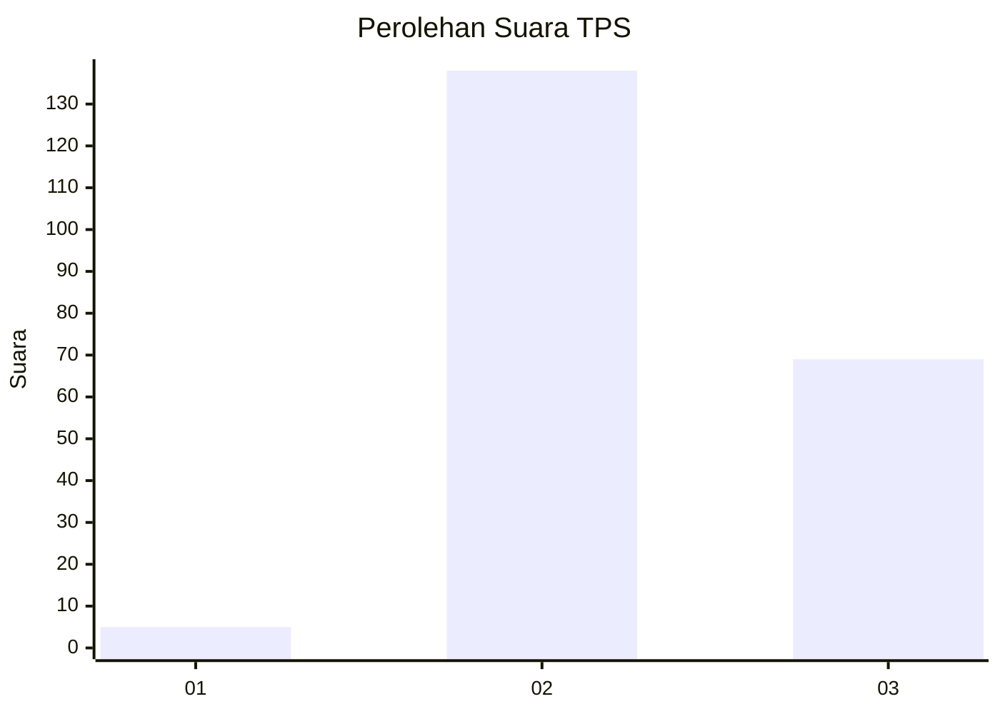
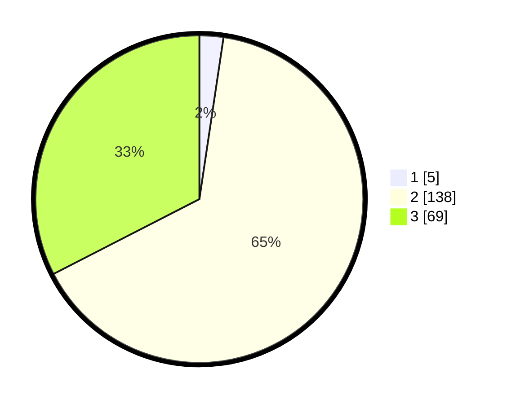

# Hasil

## Grafik

## Tabel

| No. | Nama Paslon    | Suara | Suara (raw) | Persentase |
|:--- |:-------------- | -----:| -----------:| ----------:|
| 1   | ANIES MUHAIMIN | 5     | [5][p-1]    | 2,36       |
| 2   | PRABOWO GIBRAN | 138   | [138][p-2]  | 65,09      |
| 3   | GANJAR MAHFUD  | 69    | [69][p-3]   | 32,55      |

[p-1]: https://github.com/gigit-pemilu/pemilu-2024-51-bali/blob/main/pilpres/hitung-suara/sub/51-bali/sub/03-badung/sub/05-kuta-selatan/sub/2002-ungasan/sub/028-tps/sub/paslon-1.txt
[p-2]: https://github.com/gigit-pemilu/pemilu-2024-51-bali/blob/main/pilpres/hitung-suara/sub/51-bali/sub/03-badung/sub/05-kuta-selatan/sub/2002-ungasan/sub/028-tps/sub/paslon-2.txt
[p-3]: https://github.com/gigit-pemilu/pemilu-2024-51-bali/blob/main/pilpres/hitung-suara/sub/51-bali/sub/03-badung/sub/05-kuta-selatan/sub/2002-ungasan/sub/028-tps/sub/paslon-3.txt

## Foto C Plano

https://sirekap-obj-formc.kpu.go.id/6cfa/pemilu/ppwp/51/03/05/20/02/5103052002028-20240215-234702--ed5a2cc7-98b2-42f3-b71d-e3a2e4574253.jpg

https://sirekap-obj-formc.kpu.go.id/6cfa/pemilu/ppwp/51/03/05/20/02/5103052002028-20240215-234705--a34628ad-7b93-4c8a-9cd9-6837ee0395d7.jpg

https://sirekap-obj-formc.kpu.go.id/6cfa/pemilu/ppwp/51/03/05/20/02/5103052002028-20240215-234703--0418e7bb-2562-475a-b625-eede2d9a02d5.jpg

## Metadata

| Key        | Value               |
| ---------- | ------------------- |
| Time Stamp | 2024-02-21 11:00:00 |

## DATA PEMILIH TETAP

Jumlah pemilih dalam DPT: **263**.
 * L: **129**.
 * P: **134**.

## DATA PENGGUNA HAK PILIH

Jumlah pengguna hak pilih dalam DPT: **211**.
 * L: **103**.
 * P: **108**.

Jumlah pengguna hak pilih dalam DPTb: **4**.
 * L: **4**.
 * P: **0**.

Jumlah pengguna hak pilih dalam DPK: **0**.
 * L: **0**.
 * P: **0**.

Jumlah pengguna hak pilih: **215**.
 * L: **107**.
 * P: **108**.

## JUMLAH SUARA SAH DAN TIDAK SAH

JUMLAH SELURUH SUARA SAH: **212**.

JUMLAH SUARA TIDAK SAH: **3**.

JUMLAH SELURUH SUARA SAH DAN SUARA TIDAK SAH: **215**.

