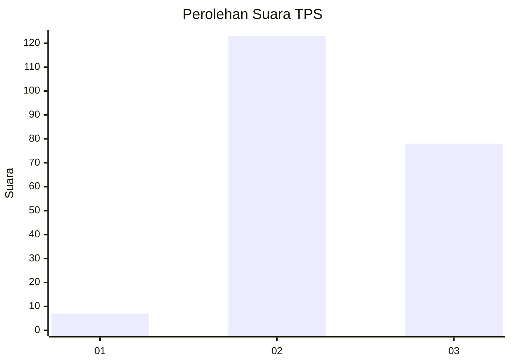
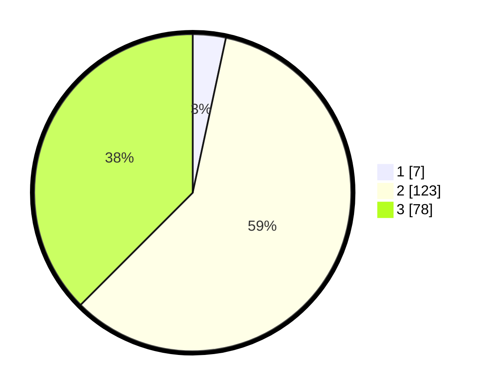

# Hasil

## Grafik

## Tabel

| No. | Nama Paslon    | Suara | Suara (raw) | Persentase |
|:--- |:-------------- | -----:| -----------:| ----------:|
| 1   | ANIES MUHAIMIN | 7     | [7][p-1]    | 3,37       |
| 2   | PRABOWO GIBRAN | 123   | [123][p-2]  | 59,13      |
| 3   | GANJAR MAHFUD  | 78    | [78][p-3]   | 37,50      |

[p-1]: https://github.com/gigit-pemilu/pemilu-2024-51-bali/blob/main/pilpres/hitung-suara/sub/51-bali/sub/03-badung/sub/05-kuta-selatan/sub/2002-ungasan/sub/030-tps/sub/paslon-1.txt
[p-2]: https://github.com/gigit-pemilu/pemilu-2024-51-bali/blob/main/pilpres/hitung-suara/sub/51-bali/sub/03-badung/sub/05-kuta-selatan/sub/2002-ungasan/sub/030-tps/sub/paslon-2.txt
[p-3]: https://github.com/gigit-pemilu/pemilu-2024-51-bali/blob/main/pilpres/hitung-suara/sub/51-bali/sub/03-badung/sub/05-kuta-selatan/sub/2002-ungasan/sub/030-tps/sub/paslon-3.txt

## Foto C Plano

https://sirekap-obj-formc.kpu.go.id/3f5c/pemilu/ppwp/51/03/05/20/02/5103052002030-20240215-143623--a0e2bb83-31e7-4d5f-92b7-d88c5d449f06.jpg

https://sirekap-obj-formc.kpu.go.id/3f5c/pemilu/ppwp/51/03/05/20/02/5103052002030-20240216-123821--e1269763-9d45-4b38-bf89-6aa21fce6ff8.jpg

https://sirekap-obj-formc.kpu.go.id/3f5c/pemilu/ppwp/51/03/05/20/02/5103052002030-20240215-112248--5411b15e-bb69-4824-934e-944adecaa92e.jpg

## Metadata

| Key        | Value               |
| ---------- | ------------------- |
| Time Stamp | 2024-02-21 12:00:00 |

