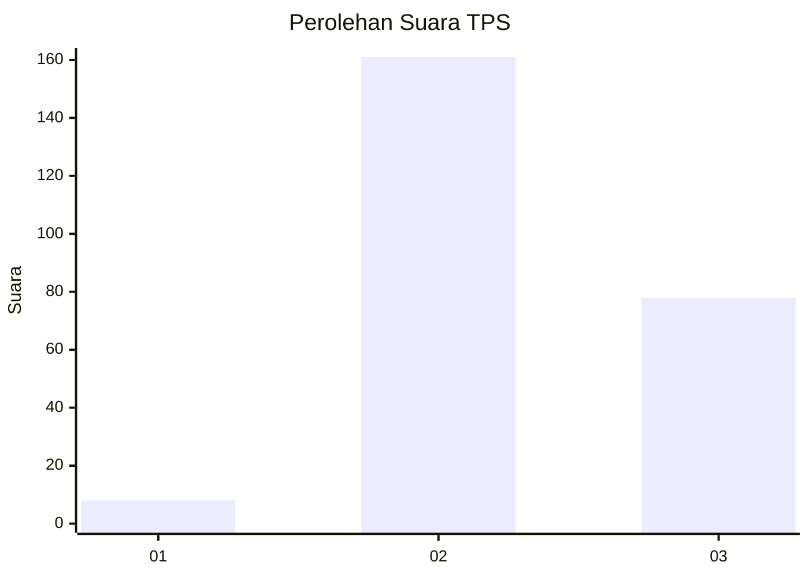
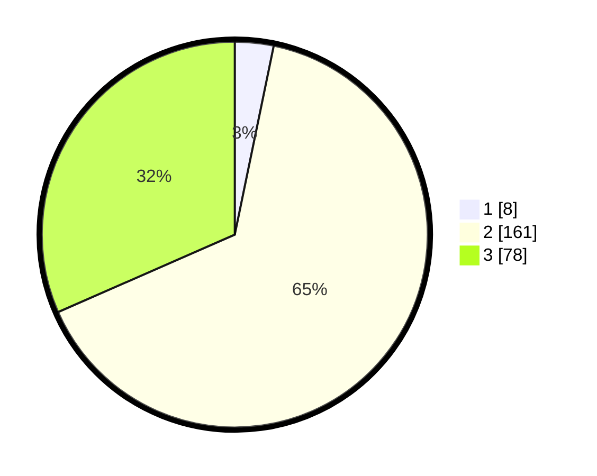

# Hasil

## Grafik

## Tabel

| No. | Nama Paslon    | Suara | Suara (raw) | Persentase |
|:--- |:-------------- | -----:| -----------:| ----------:|
| 1   | ANIES MUHAIMIN | 8     | [8][p-1]    | 3,24       |
| 2   | PRABOWO GIBRAN | 161   | [161][p-2]  | 65,18      |
| 3   | GANJAR MAHFUD  | 78    | [78][p-3]   | 31,58      |

[p-1]: https://github.com/gigit-pemilu/pemilu-2024-51-bali/blob/main/pilpres/hitung-suara/sub/51-bali/sub/03-badung/sub/05-kuta-selatan/sub/2002-ungasan/sub/032-tps/sub/paslon-1.txt
[p-2]: https://github.com/gigit-pemilu/pemilu-2024-51-bali/blob/main/pilpres/hitung-suara/sub/51-bali/sub/03-badung/sub/05-kuta-selatan/sub/2002-ungasan/sub/032-tps/sub/paslon-2.txt
[p-3]: https://github.com/gigit-pemilu/pemilu-2024-51-bali/blob/main/pilpres/hitung-suara/sub/51-bali/sub/03-badung/sub/05-kuta-selatan/sub/2002-ungasan/sub/032-tps/sub/paslon-3.txt

## Foto C Plano

https://sirekap-obj-formc.kpu.go.id/60e3/pemilu/ppwp/51/03/05/20/02/5103052002032-20240216-002751--be3ea742-4c94-488a-b24d-037b805e6a26.jpg

https://sirekap-obj-formc.kpu.go.id/60e3/pemilu/ppwp/51/03/05/20/02/5103052002032-20240216-002755--8cd4eb79-f546-4a0c-9e9e-ff2869d03922.jpg

https://sirekap-obj-formc.kpu.go.id/60e3/pemilu/ppwp/51/03/05/20/02/5103052002032-20240216-002753--37ccd77a-e644-4b2a-9316-1d4386c21656.jpg

## Metadata

| Key        | Value               |
| ---------- | ------------------- |
| Time Stamp | 2024-02-21 13:00:00 |

## DATA PEMILIH TETAP

Jumlah pemilih dalam DPT: **298**.
 * L: **137**.
 * P: **161**.

## DATA PENGGUNA HAK PILIH

Jumlah pengguna hak pilih dalam DPT: **244**.
 * L: **117**.
 * P: **127**.

Jumlah pengguna hak pilih dalam DPTb: **6**.
 * L: **4**.
 * P: **2**.

Jumlah pengguna hak pilih dalam DPK: **0**.
 * L: **0**.
 * P: **0**.

Jumlah pengguna hak pilih: **250**.
 * L: **121**.
 * P: **129**.

## JUMLAH SUARA SAH DAN TIDAK SAH

JUMLAH SELURUH SUARA SAH: **247**.

JUMLAH SUARA TIDAK SAH: **3**.

JUMLAH SELURUH SUARA SAH DAN SUARA TIDAK SAH: **250**.

