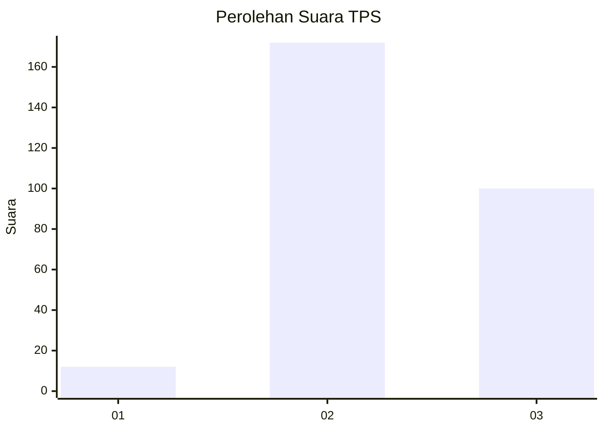
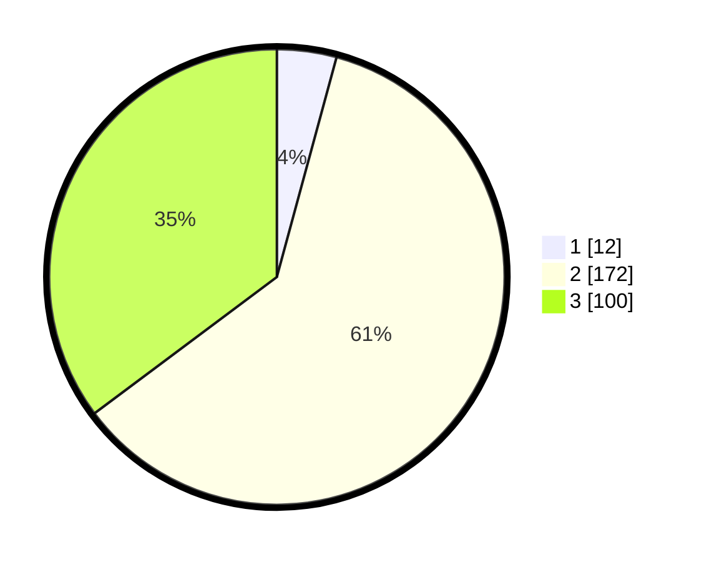

# Hasil

## Grafik

## Tabel

| No. | Nama Paslon    | Suara | Suara (raw) | Persentase |
|:--- |:-------------- | -----:| -----------:| ----------:|
| 1   | ANIES MUHAIMIN | 12    | [12][p-1]   | 4,23       |
| 2   | PRABOWO GIBRAN | 172   | [172][p-2]  | 60,56      |
| 3   | GANJAR MAHFUD  | 100   | [100][p-3]  | 35,21      |

[p-1]: https://github.com/gigit-pemilu/pemilu-2024-51-bali/blob/main/pilpres/hitung-suara/sub/51-bali/sub/03-badung/sub/05-kuta-selatan/sub/2003-kutuh/sub/005-tps/sub/paslon-1.txt
[p-2]: https://github.com/gigit-pemilu/pemilu-2024-51-bali/blob/main/pilpres/hitung-suara/sub/51-bali/sub/03-badung/sub/05-kuta-selatan/sub/2003-kutuh/sub/005-tps/sub/paslon-2.txt
[p-3]: https://github.com/gigit-pemilu/pemilu-2024-51-bali/blob/main/pilpres/hitung-suara/sub/51-bali/sub/03-badung/sub/05-kuta-selatan/sub/2003-kutuh/sub/005-tps/sub/paslon-3.txt

## Foto C Plano

https://sirekap-obj-formc.kpu.go.id/5cbf/pemilu/ppwp/51/03/05/20/03/5103052003005-20240215-003312--a99fb523-21ac-4636-8593-673cc74aab6c.jpg

https://sirekap-obj-formc.kpu.go.id/5cbf/pemilu/ppwp/51/03/05/20/03/5103052003005-20240215-003621--de8ce994-f6d6-493f-beb6-44e581b7b491.jpg

https://sirekap-obj-formc.kpu.go.id/5cbf/pemilu/ppwp/51/03/05/20/03/5103052003005-20240215-003749--5dcce3e1-f0e8-4b59-81fc-d2b8f506e929.jpg

## Metadata

| Key        | Value               |
| ---------- | ------------------- |
| Time Stamp | 2024-02-15 22:30:27 |

