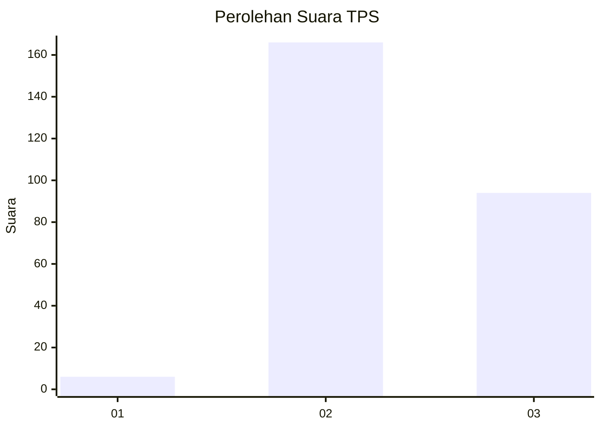
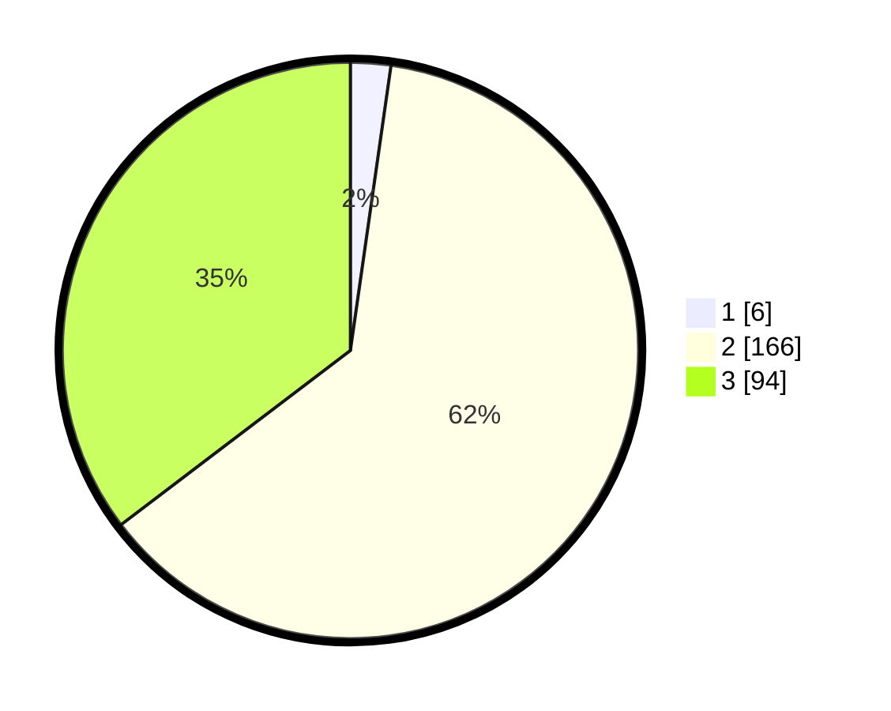

# Hasil

## Grafik

## Tabel

| No. | Nama Paslon    | Suara | Suara (raw) | Persentase |
|:--- |:-------------- | -----:| -----------:| ----------:|
| 1   | ANIES MUHAIMIN | 6     | [6][p-1]    | 2,26       |
| 2   | PRABOWO GIBRAN | 166   | [166][p-2]  | 62,41      |
| 3   | GANJAR MAHFUD  | 94    | [94][p-3]   | 35,34      |

[p-1]: https://github.com/gigit-pemilu/pemilu-2024-51-bali/blob/main/pilpres/hitung-suara/sub/51-bali/sub/03-badung/sub/05-kuta-selatan/sub/2003-kutuh/sub/006-tps/sub/paslon-1.txt
[p-2]: https://github.com/gigit-pemilu/pemilu-2024-51-bali/blob/main/pilpres/hitung-suara/sub/51-bali/sub/03-badung/sub/05-kuta-selatan/sub/2003-kutuh/sub/006-tps/sub/paslon-2.txt
[p-3]: https://github.com/gigit-pemilu/pemilu-2024-51-bali/blob/main/pilpres/hitung-suara/sub/51-bali/sub/03-badung/sub/05-kuta-selatan/sub/2003-kutuh/sub/006-tps/sub/paslon-3.txt

## Foto C Plano

https://sirekap-obj-formc.kpu.go.id/bfb8/pemilu/ppwp/51/03/05/20/03/5103052003006-20240216-084245--6afe716f-5a22-45ae-a3ad-cec092b7e0d9.jpg

https://sirekap-obj-formc.kpu.go.id/bfb8/pemilu/ppwp/51/03/05/20/03/5103052003006-20240216-084247--5ae780d3-0385-4059-95d3-fd57b55ecdb7.jpg

https://sirekap-obj-formc.kpu.go.id/bfb8/pemilu/ppwp/51/03/05/20/03/5103052003006-20240216-084246--aa96cecf-62b4-497e-850a-4b07045c367a.jpg

## Metadata

| Key        | Value               |
| ---------- | ------------------- |
| Time Stamp | 2024-02-24 22:31:28 |

## DATA PEMILIH TETAP

Jumlah pemilih dalam DPT: **280**.
 * L: **139**.
 * P: **141**.

## DATA PENGGUNA HAK PILIH

Jumlah pengguna hak pilih dalam DPT: **264**.
 * L: **133**.
 * P: **131**.

Jumlah pengguna hak pilih dalam DPTb: **2**.
 * L: **1**.
 * P: **1**.

Jumlah pengguna hak pilih dalam DPK: **4**.
 * L: **3**.
 * P: **1**.

Jumlah pengguna hak pilih: **270**.
 * L: **137**.
 * P: **133**.

## JUMLAH SUARA SAH DAN TIDAK SAH

JUMLAH SELURUH SUARA SAH: **266**.

JUMLAH SUARA TIDAK SAH: **4**.

JUMLAH SELURUH SUARA SAH DAN SUARA TIDAK SAH: **270**.

