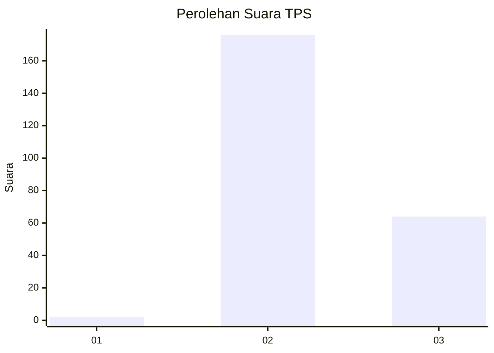
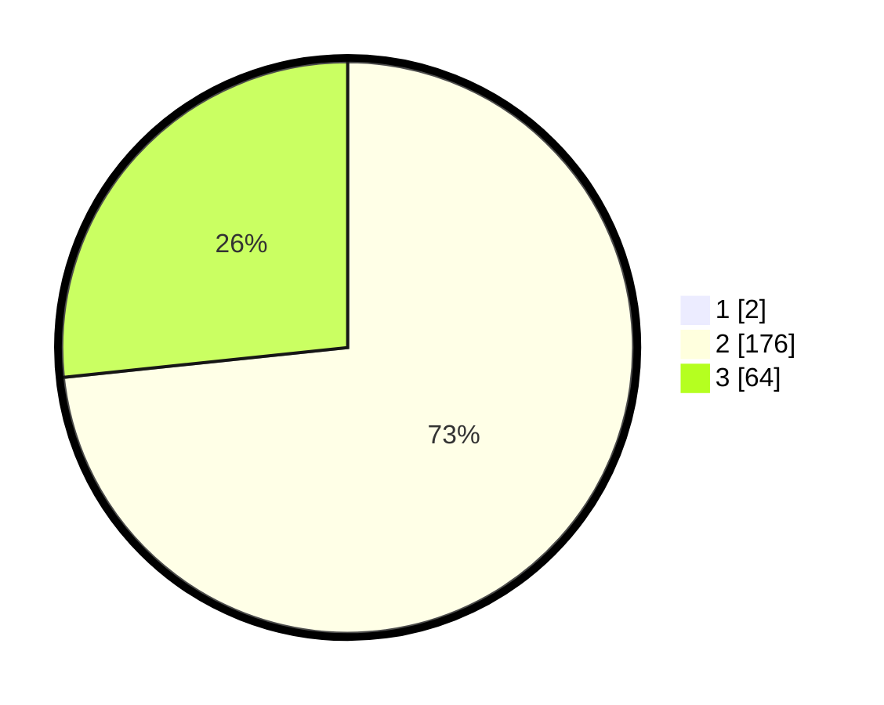

# Hasil

## Grafik

## Tabel

| No. | Nama Paslon    | Suara | Suara (raw) | Persentase |
|:--- |:-------------- | -----:| -----------:| ----------:|
| 1   | ANIES MUHAIMIN | 2     | [2][p-1]    | 0,83       |
| 2   | PRABOWO GIBRAN | 176   | [176][p-2]  | 72,73      |
| 3   | GANJAR MAHFUD  | 64    | [64][p-3]   | 26,45      |

[p-1]: https://github.com/gigit-pemilu/pemilu-2024-51-bali/blob/main/pilpres/hitung-suara/sub/51-bali/sub/03-badung/sub/05-kuta-selatan/sub/2003-kutuh/sub/010-tps/sub/paslon-1.txt
[p-2]: https://github.com/gigit-pemilu/pemilu-2024-51-bali/blob/main/pilpres/hitung-suara/sub/51-bali/sub/03-badung/sub/05-kuta-selatan/sub/2003-kutuh/sub/010-tps/sub/paslon-2.txt
[p-3]: https://github.com/gigit-pemilu/pemilu-2024-51-bali/blob/main/pilpres/hitung-suara/sub/51-bali/sub/03-badung/sub/05-kuta-selatan/sub/2003-kutuh/sub/010-tps/sub/paslon-3.txt

## Foto C Plano

https://sirekap-obj-formc.kpu.go.id/9e2a/pemilu/ppwp/51/03/05/20/03/5103052003010-20240214-141547--295d3a30-a580-41d9-b25c-2206fc7dc164.jpg

https://sirekap-obj-formc.kpu.go.id/9e2a/pemilu/ppwp/51/03/05/20/03/5103052003010-20240214-141651--7dede92d-6bdd-4c8a-8519-3eecc6257040.jpg

https://sirekap-obj-formc.kpu.go.id/9e2a/pemilu/ppwp/51/03/05/20/03/5103052003010-20240214-141746--23116068-e53a-4a5e-81ab-e2e51a1427f6.jpg

## Metadata

| Key        | Value               |
| ---------- | ------------------- |
| Time Stamp | 2024-02-14 21:46:01 |

