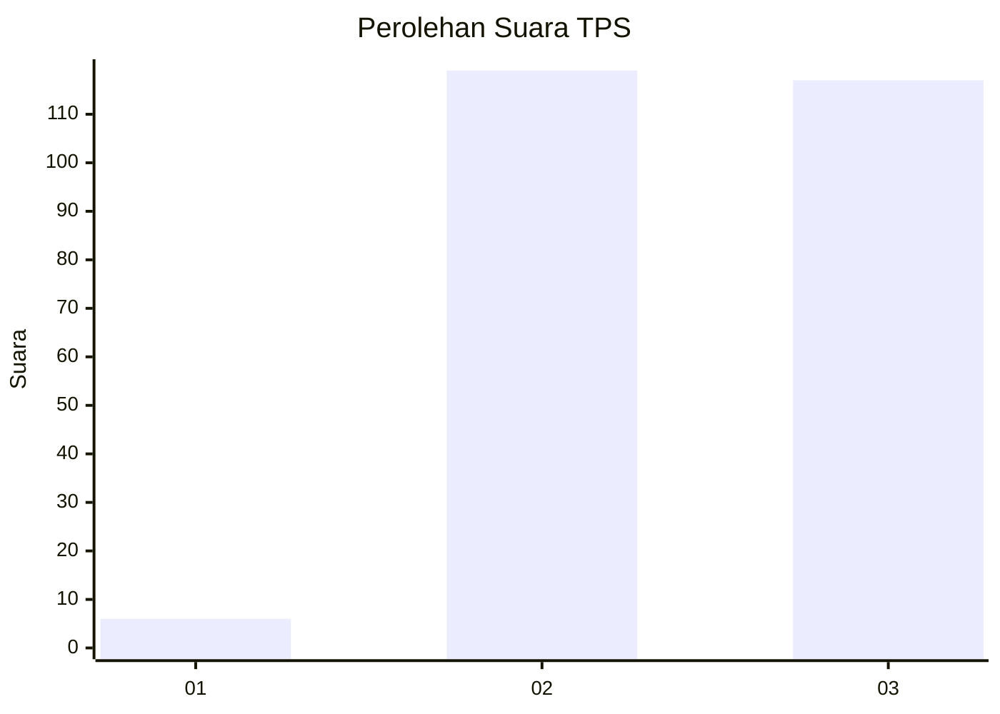
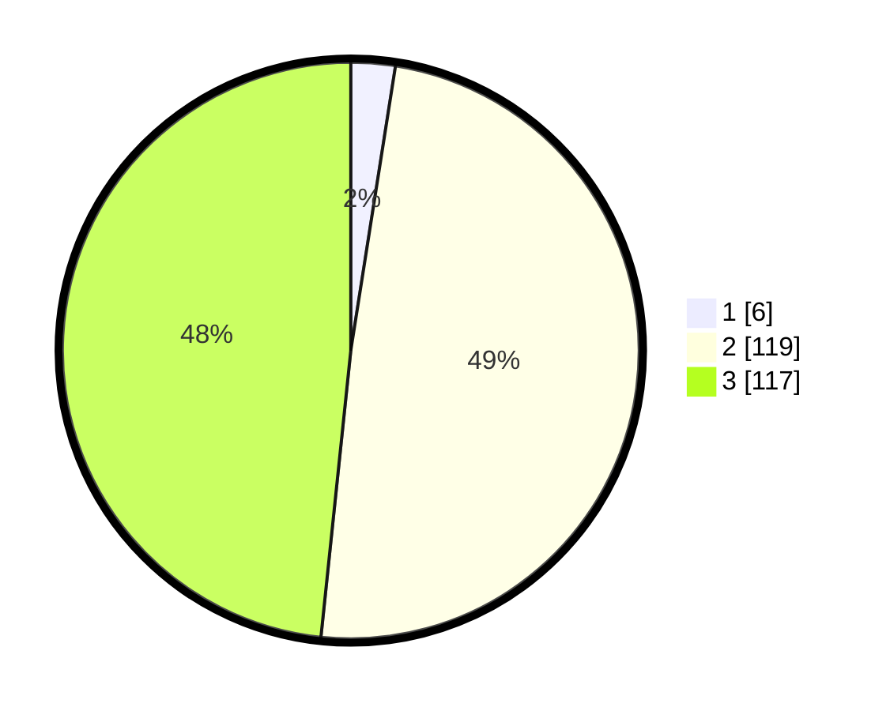

# Hasil

## Grafik

## Tabel

| No. | Nama Paslon    | Suara | Suara (raw) | Persentase |
|:--- |:-------------- | -----:| -----------:| ----------:|
| 1   | ANIES MUHAIMIN | 6     | [6][p-1]    | 2,48       |
| 2   | PRABOWO GIBRAN | 119   | [119][p-2]  | 49,17      |
| 3   | GANJAR MAHFUD  | 117   | [117][p-3]  | 48,35      |

[p-1]: https://github.com/gigit-pemilu/pemilu-2024-51-bali/blob/main/pilpres/hitung-suara/sub/51-bali/sub/03-badung/sub/05-kuta-selatan/sub/2003-kutuh/sub/012-tps/sub/paslon-1.txt
[p-2]: https://github.com/gigit-pemilu/pemilu-2024-51-bali/blob/main/pilpres/hitung-suara/sub/51-bali/sub/03-badung/sub/05-kuta-selatan/sub/2003-kutuh/sub/012-tps/sub/paslon-2.txt
[p-3]: https://github.com/gigit-pemilu/pemilu-2024-51-bali/blob/main/pilpres/hitung-suara/sub/51-bali/sub/03-badung/sub/05-kuta-selatan/sub/2003-kutuh/sub/012-tps/sub/paslon-3.txt

## Foto C Plano

https://sirekap-obj-formc.kpu.go.id/c373/pemilu/ppwp/51/03/05/20/03/5103052003012-20240215-033529--dd91aa15-801c-4b9a-92bd-b2ceeb22f43b.jpg

https://sirekap-obj-formc.kpu.go.id/c373/pemilu/ppwp/51/03/05/20/03/5103052003012-20240215-033615--20248e1b-c034-4105-8122-0e95386b5d12.jpg

https://sirekap-obj-formc.kpu.go.id/c373/pemilu/ppwp/51/03/05/20/03/5103052003012-20240215-033757--8ce84939-3011-4d57-9be5-077dedb5aa28.jpg

## Metadata

| Key        | Value               |
| ---------- | ------------------- |
| Time Stamp | 2024-02-15 15:00:29 |

## DATA PEMILIH TETAP

Jumlah pemilih dalam DPT: **264**.
 * L: **131**.
 * P: **133**.

## DATA PENGGUNA HAK PILIH

Jumlah pengguna hak pilih dalam DPT: **233**.
 * L: **117**.
 * P: **116**.

Jumlah pengguna hak pilih dalam DPTb: **6**.
 * L: **3**.
 * P: **3**.

Jumlah pengguna hak pilih dalam DPK: **9**.
 * L: **3**.
 * P: **6**.

Jumlah pengguna hak pilih: **248**.
 * L: **123**.
 * P: **125**.

## JUMLAH SUARA SAH DAN TIDAK SAH

JUMLAH SELURUH SUARA SAH: **242**.

JUMLAH SUARA TIDAK SAH: **6**.

JUMLAH SELURUH SUARA SAH DAN SUARA TIDAK SAH: **248**.

