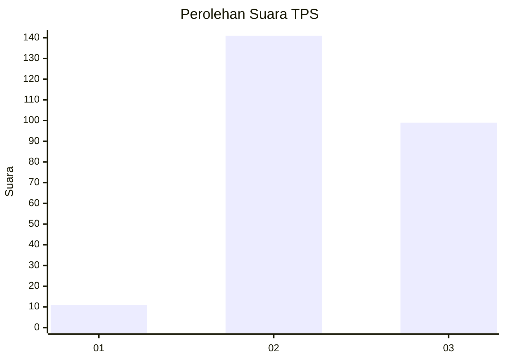
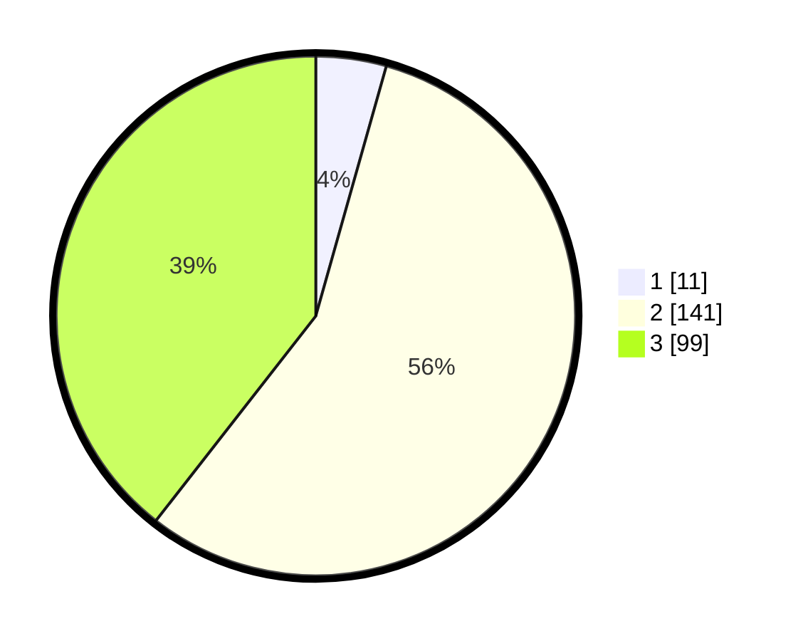

# Hasil

## Grafik

## Tabel

| No. | Nama Paslon    | Suara | Suara (raw) | Persentase |
|:--- |:-------------- | -----:| -----------:| ----------:|
| 1   | ANIES MUHAIMIN | 11    | [11][p-1]   | 4,38       |
| 2   | PRABOWO GIBRAN | 141   | [141][p-2]  | 56,18      |
| 3   | GANJAR MAHFUD  | 99    | [99][p-3]   | 39,44      |

[p-1]: https://github.com/gigit-pemilu/pemilu-2024-51-bali/blob/main/pilpres/hitung-suara/sub/51-bali/sub/03-badung/sub/05-kuta-selatan/sub/2003-kutuh/sub/013-tps/sub/paslon-1.txt
[p-2]: https://github.com/gigit-pemilu/pemilu-2024-51-bali/blob/main/pilpres/hitung-suara/sub/51-bali/sub/03-badung/sub/05-kuta-selatan/sub/2003-kutuh/sub/013-tps/sub/paslon-2.txt
[p-3]: https://github.com/gigit-pemilu/pemilu-2024-51-bali/blob/main/pilpres/hitung-suara/sub/51-bali/sub/03-badung/sub/05-kuta-selatan/sub/2003-kutuh/sub/013-tps/sub/paslon-3.txt

## Foto C Plano

https://sirekap-obj-formc.kpu.go.id/a71a/pemilu/ppwp/51/03/05/20/03/5103052003013-20240216-205720--a2ffdbfb-1be1-473f-9371-2677eefc77aa.jpg

https://sirekap-obj-formc.kpu.go.id/a71a/pemilu/ppwp/51/03/05/20/03/5103052003013-20240216-164242--30d14bf8-0d5a-4531-9545-97739979550e.jpg

https://sirekap-obj-formc.kpu.go.id/a71a/pemilu/ppwp/51/03/05/20/03/5103052003013-20240216-155841--90825ed6-09fe-4499-b091-da2240c32abe.jpg

## Metadata

| Key        | Value               |
| ---------- | ------------------- |
| Time Stamp | 2024-02-21 20:00:00 |

## DATA PEMILIH TETAP

Jumlah pemilih dalam DPT: **259**.
 * L: **130**.
 * P: **129**.

## DATA PENGGUNA HAK PILIH

Jumlah pengguna hak pilih dalam DPT: **232**.
 * L: **118**.
 * P: **114**.

Jumlah pengguna hak pilih dalam DPTb: **7**.
 * L: **4**.
 * P: **3**.

Jumlah pengguna hak pilih dalam DPK: **14**.
 * L: **4**.
 * P: **10**.

Jumlah pengguna hak pilih: **253**.
 * L: **126**.
 * P: **127**.

## JUMLAH SUARA SAH DAN TIDAK SAH

JUMLAH SELURUH SUARA SAH: **251**.

JUMLAH SUARA TIDAK SAH: **2**.

JUMLAH SELURUH SUARA SAH DAN SUARA TIDAK SAH: **253**.

