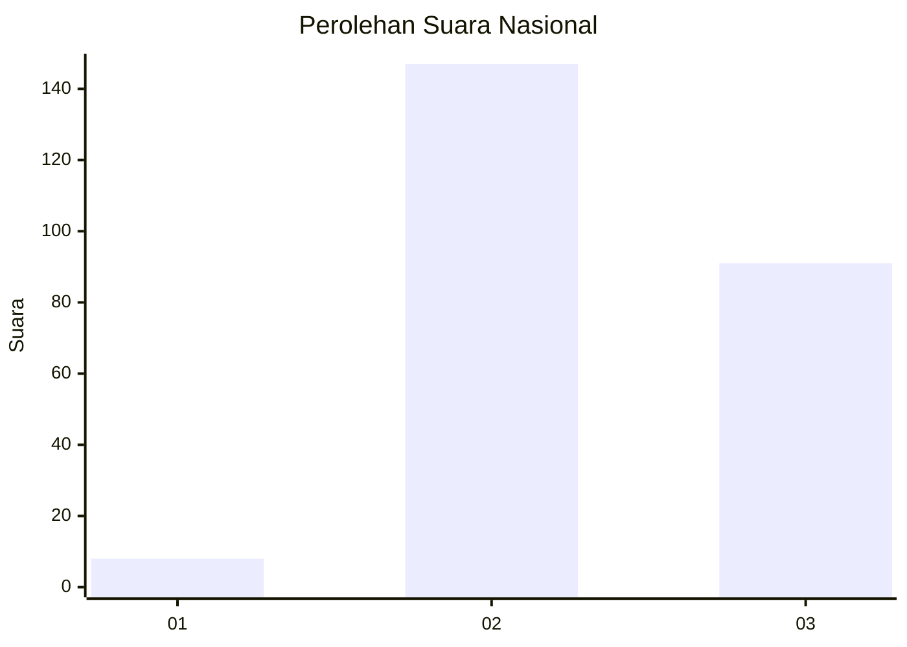
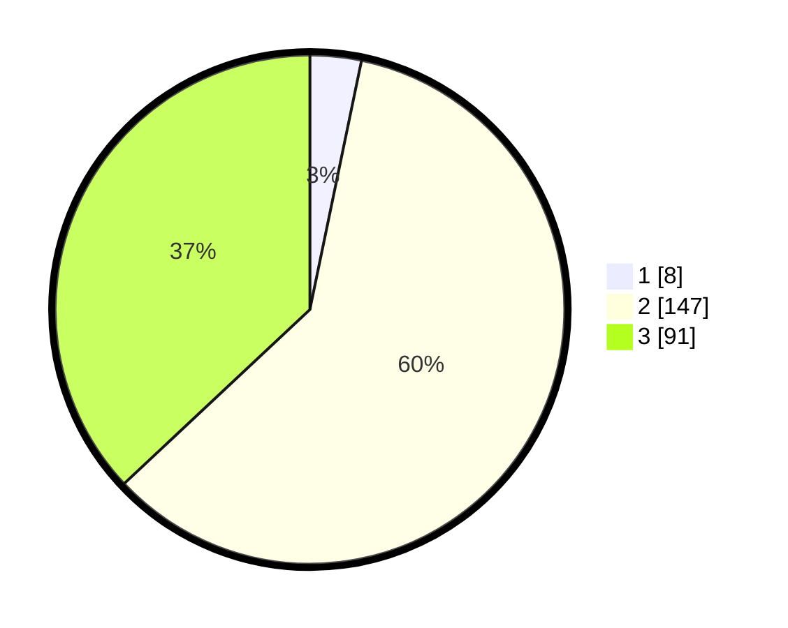

# Hasil

## Grafik

## Tabel

| No. | Nama Paslon    | Suara | Suara (raw) | Persentase |
|:--- |:-------------- | -----:| -----------:| ----------:|
| 1   | ANIES MUHAIMIN | 8     | [8][p-1]    | 3,25       |
| 2   | PRABOWO GIBRAN | 147   | [147][p-2]  | 59,76      |
| 3   | GANJAR MAHFUD  | 91    | [91][p-3]   | 36,99      |

[p-1]: https://github.com/gigit-pemilu/pemilu-2024/blob/main/pilpres/hitung-suara/sub/51-bali/sub/03-badung/sub/05-kuta-selatan/sub/2003-kutuh/sub/014-tps/sub/paslon-1.txt
[p-2]: https://github.com/gigit-pemilu/pemilu-2024/blob/main/pilpres/hitung-suara/sub/51-bali/sub/03-badung/sub/05-kuta-selatan/sub/2003-kutuh/sub/014-tps/sub/paslon-2.txt
[p-3]: https://github.com/gigit-pemilu/pemilu-2024/blob/main/pilpres/hitung-suara/sub/51-bali/sub/03-badung/sub/05-kuta-selatan/sub/2003-kutuh/sub/014-tps/sub/paslon-3.txt

## Foto C Plano

https://sirekap-obj-formc.kpu.go.id/587d/pemilu/ppwp/51/03/05/20/03/5103052003014-20240215-205212--94ee4c58-c404-4047-9620-2e6d8d2e21a0.jpg

https://sirekap-obj-formc.kpu.go.id/587d/pemilu/ppwp/51/03/05/20/03/5103052003014-20240215-205215--80cc6bee-91d8-49d2-baa4-c5439821e4b9.jpg

https://sirekap-obj-formc.kpu.go.id/587d/pemilu/ppwp/51/03/05/20/03/5103052003014-20240215-205213--8f741855-0d9d-4e68-8dd3-ad11245edcef.jpg

## Metadata

| Key        | Value               |
| ---------- | ------------------- |
| Time Stamp | 2024-02-21 11:00:00 |

## DATA PEMILIH TETAP

Jumlah pemilih dalam DPT: **266**.
 * L: **132**.
 * P: **134**.

## DATA PENGGUNA HAK PILIH

Jumlah pengguna hak pilih dalam DPT: **235**.
 * L: **118**.
 * P: **117**.

Jumlah pengguna hak pilih dalam DPTb: **5**.
 * L: **3**.
 * P: **2**.

Jumlah pengguna hak pilih dalam DPK: **12**.
 * L: **7**.
 * P: **5**.

Jumlah pengguna hak pilih: **252**.
 * L: **128**.
 * P: **124**.

## JUMLAH SUARA SAH DAN TIDAK SAH

JUMLAH SELURUH SUARA SAH: **246**.

JUMLAH SUARA TIDAK SAH: **6**.

JUMLAH SELURUH SUARA SAH DAN SUARA TIDAK SAH: **252**.

