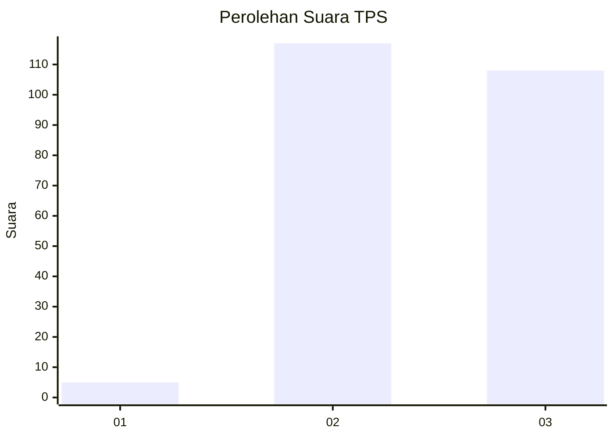
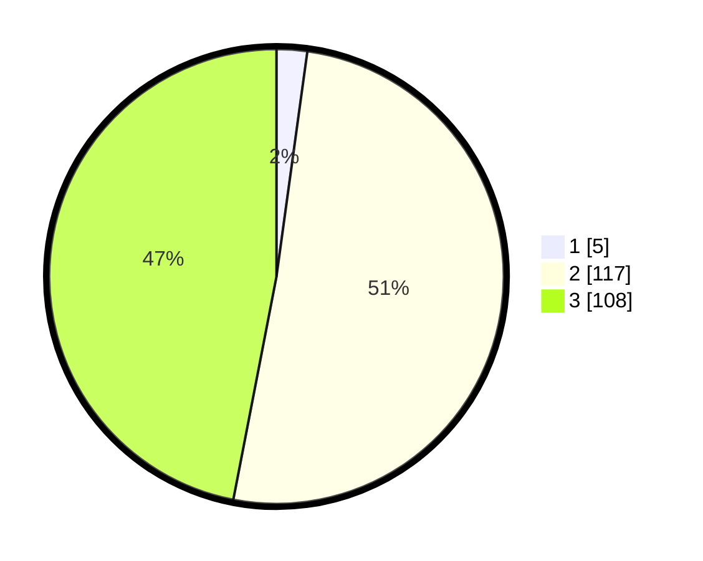

# Hasil

## Grafik

## Tabel

| No. | Nama Paslon    | Suara | Suara (raw) | Persentase |
|:--- |:-------------- | -----:| -----------:| ----------:|
| 1   | ANIES MUHAIMIN | 5     | [5][p-1]    | 2,17       |
| 2   | PRABOWO GIBRAN | 117   | [117][p-2]  | 50,87      |
| 3   | GANJAR MAHFUD  | 108   | [108][p-3]  | 46,96      |

[p-1]: https://github.com/gigit-pemilu/pemilu-2024-51-bali/blob/main/pilpres/hitung-suara/sub/51-bali/sub/03-badung/sub/06-kuta-utara/sub/1001-kerobokan-kelod/sub/001-tps/sub/paslon-1.txt
[p-2]: https://github.com/gigit-pemilu/pemilu-2024-51-bali/blob/main/pilpres/hitung-suara/sub/51-bali/sub/03-badung/sub/06-kuta-utara/sub/1001-kerobokan-kelod/sub/001-tps/sub/paslon-2.txt
[p-3]: https://github.com/gigit-pemilu/pemilu-2024-51-bali/blob/main/pilpres/hitung-suara/sub/51-bali/sub/03-badung/sub/06-kuta-utara/sub/1001-kerobokan-kelod/sub/001-tps/sub/paslon-3.txt

## Foto C Plano

https://sirekap-obj-formc.kpu.go.id/31cd/pemilu/ppwp/51/03/06/10/01/5103061001001-20240214-211708--bd3087ba-c37d-4052-bfdc-e4feef2df49c.jpg

https://sirekap-obj-formc.kpu.go.id/31cd/pemilu/ppwp/51/03/06/10/01/5103061001001-20240214-211821--f2dfa6e1-8fa9-407c-a62d-d6e6c6f201dc.jpg

https://sirekap-obj-formc.kpu.go.id/31cd/pemilu/ppwp/51/03/06/10/01/5103061001001-20240214-222000--e5b24a1c-855f-43ee-987d-ef6f0bc99b61.jpg

## Metadata

| Key        | Value               |
| ---------- | ------------------- |
| Time Stamp | 2024-02-15 09:00:24 |

## DATA PEMILIH TETAP

Jumlah pemilih dalam DPT: **242**.
 * L: **117**.
 * P: **125**.

## DATA PENGGUNA HAK PILIH

Jumlah pengguna hak pilih dalam DPT: **220**.
 * L: **104**.
 * P: **116**.

Jumlah pengguna hak pilih dalam DPTb: **3**.
 * L: **0**.
 * P: **3**.

Jumlah pengguna hak pilih dalam DPK: **9**.
 * L: **1**.
 * P: **8**.

Jumlah pengguna hak pilih: **232**.
 * L: **105**.
 * P: **127**.

## JUMLAH SUARA SAH DAN TIDAK SAH

JUMLAH SELURUH SUARA SAH: **230**.

JUMLAH SUARA TIDAK SAH: **2**.

JUMLAH SELURUH SUARA SAH DAN SUARA TIDAK SAH: **232**.

