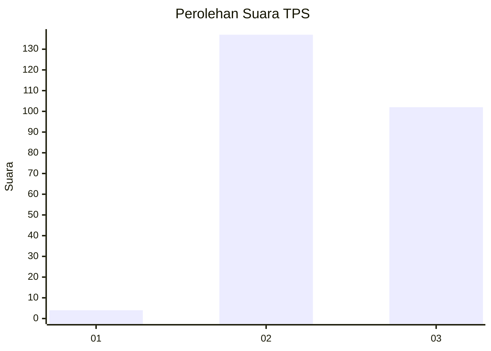
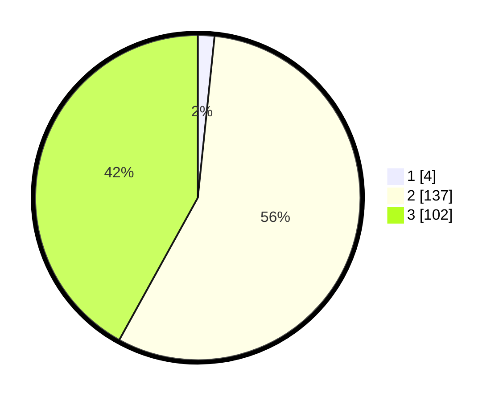

# Hasil

## Grafik

## Tabel

| No. | Nama Paslon    | Suara | Suara (raw) | Persentase |
|:--- |:-------------- | -----:| -----------:| ----------:|
| 1   | ANIES MUHAIMIN | 4     | [4][p-1]    | 1,65       |
| 2   | PRABOWO GIBRAN | 137   | [137][p-2]  | 56,38      |
| 3   | GANJAR MAHFUD  | 102   | [102][p-3]  | 41,98      |

[p-1]: https://github.com/gigit-pemilu/pemilu-2024-51-bali/blob/main/pilpres/hitung-suara/sub/51-bali/sub/03-badung/sub/06-kuta-utara/sub/1001-kerobokan-kelod/sub/002-tps/sub/paslon-1.txt
[p-2]: https://github.com/gigit-pemilu/pemilu-2024-51-bali/blob/main/pilpres/hitung-suara/sub/51-bali/sub/03-badung/sub/06-kuta-utara/sub/1001-kerobokan-kelod/sub/002-tps/sub/paslon-2.txt
[p-3]: https://github.com/gigit-pemilu/pemilu-2024-51-bali/blob/main/pilpres/hitung-suara/sub/51-bali/sub/03-badung/sub/06-kuta-utara/sub/1001-kerobokan-kelod/sub/002-tps/sub/paslon-3.txt

## Foto C Plano

https://sirekap-obj-formc.kpu.go.id/b5d0/pemilu/ppwp/51/03/06/10/01/5103061001002-20240214-202537--c073f6b3-0270-4c75-85ff-837c30e4174d.jpg

https://sirekap-obj-formc.kpu.go.id/b5d0/pemilu/ppwp/51/03/06/10/01/5103061001002-20240214-224020--91ce4a64-b65e-4c80-bc4c-a5a440e1fa5a.jpg

https://sirekap-obj-formc.kpu.go.id/b5d0/pemilu/ppwp/51/03/06/10/01/5103061001002-20240214-213108--79ad379f-78b2-4ebb-9ebe-3237e6cbea6c.jpg

## Metadata

| Key        | Value               |
| ---------- | ------------------- |
| Time Stamp | 2024-02-15 20:30:46 |

## DATA PEMILIH TETAP

Jumlah pemilih dalam DPT: **270**.
 * L: **133**.
 * P: **137**.

## DATA PENGGUNA HAK PILIH

Jumlah pengguna hak pilih dalam DPT: **238**.
 * L: **116**.
 * P: **122**.

Jumlah pengguna hak pilih dalam DPTb: **2**.
 * L: **0**.
 * P: **2**.

Jumlah pengguna hak pilih dalam DPK: **7**.
 * L: **3**.
 * P: **4**.

Jumlah pengguna hak pilih: **247**.
 * L: **119**.
 * P: **128**.

## JUMLAH SUARA SAH DAN TIDAK SAH

JUMLAH SELURUH SUARA SAH: **243**.

JUMLAH SUARA TIDAK SAH: **4**.

JUMLAH SELURUH SUARA SAH DAN SUARA TIDAK SAH: **247**.

