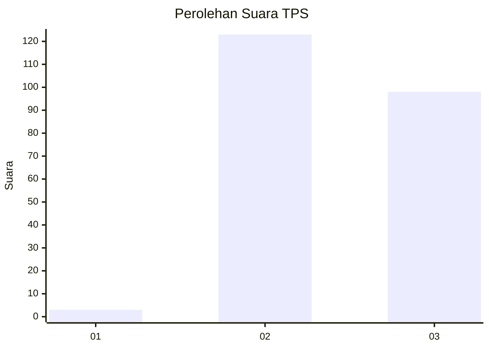
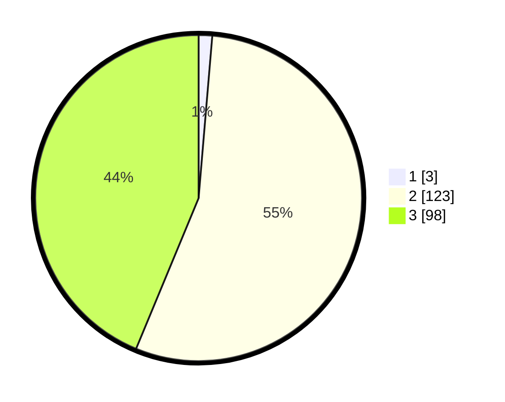

# Hasil

## Grafik

## Tabel

| No. | Nama Paslon    | Suara | Suara (raw) | Persentase |
|:--- |:-------------- | -----:| -----------:| ----------:|
| 1   | ANIES MUHAIMIN | 3     | [3][p-1]    | 1,34       |
| 2   | PRABOWO GIBRAN | 123   | [123][p-2]  | 54,91      |
| 3   | GANJAR MAHFUD  | 98    | [98][p-3]   | 43,75      |

[p-1]: https://github.com/gigit-pemilu/pemilu-2024-51-bali/blob/main/pilpres/hitung-suara/sub/51-bali/sub/03-badung/sub/06-kuta-utara/sub/1001-kerobokan-kelod/sub/003-tps/sub/paslon-1.txt
[p-2]: https://github.com/gigit-pemilu/pemilu-2024-51-bali/blob/main/pilpres/hitung-suara/sub/51-bali/sub/03-badung/sub/06-kuta-utara/sub/1001-kerobokan-kelod/sub/003-tps/sub/paslon-2.txt
[p-3]: https://github.com/gigit-pemilu/pemilu-2024-51-bali/blob/main/pilpres/hitung-suara/sub/51-bali/sub/03-badung/sub/06-kuta-utara/sub/1001-kerobokan-kelod/sub/003-tps/sub/paslon-3.txt

## Foto C Plano

https://sirekap-obj-formc.kpu.go.id/856d/pemilu/ppwp/51/03/06/10/01/5103061001003-20240214-214826--1a4052a0-599f-49cd-b0c3-d569a182a6d2.jpg

https://sirekap-obj-formc.kpu.go.id/856d/pemilu/ppwp/51/03/06/10/01/5103061001003-20240214-215036--27089886-eb9a-4983-aec3-5b9d71f9a727.jpg

https://sirekap-obj-formc.kpu.go.id/856d/pemilu/ppwp/51/03/06/10/01/5103061001003-20240214-215228--26d5879d-1bf5-4e60-82a0-9435a671f09e.jpg

## Metadata

| Key        | Value               |
| ---------- | ------------------- |
| Time Stamp | 2024-02-21 21:00:04 |

## DATA PEMILIH TETAP

Jumlah pemilih dalam DPT: **269**.
 * L: **118**.
 * P: **151**.

## DATA PENGGUNA HAK PILIH

Jumlah pengguna hak pilih dalam DPT: **217**.
 * L: **93**.
 * P: **124**.

Jumlah pengguna hak pilih dalam DPTb: **1**.
 * L: **0**.
 * P: **1**.

Jumlah pengguna hak pilih dalam DPK: **9**.
 * L: **3**.
 * P: **6**.

Jumlah pengguna hak pilih: **227**.
 * L: **96**.
 * P: **131**.

## JUMLAH SUARA SAH DAN TIDAK SAH

JUMLAH SELURUH SUARA SAH: **224**.

JUMLAH SUARA TIDAK SAH: **3**.

JUMLAH SELURUH SUARA SAH DAN SUARA TIDAK SAH: **227**.

