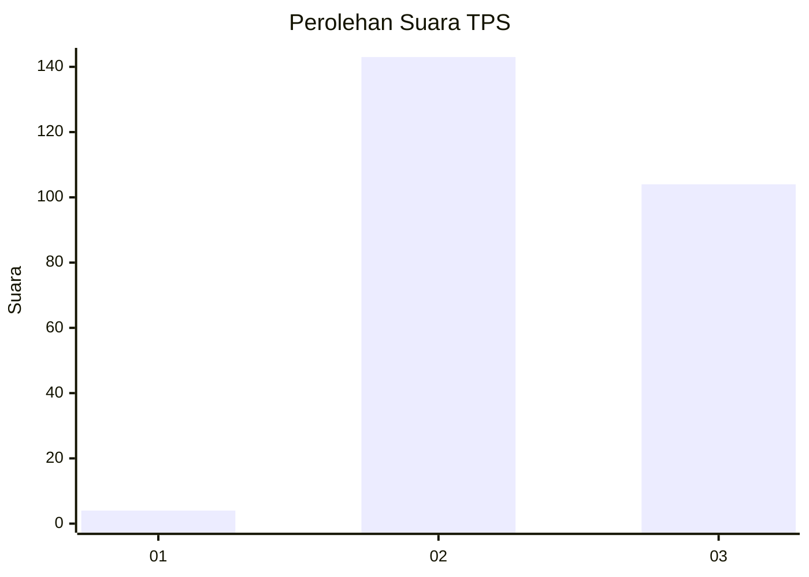
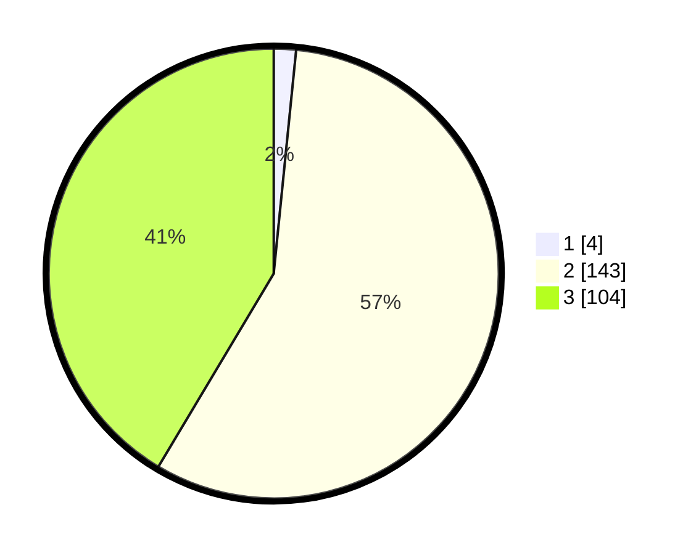

# Hasil

## Grafik

## Tabel

| No. | Nama Paslon    | Suara | Suara (raw) | Persentase |
|:--- |:-------------- | -----:| -----------:| ----------:|
| 1   | ANIES MUHAIMIN | 4     | [4][p-1]    | 1,59       |
| 2   | PRABOWO GIBRAN | 143   | [143][p-2]  | 56,97      |
| 3   | GANJAR MAHFUD  | 104   | [104][p-3]  | 41,43      |

[p-1]: https://github.com/gigit-pemilu/pemilu-2024-51-bali/blob/main/pilpres/hitung-suara/sub/51-bali/sub/03-badung/sub/06-kuta-utara/sub/1001-kerobokan-kelod/sub/004-tps/sub/paslon-1.txt
[p-2]: https://github.com/gigit-pemilu/pemilu-2024-51-bali/blob/main/pilpres/hitung-suara/sub/51-bali/sub/03-badung/sub/06-kuta-utara/sub/1001-kerobokan-kelod/sub/004-tps/sub/paslon-2.txt
[p-3]: https://github.com/gigit-pemilu/pemilu-2024-51-bali/blob/main/pilpres/hitung-suara/sub/51-bali/sub/03-badung/sub/06-kuta-utara/sub/1001-kerobokan-kelod/sub/004-tps/sub/paslon-3.txt

## Foto C Plano

https://sirekap-obj-formc.kpu.go.id/3abd/pemilu/ppwp/51/03/06/10/01/5103061001004-20240214-233450--ec196ed9-b0f6-41cb-8702-22222c28e0d8.jpg

https://sirekap-obj-formc.kpu.go.id/3abd/pemilu/ppwp/51/03/06/10/01/5103061001004-20240214-233505--9ba0f3ed-ca85-449b-9e78-8b5b2b7718de.jpg

https://sirekap-obj-formc.kpu.go.id/3abd/pemilu/ppwp/51/03/06/10/01/5103061001004-20240214-233515--bbe49c9a-4942-430d-82d6-71e190b320c2.jpg

## Metadata

| Key        | Value               |
| ---------- | ------------------- |
| Time Stamp | 2024-02-15 21:01:18 |

## DATA PEMILIH TETAP

Jumlah pemilih dalam DPT: **281**.
 * L: **141**.
 * P: **140**.

## DATA PENGGUNA HAK PILIH

Jumlah pengguna hak pilih dalam DPT: **247**.
 * L: **122**.
 * P: **125**.

Jumlah pengguna hak pilih dalam DPTb: **4**.
 * L: **3**.
 * P: **1**.

Jumlah pengguna hak pilih dalam DPK: **2**.
 * L: **1**.
 * P: **1**.

Jumlah pengguna hak pilih: **253**.
 * L: **126**.
 * P: **127**.

## JUMLAH SUARA SAH DAN TIDAK SAH

JUMLAH SELURUH SUARA SAH: **251**.

JUMLAH SUARA TIDAK SAH: **2**.

JUMLAH SELURUH SUARA SAH DAN SUARA TIDAK SAH: **253**.

