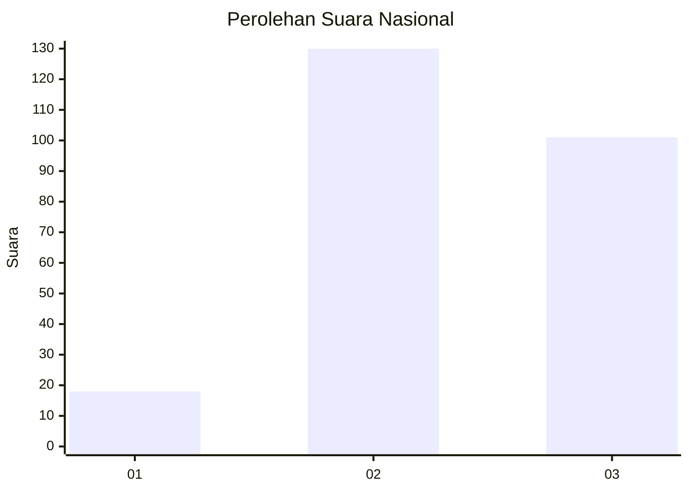
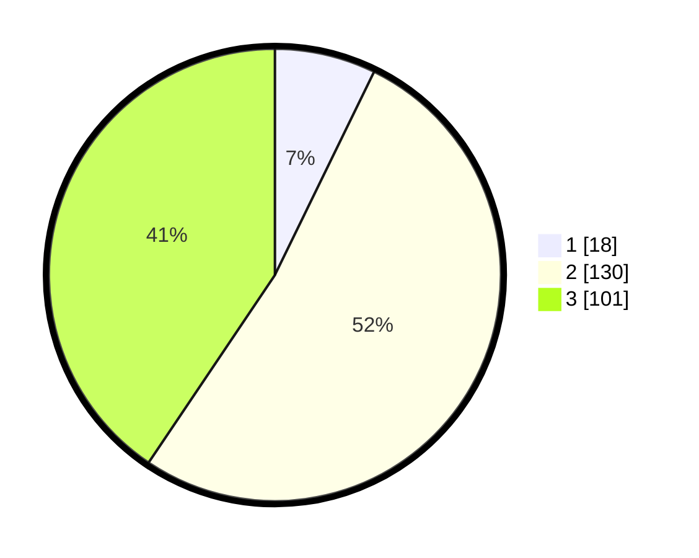

# Hasil

## Grafik

## Tabel

| No. | Nama Paslon    | Suara | Suara (raw) | Persentase |
|:--- |:-------------- | -----:| -----------:| ----------:|
| 1   | ANIES MUHAIMIN | 18    | [18][p-1]   | 7,23       |
| 2   | PRABOWO GIBRAN | 130   | [130][p-2]  | 52,21      |
| 3   | GANJAR MAHFUD  | 101   | [101][p-3]  | 40,56      |

[p-1]: https://github.com/gigit-pemilu/pemilu-2024/blob/main/pilpres/hitung-suara/sub/51-bali/sub/03-badung/sub/06-kuta-utara/sub/1001-kerobokan-kelod/sub/005-tps/sub/paslon-1.txt
[p-2]: https://github.com/gigit-pemilu/pemilu-2024/blob/main/pilpres/hitung-suara/sub/51-bali/sub/03-badung/sub/06-kuta-utara/sub/1001-kerobokan-kelod/sub/005-tps/sub/paslon-2.txt
[p-3]: https://github.com/gigit-pemilu/pemilu-2024/blob/main/pilpres/hitung-suara/sub/51-bali/sub/03-badung/sub/06-kuta-utara/sub/1001-kerobokan-kelod/sub/005-tps/sub/paslon-3.txt

## Foto C Plano

https://sirekap-obj-formc.kpu.go.id/1d9a/pemilu/ppwp/51/03/06/10/01/5103061001005-20240216-030109--054c3d49-75ca-4094-94dc-ed6544b7adb8.jpg

https://sirekap-obj-formc.kpu.go.id/1d9a/pemilu/ppwp/51/03/06/10/01/5103061001005-20240216-030112--0c578ec5-cd1b-4545-9c45-99b1f1b685ce.jpg

https://sirekap-obj-formc.kpu.go.id/1d9a/pemilu/ppwp/51/03/06/10/01/5103061001005-20240216-030110--19f11521-7769-4b2c-85d8-eb52fc15d365.jpg

## Metadata

| Key        | Value               |
| ---------- | ------------------- |
| Time Stamp | 2024-02-21 18:00:00 |

## DATA PEMILIH TETAP

Jumlah pemilih dalam DPT: **278**.
 * L: **136**.
 * P: **142**.

## DATA PENGGUNA HAK PILIH

Jumlah pengguna hak pilih dalam DPT: **242**.
 * L: **116**.
 * P: **126**.

Jumlah pengguna hak pilih dalam DPTb: **7**.
 * L: **3**.
 * P: **4**.

Jumlah pengguna hak pilih dalam DPK: **1**.
 * L: **0**.
 * P: **1**.

Jumlah pengguna hak pilih: **250**.
 * L: **119**.
 * P: **131**.

## JUMLAH SUARA SAH DAN TIDAK SAH

JUMLAH SELURUH SUARA SAH: **249**.

JUMLAH SUARA TIDAK SAH: **1**.

JUMLAH SELURUH SUARA SAH DAN SUARA TIDAK SAH: **250**.

