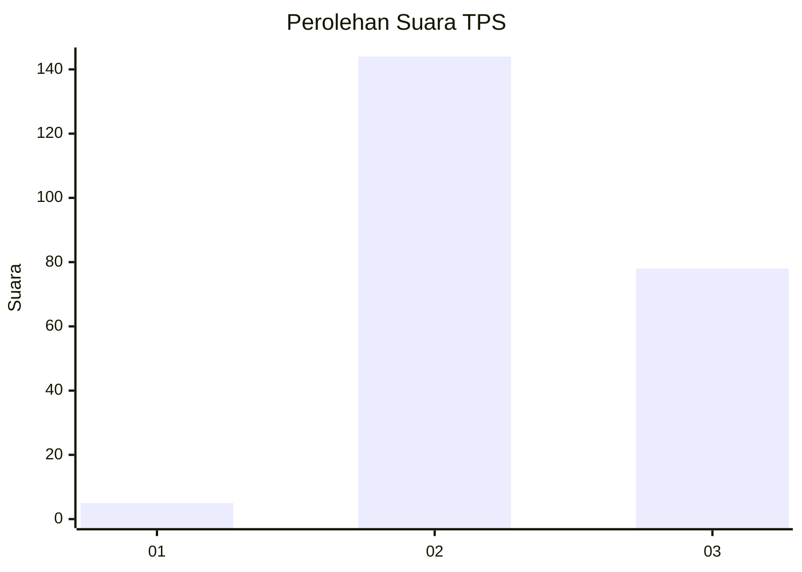
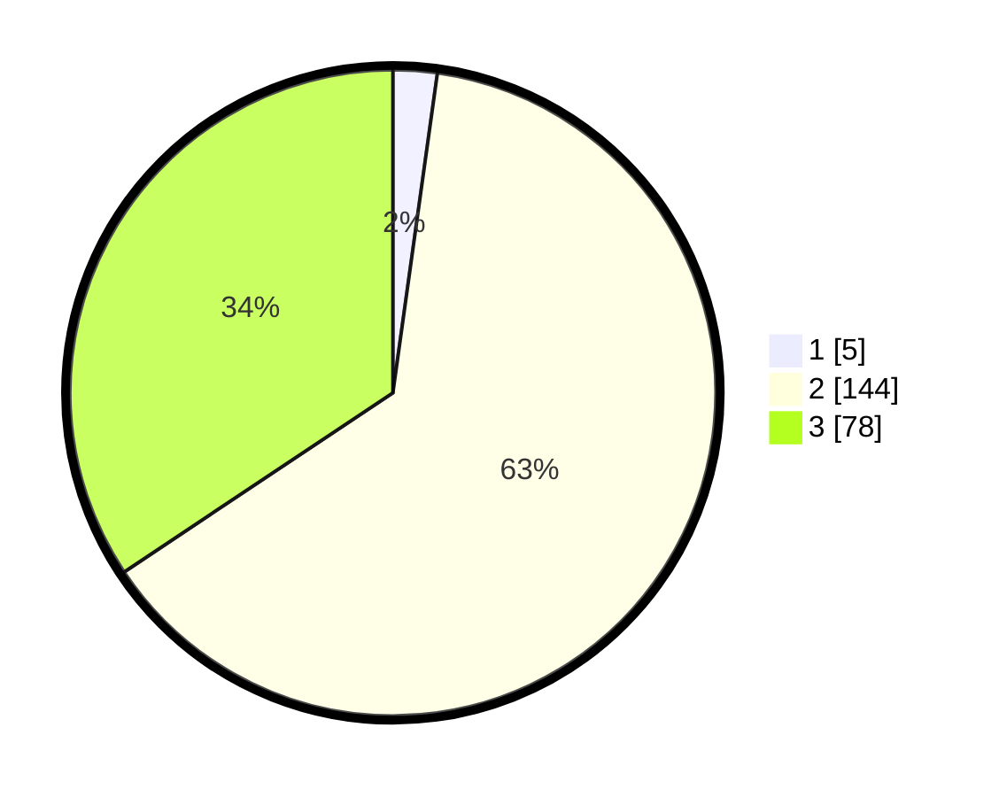

# Hasil

## Grafik

## Tabel

| No. | Nama Paslon    | Suara | Suara (raw) | Persentase |
|:--- |:-------------- | -----:| -----------:| ----------:|
| 1   | ANIES MUHAIMIN | 5     | [5][p-1]    | 2,20       |
| 2   | PRABOWO GIBRAN | 144   | [144][p-2]  | 63,44      |
| 3   | GANJAR MAHFUD  | 78    | [78][p-3]   | 34,36      |

[p-1]: https://github.com/gigit-pemilu/pemilu-2024-51-bali/blob/main/pilpres/hitung-suara/sub/51-bali/sub/03-badung/sub/06-kuta-utara/sub/1001-kerobokan-kelod/sub/006-tps/sub/paslon-1.txt
[p-2]: https://github.com/gigit-pemilu/pemilu-2024-51-bali/blob/main/pilpres/hitung-suara/sub/51-bali/sub/03-badung/sub/06-kuta-utara/sub/1001-kerobokan-kelod/sub/006-tps/sub/paslon-2.txt
[p-3]: https://github.com/gigit-pemilu/pemilu-2024-51-bali/blob/main/pilpres/hitung-suara/sub/51-bali/sub/03-badung/sub/06-kuta-utara/sub/1001-kerobokan-kelod/sub/006-tps/sub/paslon-3.txt

## Foto C Plano

https://sirekap-obj-formc.kpu.go.id/2fab/pemilu/ppwp/51/03/06/10/01/5103061001006-20240216-013206--9cd4190e-ce5e-48de-a6cf-b919f6e2d2c9.jpg

https://sirekap-obj-formc.kpu.go.id/2fab/pemilu/ppwp/51/03/06/10/01/5103061001006-20240216-013223--c1c27e85-b356-4b44-8242-497424898c0b.jpg

https://sirekap-obj-formc.kpu.go.id/2fab/pemilu/ppwp/51/03/06/10/01/5103061001006-20240216-013214--fd1a3f1f-8c5b-483b-9833-969ced1f5d35.jpg

## Metadata

| Key        | Value               |
| ---------- | ------------------- |
| Time Stamp | 2024-02-21 18:00:00 |

## DATA PEMILIH TETAP

Jumlah pemilih dalam DPT: **255**.
 * L: **120**.
 * P: **135**.

## DATA PENGGUNA HAK PILIH

Jumlah pengguna hak pilih dalam DPT: **218**.
 * L: **105**.
 * P: **113**.

Jumlah pengguna hak pilih dalam DPTb: **8**.
 * L: **5**.
 * P: **3**.

Jumlah pengguna hak pilih dalam DPK: **3**.
 * L: **0**.
 * P: **3**.

Jumlah pengguna hak pilih: **229**.
 * L: **110**.
 * P: **119**.

## JUMLAH SUARA SAH DAN TIDAK SAH

JUMLAH SELURUH SUARA SAH: **227**.

JUMLAH SUARA TIDAK SAH: **2**.

JUMLAH SELURUH SUARA SAH DAN SUARA TIDAK SAH: **229**.

