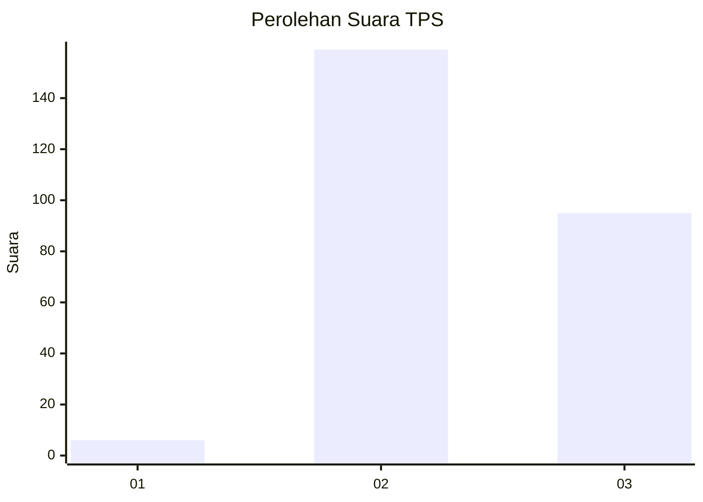
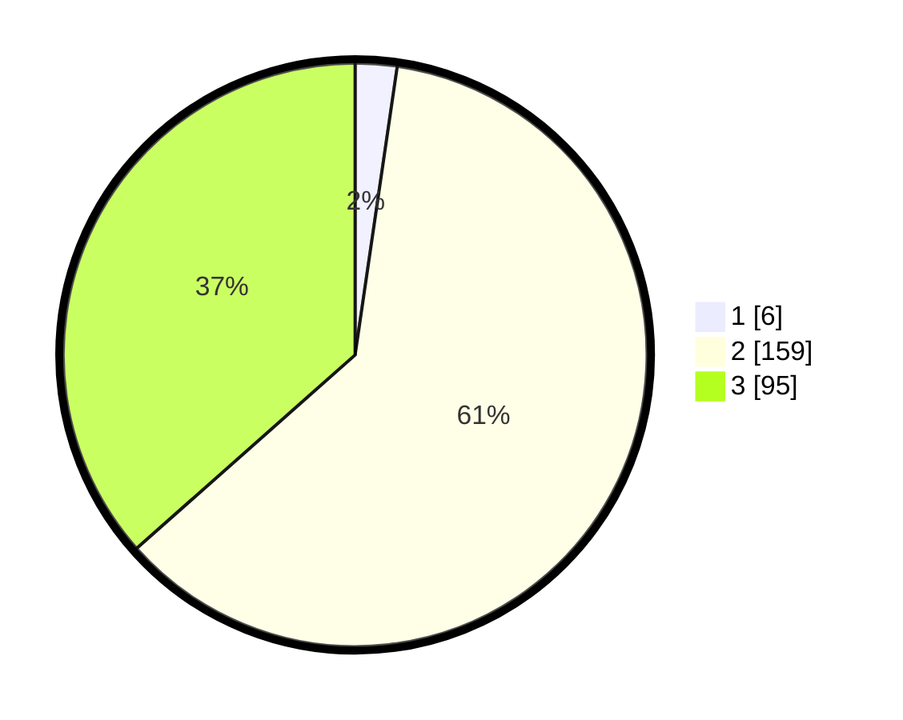

# Hasil

## Grafik

## Tabel

| No. | Nama Paslon    | Suara | Suara (raw) | Persentase |
|:--- |:-------------- | -----:| -----------:| ----------:|
| 1   | ANIES MUHAIMIN | 6     | [6][p-1]    | 2,31       |
| 2   | PRABOWO GIBRAN | 159   | [159][p-2]  | 61,15      |
| 3   | GANJAR MAHFUD  | 95    | [95][p-3]   | 36,54      |

[p-1]: https://github.com/gigit-pemilu/pemilu-2024-51-bali/blob/main/pilpres/hitung-suara/sub/51-bali/sub/03-badung/sub/06-kuta-utara/sub/1001-kerobokan-kelod/sub/007-tps/sub/paslon-1.txt
[p-2]: https://github.com/gigit-pemilu/pemilu-2024-51-bali/blob/main/pilpres/hitung-suara/sub/51-bali/sub/03-badung/sub/06-kuta-utara/sub/1001-kerobokan-kelod/sub/007-tps/sub/paslon-2.txt
[p-3]: https://github.com/gigit-pemilu/pemilu-2024-51-bali/blob/main/pilpres/hitung-suara/sub/51-bali/sub/03-badung/sub/06-kuta-utara/sub/1001-kerobokan-kelod/sub/007-tps/sub/paslon-3.txt

## Foto C Plano

https://sirekap-obj-formc.kpu.go.id/f25f/pemilu/ppwp/51/03/06/10/01/5103061001007-20240214-204206--89860044-a177-4228-93db-30e31dc4af86.jpg

https://sirekap-obj-formc.kpu.go.id/f25f/pemilu/ppwp/51/03/06/10/01/5103061001007-20240214-204254--06b43a94-4fab-44af-b165-9e8e512f673e.jpg

https://sirekap-obj-formc.kpu.go.id/f25f/pemilu/ppwp/51/03/06/10/01/5103061001007-20240214-204337--bd0c7d28-f23f-44b8-9815-ce6005230be0.jpg

## Metadata

| Key        | Value               |
| ---------- | ------------------- |
| Time Stamp | 2024-02-15 21:01:18 |

