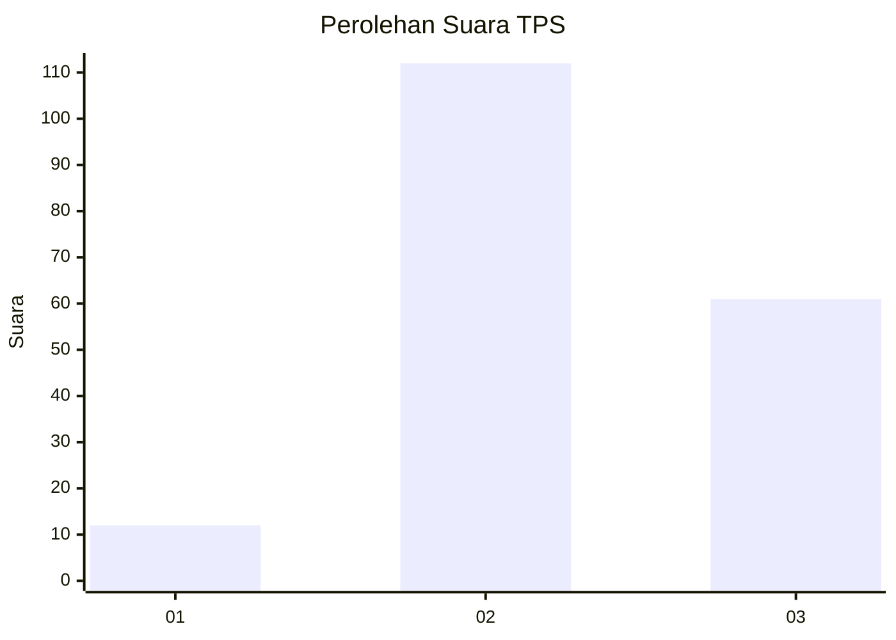
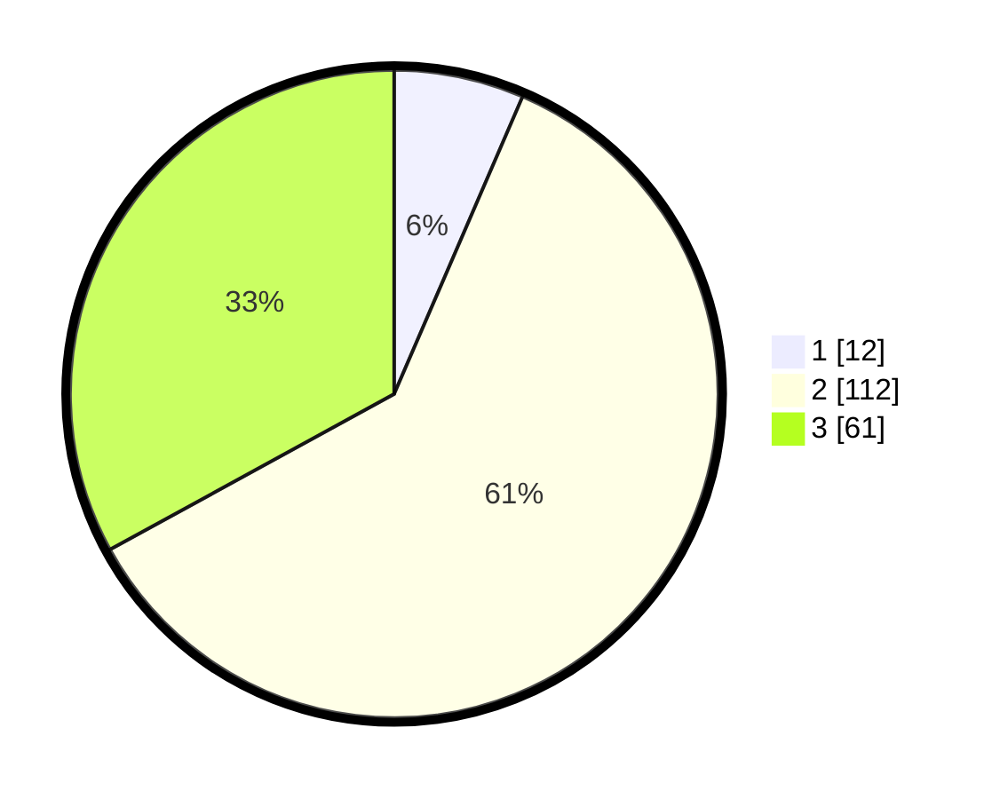

# Hasil

## Grafik

## Tabel

| No. | Nama Paslon    | Suara | Suara (raw) | Persentase |
|:--- |:-------------- | -----:| -----------:| ----------:|
| 1   | ANIES MUHAIMIN | 12    | [12][p-1]   | 6,49       |
| 2   | PRABOWO GIBRAN | 112   | [112][p-2]  | 60,54      |
| 3   | GANJAR MAHFUD  | 61    | [61][p-3]   | 32,97      |

[p-1]: https://github.com/gigit-pemilu/pemilu-2024-51-bali/blob/main/pilpres/hitung-suara/sub/51-bali/sub/03-badung/sub/06-kuta-utara/sub/1001-kerobokan-kelod/sub/010-tps/sub/paslon-1.txt
[p-2]: https://github.com/gigit-pemilu/pemilu-2024-51-bali/blob/main/pilpres/hitung-suara/sub/51-bali/sub/03-badung/sub/06-kuta-utara/sub/1001-kerobokan-kelod/sub/010-tps/sub/paslon-2.txt
[p-3]: https://github.com/gigit-pemilu/pemilu-2024-51-bali/blob/main/pilpres/hitung-suara/sub/51-bali/sub/03-badung/sub/06-kuta-utara/sub/1001-kerobokan-kelod/sub/010-tps/sub/paslon-3.txt

## Foto C Plano

https://sirekap-obj-formc.kpu.go.id/1244/pemilu/ppwp/51/03/06/10/01/5103061001010-20240215-075707--6925d5e1-37db-4b20-8033-8175bd3d2146.jpg

https://sirekap-obj-formc.kpu.go.id/1244/pemilu/ppwp/51/03/06/10/01/5103061001010-20240215-075729--6c707467-9076-44d1-b3e9-ae3ec3a3216a.jpg

https://sirekap-obj-formc.kpu.go.id/1244/pemilu/ppwp/51/03/06/10/01/5103061001010-20240215-075718--b6db4e49-485d-4abc-a09a-26a429ed7381.jpg

## Metadata

| Key        | Value               |
| ---------- | ------------------- |
| Time Stamp | 2024-02-21 15:00:00 |

## DATA PEMILIH TETAP

Jumlah pemilih dalam DPT: **213**.
 * L: **91**.
 * P: **122**.

## DATA PENGGUNA HAK PILIH

Jumlah pengguna hak pilih dalam DPT: **179**.
 * L: **76**.
 * P: **103**.

Jumlah pengguna hak pilih dalam DPTb: **8**.
 * L: **5**.
 * P: **3**.

Jumlah pengguna hak pilih dalam DPK: **0**.
 * L: **0**.
 * P: **0**.

Jumlah pengguna hak pilih: **187**.
 * L: **81**.
 * P: **106**.

## JUMLAH SUARA SAH DAN TIDAK SAH

JUMLAH SELURUH SUARA SAH: **185**.

JUMLAH SUARA TIDAK SAH: **2**.

JUMLAH SELURUH SUARA SAH DAN SUARA TIDAK SAH: **187**.

