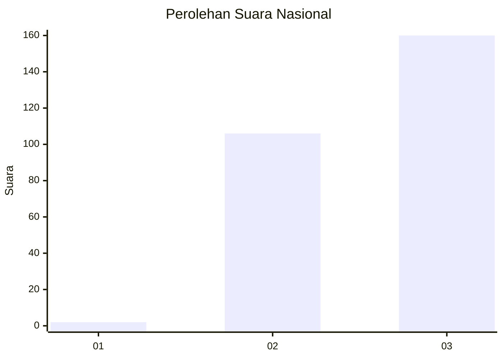
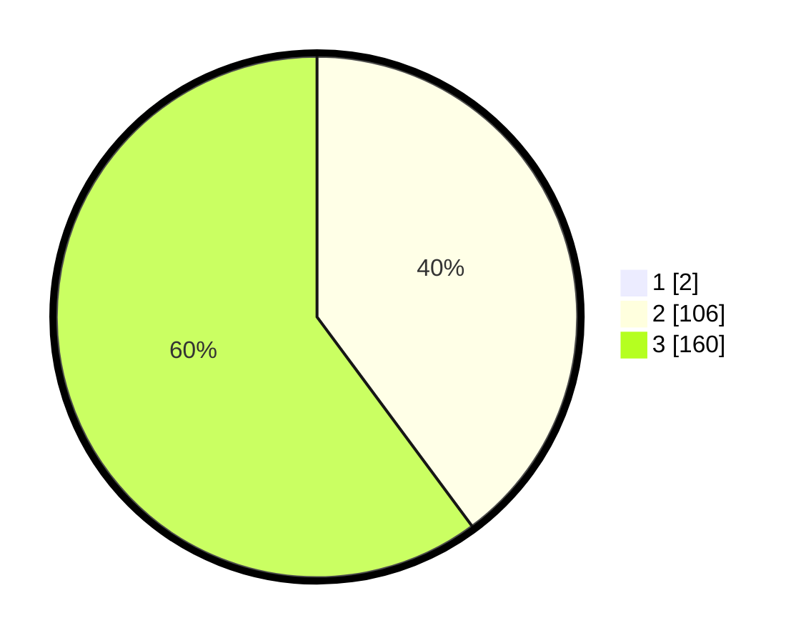

# Hasil

## Grafik

## Tabel

| No. | Nama Paslon    | Suara | Suara (raw) | Persentase |
|:--- |:-------------- | -----:| -----------:| ----------:|
| 1   | ANIES MUHAIMIN | 2     | [2][p-1]    | 0,75       |
| 2   | PRABOWO GIBRAN | 106   | [106][p-2]  | 39,55      |
| 3   | GANJAR MAHFUD  | 160   | [160][p-3]  | 59,70      |

[p-1]: https://github.com/gigit-pemilu/pemilu-2024/blob/main/pilpres/hitung-suara/sub/51-bali/sub/03-badung/sub/06-kuta-utara/sub/1001-kerobokan-kelod/sub/014-tps/sub/paslon-1.txt
[p-2]: https://github.com/gigit-pemilu/pemilu-2024/blob/main/pilpres/hitung-suara/sub/51-bali/sub/03-badung/sub/06-kuta-utara/sub/1001-kerobokan-kelod/sub/014-tps/sub/paslon-2.txt
[p-3]: https://github.com/gigit-pemilu/pemilu-2024/blob/main/pilpres/hitung-suara/sub/51-bali/sub/03-badung/sub/06-kuta-utara/sub/1001-kerobokan-kelod/sub/014-tps/sub/paslon-3.txt

## Foto C Plano

https://sirekap-obj-formc.kpu.go.id/ba3a/pemilu/ppwp/51/03/06/10/01/5103061001014-20240214-191626--3bb4bfd4-9881-407e-a492-c95de6d807ee.jpg

https://sirekap-obj-formc.kpu.go.id/ba3a/pemilu/ppwp/51/03/06/10/01/5103061001014-20240214-200358--cdc9fdaf-54fc-491e-b3d8-6b9d0fe2b453.jpg

https://sirekap-obj-formc.kpu.go.id/ba3a/pemilu/ppwp/51/03/06/10/01/5103061001014-20240214-193535--71e54b82-0141-4485-a2e2-f704e28a0ffc.jpg

## Metadata

| Key        | Value               |
| ---------- | ------------------- |
| Time Stamp | 2024-02-14 21:46:01 |

## DATA PEMILIH TETAP

Jumlah pemilih dalam DPT: **283**.
 * L: **130**.
 * P: **153**.

## DATA PENGGUNA HAK PILIH

Jumlah pengguna hak pilih dalam DPT: **250**.
 * L: **121**.
 * P: **129**.

Jumlah pengguna hak pilih dalam DPTb: **18**.
 * L: **18**.
 * P: **0**.

Jumlah pengguna hak pilih dalam DPK: **3**.
 * L: **0**.
 * P: **3**.

Jumlah pengguna hak pilih: **271**.
 * L: **139**.
 * P: **132**.

## JUMLAH SUARA SAH DAN TIDAK SAH

JUMLAH SELURUH SUARA SAH: **268**.

JUMLAH SUARA TIDAK SAH: **3**.

JUMLAH SELURUH SUARA SAH DAN SUARA TIDAK SAH: **271**.

