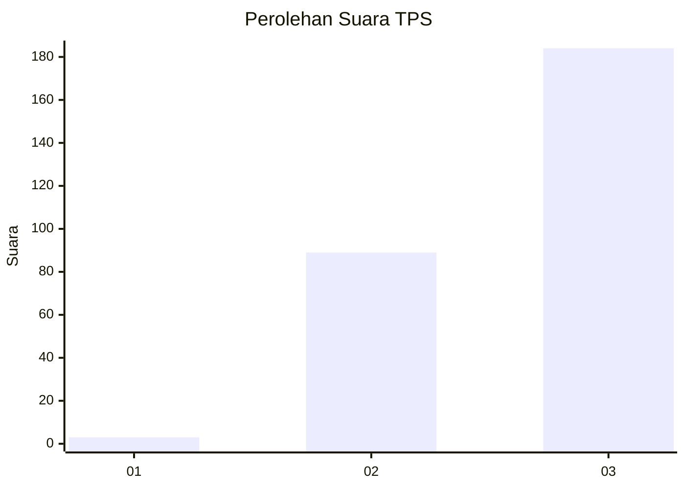
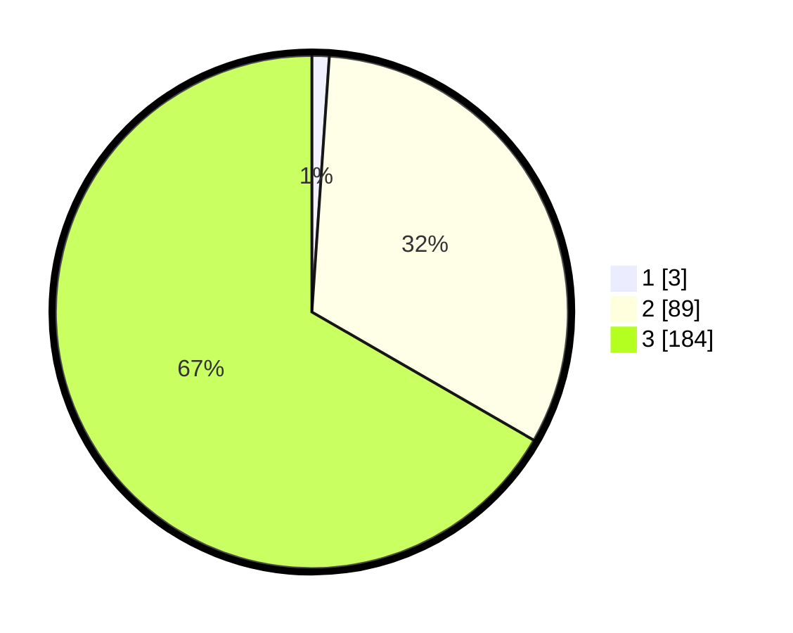

# Hasil

## Grafik

## Tabel

| No. | Nama Paslon    | Suara | Suara (raw) | Persentase |
|:--- |:-------------- | -----:| -----------:| ----------:|
| 1   | ANIES MUHAIMIN | 3     | [3][p-1]    | 1,09       |
| 2   | PRABOWO GIBRAN | 89    | [89][p-2]   | 32,25      |
| 3   | GANJAR MAHFUD  | 184   | [184][p-3]  | 66,67      |

[p-1]: https://github.com/gigit-pemilu/pemilu-2024-51-bali/blob/main/pilpres/hitung-suara/sub/51-bali/sub/03-badung/sub/06-kuta-utara/sub/1001-kerobokan-kelod/sub/015-tps/sub/paslon-1.txt
[p-2]: https://github.com/gigit-pemilu/pemilu-2024-51-bali/blob/main/pilpres/hitung-suara/sub/51-bali/sub/03-badung/sub/06-kuta-utara/sub/1001-kerobokan-kelod/sub/015-tps/sub/paslon-2.txt
[p-3]: https://github.com/gigit-pemilu/pemilu-2024-51-bali/blob/main/pilpres/hitung-suara/sub/51-bali/sub/03-badung/sub/06-kuta-utara/sub/1001-kerobokan-kelod/sub/015-tps/sub/paslon-3.txt

## Foto C Plano

https://sirekap-obj-formc.kpu.go.id/2474/pemilu/ppwp/51/03/06/10/01/5103061001015-20240214-193536--fd66d8e0-46ad-4435-9ab0-d226f7763d1c.jpg

https://sirekap-obj-formc.kpu.go.id/2474/pemilu/ppwp/51/03/06/10/01/5103061001015-20240214-193811--9261e1e9-e90c-4b0c-b5f6-709c6b24d189.jpg

https://sirekap-obj-formc.kpu.go.id/2474/pemilu/ppwp/51/03/06/10/01/5103061001015-20240214-193845--c9614fa6-3394-491b-8551-cd82d35b8189.jpg

## Metadata

| Key        | Value               |
| ---------- | ------------------- |
| Time Stamp | 2024-02-24 22:31:28 |

