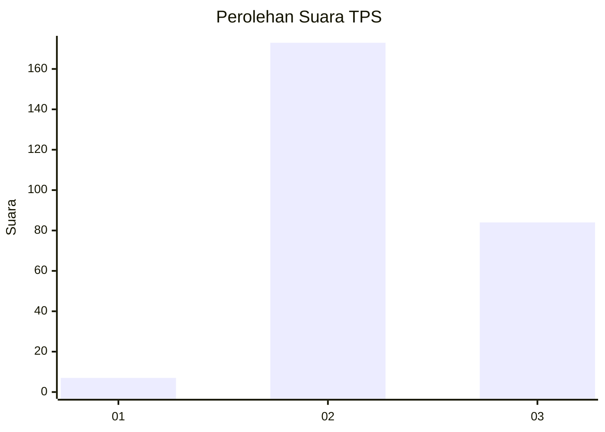
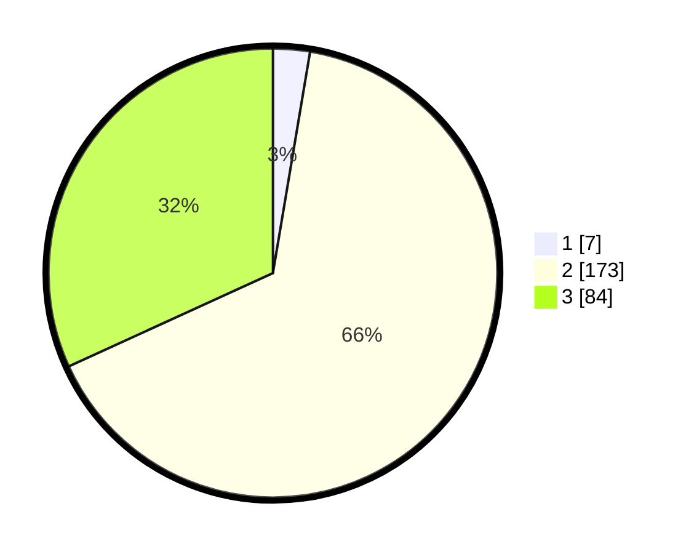

# Hasil

## Grafik

## Tabel

| No. | Nama Paslon    | Suara | Suara (raw) | Persentase |
|:--- |:-------------- | -----:| -----------:| ----------:|
| 1   | ANIES MUHAIMIN | 7     | [7][p-1]    | 2,65       |
| 2   | PRABOWO GIBRAN | 173   | [173][p-2]  | 65,53      |
| 3   | GANJAR MAHFUD  | 84    | [84][p-3]   | 31,82      |

[p-1]: https://github.com/gigit-pemilu/pemilu-2024-51-bali/blob/main/pilpres/hitung-suara/sub/51-bali/sub/03-badung/sub/06-kuta-utara/sub/1001-kerobokan-kelod/sub/017-tps/sub/paslon-1.txt
[p-2]: https://github.com/gigit-pemilu/pemilu-2024-51-bali/blob/main/pilpres/hitung-suara/sub/51-bali/sub/03-badung/sub/06-kuta-utara/sub/1001-kerobokan-kelod/sub/017-tps/sub/paslon-2.txt
[p-3]: https://github.com/gigit-pemilu/pemilu-2024-51-bali/blob/main/pilpres/hitung-suara/sub/51-bali/sub/03-badung/sub/06-kuta-utara/sub/1001-kerobokan-kelod/sub/017-tps/sub/paslon-3.txt

## Foto C Plano

https://sirekap-obj-formc.kpu.go.id/62cb/pemilu/ppwp/51/03/06/10/01/5103061001017-20240218-070853--88692046-b7de-40d9-aa60-8fc03ca13042.jpg

https://sirekap-obj-formc.kpu.go.id/62cb/pemilu/ppwp/51/03/06/10/01/5103061001017-20240218-070956--b6a174a6-9a25-4b50-80d0-49cb29d69dac.jpg

https://sirekap-obj-formc.kpu.go.id/62cb/pemilu/ppwp/51/03/06/10/01/5103061001017-20240218-071039--d79c6863-f41a-496b-8864-92a08904d45a.jpg

## Metadata

| Key        | Value               |
| ---------- | ------------------- |
| Time Stamp | 2024-02-24 22:31:28 |

