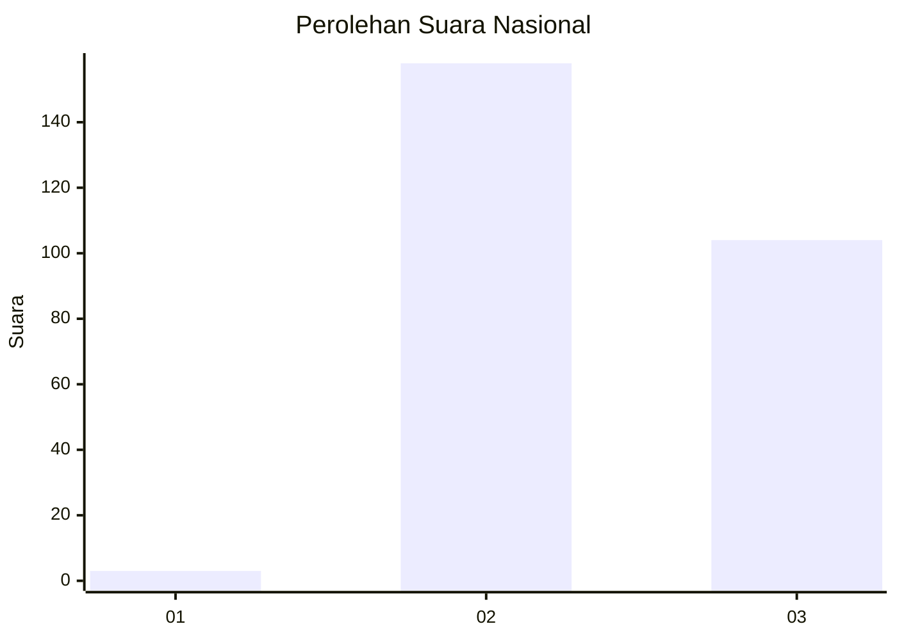
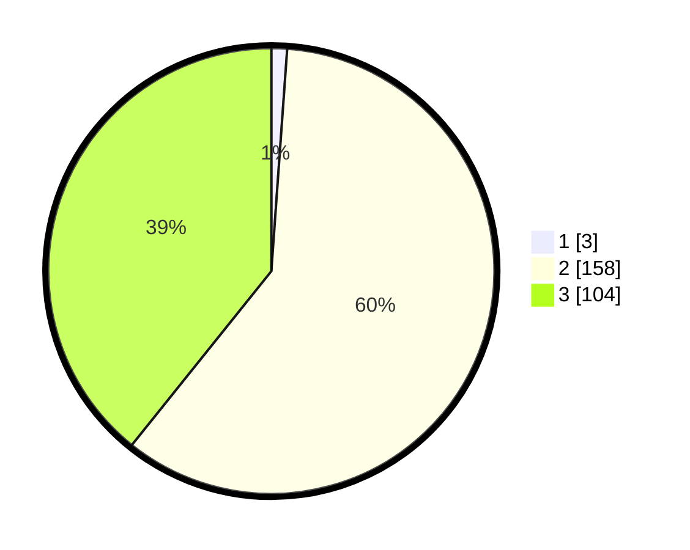

# Hasil

## Grafik

## Tabel

| No. | Nama Paslon    | Suara | Suara (raw) | Persentase |
|:--- |:-------------- | -----:| -----------:| ----------:|
| 1   | ANIES MUHAIMIN | 3     | [3][p-1]    | 1,13       |
| 2   | PRABOWO GIBRAN | 158   | [158][p-2]  | 59,62      |
| 3   | GANJAR MAHFUD  | 104   | [104][p-3]  | 39,25      |

[p-1]: https://github.com/gigit-pemilu/pemilu-2024/blob/main/pilpres/hitung-suara/sub/51-bali/sub/03-badung/sub/06-kuta-utara/sub/1001-kerobokan-kelod/sub/018-tps/sub/paslon-1.txt
[p-2]: https://github.com/gigit-pemilu/pemilu-2024/blob/main/pilpres/hitung-suara/sub/51-bali/sub/03-badung/sub/06-kuta-utara/sub/1001-kerobokan-kelod/sub/018-tps/sub/paslon-2.txt
[p-3]: https://github.com/gigit-pemilu/pemilu-2024/blob/main/pilpres/hitung-suara/sub/51-bali/sub/03-badung/sub/06-kuta-utara/sub/1001-kerobokan-kelod/sub/018-tps/sub/paslon-3.txt

## Foto C Plano

https://sirekap-obj-formc.kpu.go.id/943d/pemilu/ppwp/51/03/06/10/01/5103061001018-20240214-212202--a1a44b86-aa20-4471-9a49-3f237b7202f9.jpg

https://sirekap-obj-formc.kpu.go.id/943d/pemilu/ppwp/51/03/06/10/01/5103061001018-20240214-212446--c72f3184-e269-4646-8ada-d9b1c06d06a4.jpg

https://sirekap-obj-formc.kpu.go.id/943d/pemilu/ppwp/51/03/06/10/01/5103061001018-20240214-212631--4051b806-145f-41be-9b54-22766af7a61d.jpg

## Metadata

| Key        | Value               |
| ---------- | ------------------- |
| Time Stamp | 2024-02-16 01:00:27 |

## DATA PEMILIH TETAP

Jumlah pemilih dalam DPT: **297**.
 * L: **139**.
 * P: **158**.

## DATA PENGGUNA HAK PILIH

Jumlah pengguna hak pilih dalam DPT: **251**.
 * L: **118**.
 * P: **133**.

Jumlah pengguna hak pilih dalam DPTb: **14**.
 * L: **13**.
 * P: **1**.

Jumlah pengguna hak pilih dalam DPK: **4**.
 * L: **2**.
 * P: **2**.

Jumlah pengguna hak pilih: **269**.
 * L: **133**.
 * P: **136**.

## JUMLAH SUARA SAH DAN TIDAK SAH

JUMLAH SELURUH SUARA SAH: **265**.

JUMLAH SUARA TIDAK SAH: **4**.

JUMLAH SELURUH SUARA SAH DAN SUARA TIDAK SAH: **269**.

