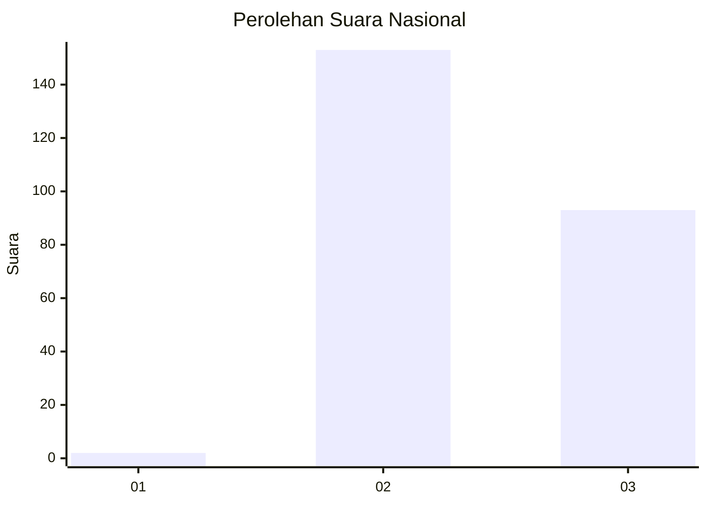
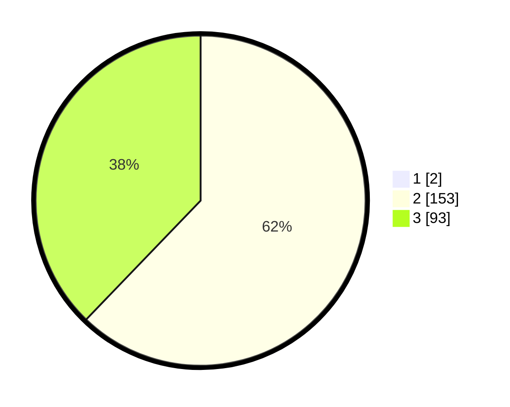

# Hasil

## Grafik

## Tabel

| No. | Nama Paslon    | Suara | Suara (raw) | Persentase |
|:--- |:-------------- | -----:| -----------:| ----------:|
| 1   | ANIES MUHAIMIN | 2     | [2][p-1]    | 0,81       |
| 2   | PRABOWO GIBRAN | 153   | [153][p-2]  | 61,69      |
| 3   | GANJAR MAHFUD  | 93    | [93][p-3]   | 37,50      |

[p-1]: https://github.com/gigit-pemilu/pemilu-2024/blob/main/pilpres/hitung-suara/sub/51-bali/sub/03-badung/sub/06-kuta-utara/sub/1001-kerobokan-kelod/sub/019-tps/sub/paslon-1.txt
[p-2]: https://github.com/gigit-pemilu/pemilu-2024/blob/main/pilpres/hitung-suara/sub/51-bali/sub/03-badung/sub/06-kuta-utara/sub/1001-kerobokan-kelod/sub/019-tps/sub/paslon-2.txt
[p-3]: https://github.com/gigit-pemilu/pemilu-2024/blob/main/pilpres/hitung-suara/sub/51-bali/sub/03-badung/sub/06-kuta-utara/sub/1001-kerobokan-kelod/sub/019-tps/sub/paslon-3.txt

## Foto C Plano

https://sirekap-obj-formc.kpu.go.id/f328/pemilu/ppwp/51/03/06/10/01/5103061001019-20240214-160055--f308d1e4-77df-4ce3-847b-0805e7253593.jpg

https://sirekap-obj-formc.kpu.go.id/f328/pemilu/ppwp/51/03/06/10/01/5103061001019-20240216-005502--c96c90f2-967c-4af1-a4be-9da3d4a10651.jpg

https://sirekap-obj-formc.kpu.go.id/f328/pemilu/ppwp/51/03/06/10/01/5103061001019-20240214-160122--92ba9546-2ed4-40e9-870e-15ac93f561b2.jpg

## Metadata

| Key        | Value               |
| ---------- | ------------------- |
| Time Stamp | 2024-02-16 01:00:27 |

## DATA PEMILIH TETAP

Jumlah pemilih dalam DPT: **293**.
 * L: **141**.
 * P: **152**.

## DATA PENGGUNA HAK PILIH

Jumlah pengguna hak pilih dalam DPT: **242**.
 * L: **116**.
 * P: **126**.

Jumlah pengguna hak pilih dalam DPTb: **13**.
 * L: **12**.
 * P: **1**.

Jumlah pengguna hak pilih dalam DPK: **2**.
 * L: **2**.
 * P: **0**.

Jumlah pengguna hak pilih: **257**.
 * L: **130**.
 * P: **127**.

## JUMLAH SUARA SAH DAN TIDAK SAH

JUMLAH SELURUH SUARA SAH: **248**.

JUMLAH SUARA TIDAK SAH: **9**.

JUMLAH SELURUH SUARA SAH DAN SUARA TIDAK SAH: **257**.

