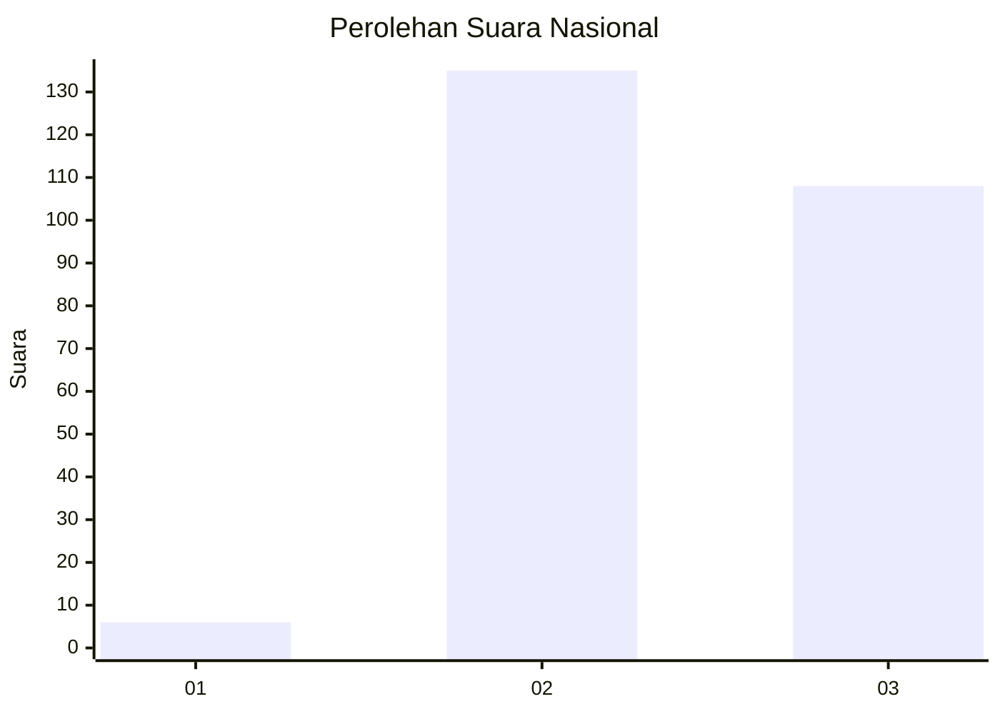
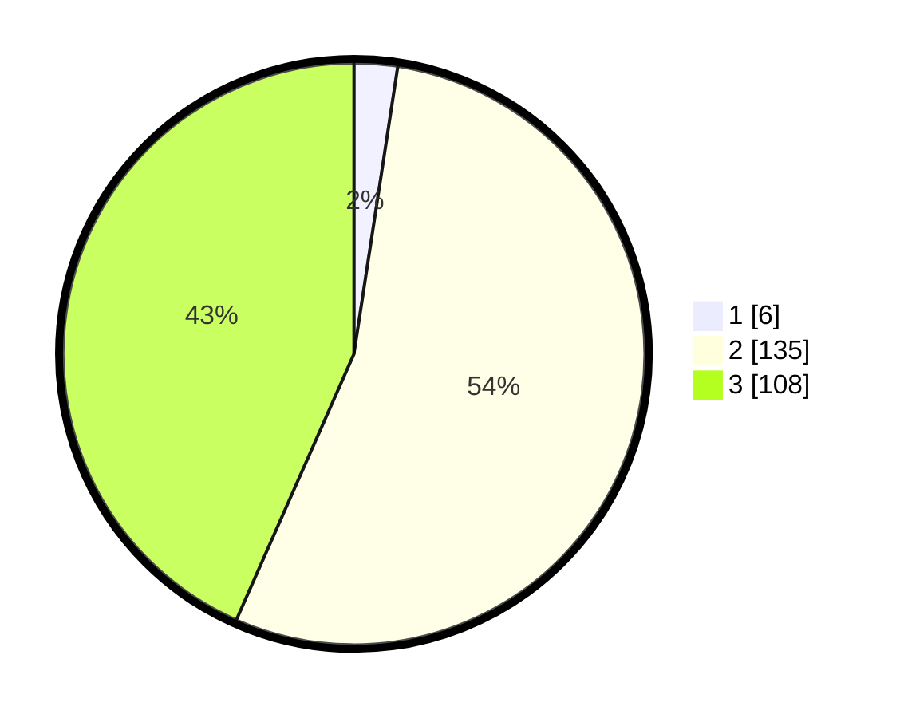

# Hasil

## Grafik

## Tabel

| No. | Nama Paslon    | Suara | Suara (raw) | Persentase |
|:--- |:-------------- | -----:| -----------:| ----------:|
| 1   | ANIES MUHAIMIN | 6     | [6][p-1]    | 2,41       |
| 2   | PRABOWO GIBRAN | 135   | [135][p-2]  | 54,22      |
| 3   | GANJAR MAHFUD  | 108   | [108][p-3]  | 43,37      |

[p-1]: https://github.com/gigit-pemilu/pemilu-2024/blob/main/pilpres/hitung-suara/sub/51-bali/sub/03-badung/sub/06-kuta-utara/sub/1001-kerobokan-kelod/sub/020-tps/sub/paslon-1.txt
[p-2]: https://github.com/gigit-pemilu/pemilu-2024/blob/main/pilpres/hitung-suara/sub/51-bali/sub/03-badung/sub/06-kuta-utara/sub/1001-kerobokan-kelod/sub/020-tps/sub/paslon-2.txt
[p-3]: https://github.com/gigit-pemilu/pemilu-2024/blob/main/pilpres/hitung-suara/sub/51-bali/sub/03-badung/sub/06-kuta-utara/sub/1001-kerobokan-kelod/sub/020-tps/sub/paslon-3.txt

## Foto C Plano

https://sirekap-obj-formc.kpu.go.id/ad14/pemilu/ppwp/51/03/06/10/01/5103061001020-20240217-071938--7b1f158c-7789-4077-b426-abe63d4b9467.jpg

https://sirekap-obj-formc.kpu.go.id/ad14/pemilu/ppwp/51/03/06/10/01/5103061001020-20240217-072124--f7b05b90-d853-40e7-a86f-2d40a4aa0398.jpg

https://sirekap-obj-formc.kpu.go.id/ad14/pemilu/ppwp/51/03/06/10/01/5103061001020-20240217-072205--307e218c-9a3d-467d-bb87-f6dbea01f604.jpg

## Metadata

| Key        | Value               |
| ---------- | ------------------- |
| Time Stamp | 2024-02-25 01:00:00 |

## DATA PEMILIH TETAP

Jumlah pemilih dalam DPT: **292**.
 * L: **638**.
 * P: **154**.

## DATA PENGGUNA HAK PILIH

Jumlah pengguna hak pilih dalam DPT: **238**.
 * L: **114**.
 * P: **124**.

Jumlah pengguna hak pilih dalam DPTb: **15**.
 * L: **9**.
 * P: **6**.

Jumlah pengguna hak pilih dalam DPK: **0**.
 * L: **0**.
 * P: **0**.

Jumlah pengguna hak pilih: **253**.
 * L: **133**.
 * P: **130**.

## JUMLAH SUARA SAH DAN TIDAK SAH

JUMLAH SELURUH SUARA SAH: **249**.

JUMLAH SUARA TIDAK SAH: **4**.

JUMLAH SELURUH SUARA SAH DAN SUARA TIDAK SAH: **253**.

