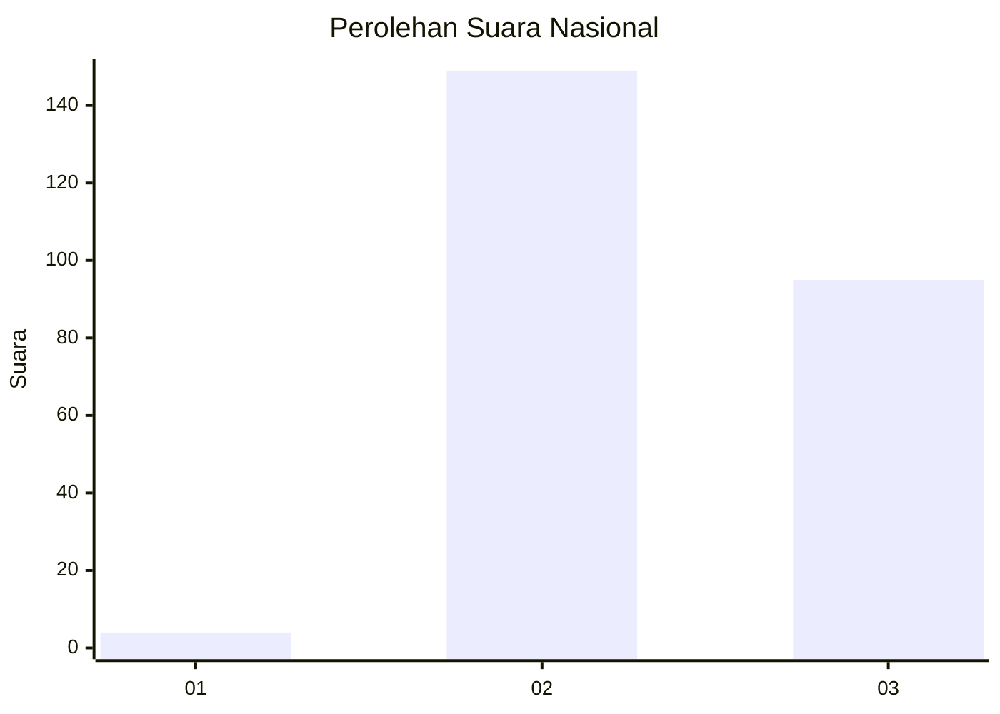
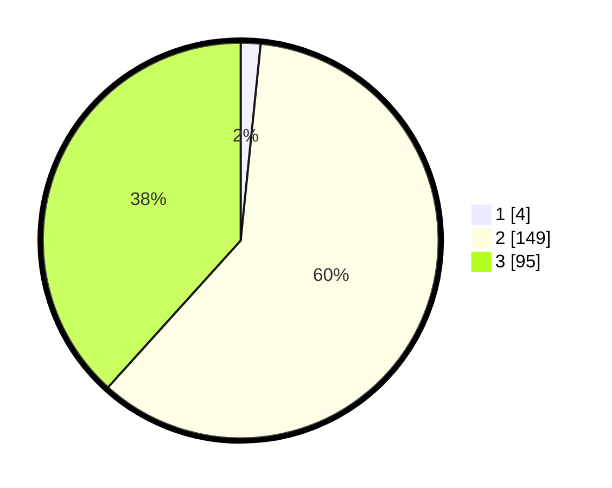

# Hasil

## Grafik

## Tabel

| No. | Nama Paslon    | Suara | Suara (raw) | Persentase |
|:--- |:-------------- | -----:| -----------:| ----------:|
| 1   | ANIES MUHAIMIN | 4     | [4][p-1]    | 1,61       |
| 2   | PRABOWO GIBRAN | 149   | [149][p-2]  | 60,08      |
| 3   | GANJAR MAHFUD  | 95    | [95][p-3]   | 38,31      |

[p-1]: https://github.com/gigit-pemilu/pemilu-2024/blob/main/pilpres/hitung-suara/sub/51-bali/sub/03-badung/sub/06-kuta-utara/sub/1001-kerobokan-kelod/sub/021-tps/sub/paslon-1.txt
[p-2]: https://github.com/gigit-pemilu/pemilu-2024/blob/main/pilpres/hitung-suara/sub/51-bali/sub/03-badung/sub/06-kuta-utara/sub/1001-kerobokan-kelod/sub/021-tps/sub/paslon-2.txt
[p-3]: https://github.com/gigit-pemilu/pemilu-2024/blob/main/pilpres/hitung-suara/sub/51-bali/sub/03-badung/sub/06-kuta-utara/sub/1001-kerobokan-kelod/sub/021-tps/sub/paslon-3.txt

## Foto C Plano

https://sirekap-obj-formc.kpu.go.id/ed06/pemilu/ppwp/51/03/06/10/01/5103061001021-20240218-120035--31a90332-2308-4406-a884-56fc0a03b904.jpg

https://sirekap-obj-formc.kpu.go.id/ed06/pemilu/ppwp/51/03/06/10/01/5103061001021-20240214-203923--f37ca70e-2231-4548-84a7-7406c81fdaba.jpg

https://sirekap-obj-formc.kpu.go.id/ed06/pemilu/ppwp/51/03/06/10/01/5103061001021-20240214-204028--985c2696-69b4-4151-8a9c-f029d91cdf31.jpg

## Metadata

| Key        | Value               |
| ---------- | ------------------- |
| Time Stamp | 2024-02-19 06:16:00 |

