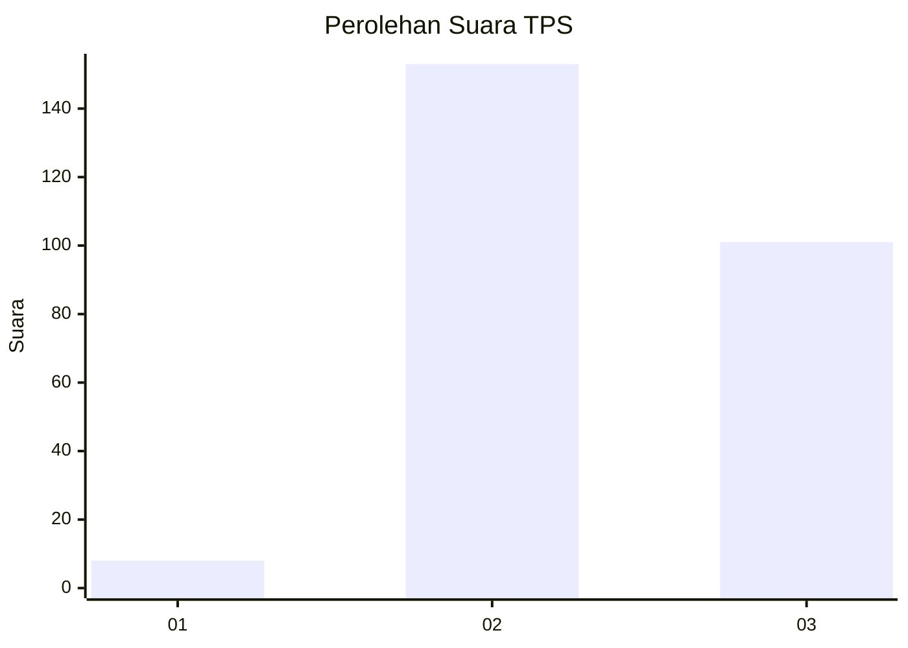
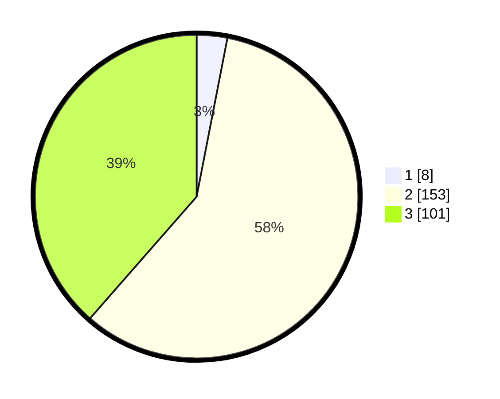

# Hasil

## Grafik

## Tabel

| No. | Nama Paslon    | Suara | Suara (raw) | Persentase |
|:--- |:-------------- | -----:| -----------:| ----------:|
| 1   | ANIES MUHAIMIN | 8     | [8][p-1]    | 3,05       |
| 2   | PRABOWO GIBRAN | 153   | [153][p-2]  | 58,40      |
| 3   | GANJAR MAHFUD  | 101   | [101][p-3]  | 38,55      |

[p-1]: https://github.com/gigit-pemilu/pemilu-2024-51-bali/blob/main/pilpres/hitung-suara/sub/51-bali/sub/03-badung/sub/06-kuta-utara/sub/1001-kerobokan-kelod/sub/022-tps/sub/paslon-1.txt
[p-2]: https://github.com/gigit-pemilu/pemilu-2024-51-bali/blob/main/pilpres/hitung-suara/sub/51-bali/sub/03-badung/sub/06-kuta-utara/sub/1001-kerobokan-kelod/sub/022-tps/sub/paslon-2.txt
[p-3]: https://github.com/gigit-pemilu/pemilu-2024-51-bali/blob/main/pilpres/hitung-suara/sub/51-bali/sub/03-badung/sub/06-kuta-utara/sub/1001-kerobokan-kelod/sub/022-tps/sub/paslon-3.txt

## Foto C Plano

https://sirekap-obj-formc.kpu.go.id/e2e5/pemilu/ppwp/51/03/06/10/01/5103061001022-20240214-205117--23fd22ea-c748-4abb-97fa-84bdd7c3c406.jpg

https://sirekap-obj-formc.kpu.go.id/e2e5/pemilu/ppwp/51/03/06/10/01/5103061001022-20240214-205241--69c6483a-7f48-40aa-aa4d-a855f6f52985.jpg

https://sirekap-obj-formc.kpu.go.id/e2e5/pemilu/ppwp/51/03/06/10/01/5103061001022-20240214-205425--81a650b3-db91-402b-a21c-8bf01a866b14.jpg

## Metadata

| Key        | Value               |
| ---------- | ------------------- |
| Time Stamp | 2024-02-15 00:41:44 |

## DATA PEMILIH TETAP

Jumlah pemilih dalam DPT: **294**.
 * L: **134**.
 * P: **160**.

## DATA PENGGUNA HAK PILIH

Jumlah pengguna hak pilih dalam DPT: **246**.
 * L: **121**.
 * P: **125**.

Jumlah pengguna hak pilih dalam DPTb: **15**.
 * L: **15**.
 * P: **0**.

Jumlah pengguna hak pilih dalam DPK: **3**.
 * L: **2**.
 * P: **1**.

Jumlah pengguna hak pilih: **264**.
 * L: **138**.
 * P: **126**.

## JUMLAH SUARA SAH DAN TIDAK SAH

JUMLAH SELURUH SUARA SAH: **262**.

JUMLAH SUARA TIDAK SAH: **2**.

JUMLAH SELURUH SUARA SAH DAN SUARA TIDAK SAH: **264**.

