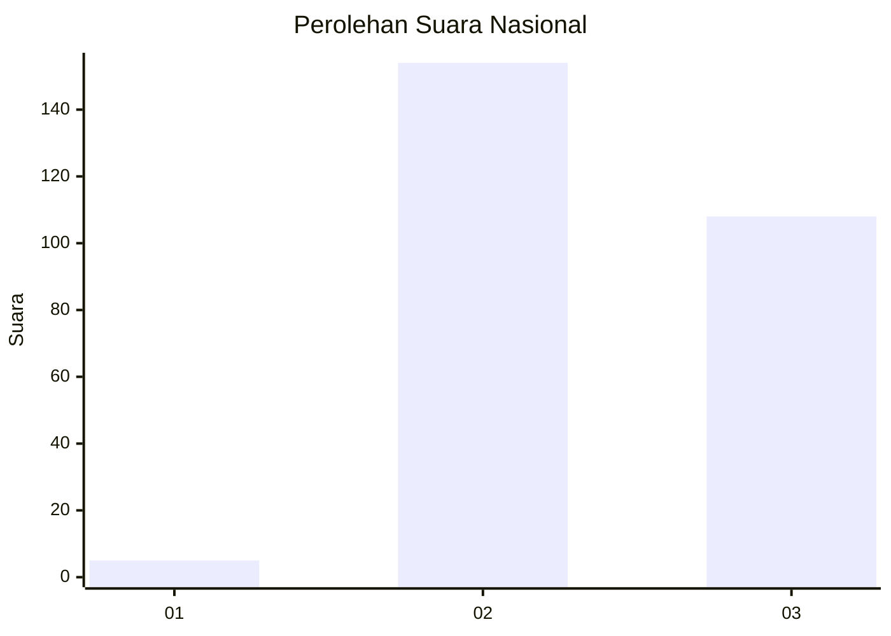
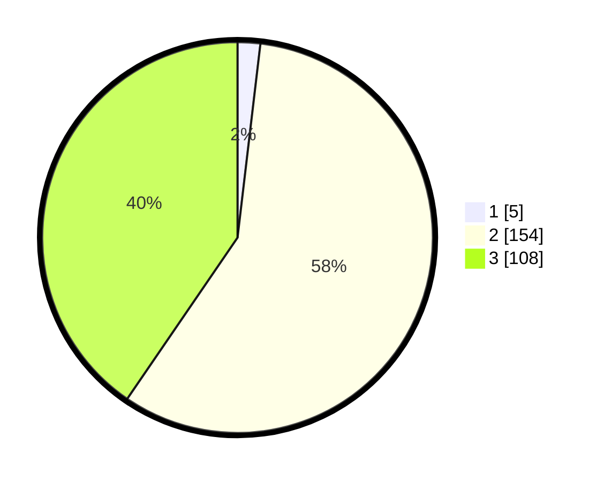

# Hasil

## Grafik

## Tabel

| No. | Nama Paslon    | Suara | Suara (raw) | Persentase |
|:--- |:-------------- | -----:| -----------:| ----------:|
| 1   | ANIES MUHAIMIN | 5     | [5][p-1]    | 1,87       |
| 2   | PRABOWO GIBRAN | 154   | [154][p-2]  | 57,68      |
| 3   | GANJAR MAHFUD  | 108   | [108][p-3]  | 40,45      |

[p-1]: https://github.com/gigit-pemilu/pemilu-2024/blob/main/pilpres/hitung-suara/sub/51-bali/sub/03-badung/sub/06-kuta-utara/sub/1001-kerobokan-kelod/sub/023-tps/sub/paslon-1.txt
[p-2]: https://github.com/gigit-pemilu/pemilu-2024/blob/main/pilpres/hitung-suara/sub/51-bali/sub/03-badung/sub/06-kuta-utara/sub/1001-kerobokan-kelod/sub/023-tps/sub/paslon-2.txt
[p-3]: https://github.com/gigit-pemilu/pemilu-2024/blob/main/pilpres/hitung-suara/sub/51-bali/sub/03-badung/sub/06-kuta-utara/sub/1001-kerobokan-kelod/sub/023-tps/sub/paslon-3.txt

## Foto C Plano

https://sirekap-obj-formc.kpu.go.id/6275/pemilu/ppwp/51/03/06/10/01/5103061001023-20240216-002317--1aa3c7d4-e017-4ff1-ad70-890eb2c0091f.jpg

https://sirekap-obj-formc.kpu.go.id/6275/pemilu/ppwp/51/03/06/10/01/5103061001023-20240215-000805--0151ffcb-9f19-46cc-ab89-3a091a7dbfeb.jpg

https://sirekap-obj-formc.kpu.go.id/6275/pemilu/ppwp/51/03/06/10/01/5103061001023-20240215-000844--c7a77356-cd6f-46ab-96c8-3bc1934ebc26.jpg

## Metadata

| Key        | Value               |
| ---------- | ------------------- |
| Time Stamp | 2024-02-25 12:00:00 |

