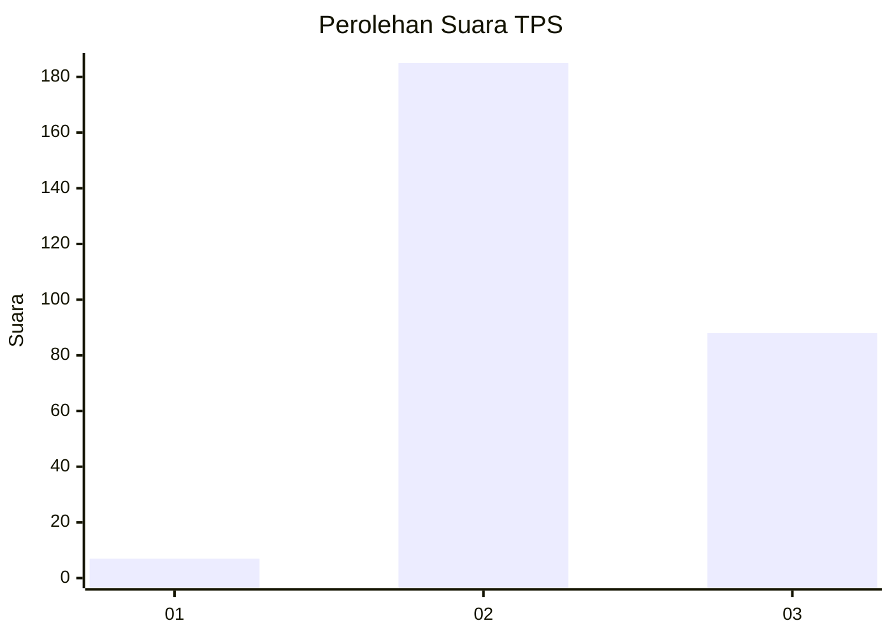
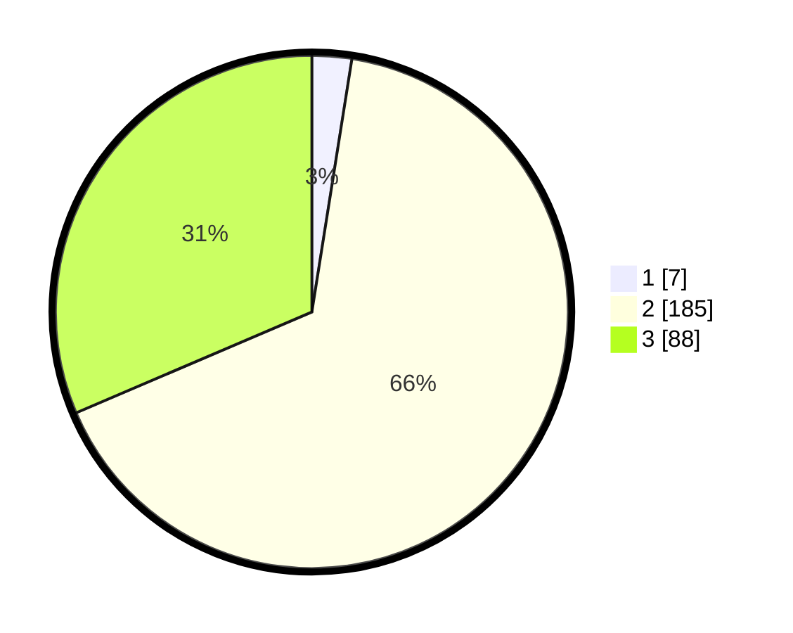

# Hasil

## Grafik

## Tabel

| No. | Nama Paslon    | Suara | Suara (raw) | Persentase |
|:--- |:-------------- | -----:| -----------:| ----------:|
| 1   | ANIES MUHAIMIN | 7     | [7][p-1]    | 2,50       |
| 2   | PRABOWO GIBRAN | 185   | [185][p-2]  | 66,07      |
| 3   | GANJAR MAHFUD  | 88    | [88][p-3]   | 31,43      |

[p-1]: https://github.com/gigit-pemilu/pemilu-2024-51-bali/blob/main/pilpres/hitung-suara/sub/51-bali/sub/03-badung/sub/06-kuta-utara/sub/1001-kerobokan-kelod/sub/024-tps/sub/paslon-1.txt
[p-2]: https://github.com/gigit-pemilu/pemilu-2024-51-bali/blob/main/pilpres/hitung-suara/sub/51-bali/sub/03-badung/sub/06-kuta-utara/sub/1001-kerobokan-kelod/sub/024-tps/sub/paslon-2.txt
[p-3]: https://github.com/gigit-pemilu/pemilu-2024-51-bali/blob/main/pilpres/hitung-suara/sub/51-bali/sub/03-badung/sub/06-kuta-utara/sub/1001-kerobokan-kelod/sub/024-tps/sub/paslon-3.txt

## Foto C Plano

https://sirekap-obj-formc.kpu.go.id/1b2c/pemilu/ppwp/51/03/06/10/01/5103061001024-20240214-211950--96b895b3-9a22-446d-b99a-7e21a44acf84.jpg

https://sirekap-obj-formc.kpu.go.id/1b2c/pemilu/ppwp/51/03/06/10/01/5103061001024-20240214-212136--84ed249c-623e-4a8b-8842-d31185892352.jpg

https://sirekap-obj-formc.kpu.go.id/1b2c/pemilu/ppwp/51/03/06/10/01/5103061001024-20240214-212312--39282733-499e-431d-bfb4-ab071a7d52e6.jpg

## Metadata

| Key        | Value               |
| ---------- | ------------------- |
| Time Stamp | 2024-02-24 22:31:28 |

## DATA PEMILIH TETAP

Jumlah pemilih dalam DPT: **291**.
 * L: **139**.
 * P: **152**.

## DATA PENGGUNA HAK PILIH

Jumlah pengguna hak pilih dalam DPT: **255**.
 * L: **123**.
 * P: **132**.

Jumlah pengguna hak pilih dalam DPTb: **16**.
 * L: **15**.
 * P: **1**.

Jumlah pengguna hak pilih dalam DPK: **15**.
 * L: **5**.
 * P: **10**.

Jumlah pengguna hak pilih: **286**.
 * L: **143**.
 * P: **143**.

## JUMLAH SUARA SAH DAN TIDAK SAH

JUMLAH SELURUH SUARA SAH: **280**.

JUMLAH SUARA TIDAK SAH: **6**.

JUMLAH SELURUH SUARA SAH DAN SUARA TIDAK SAH: **286**.

