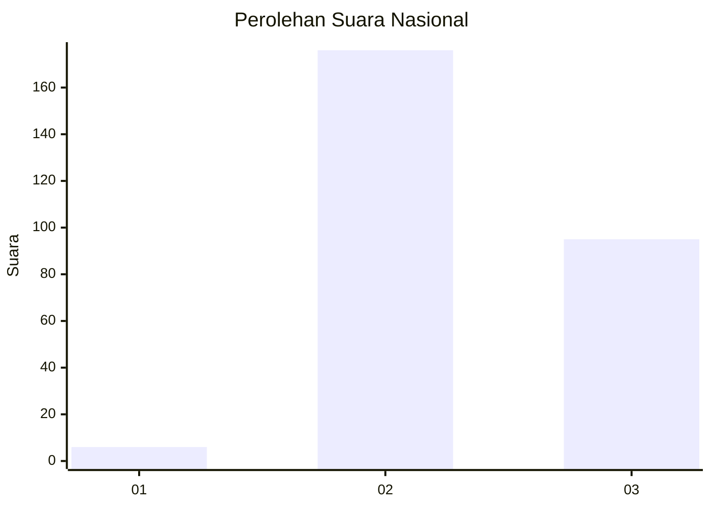
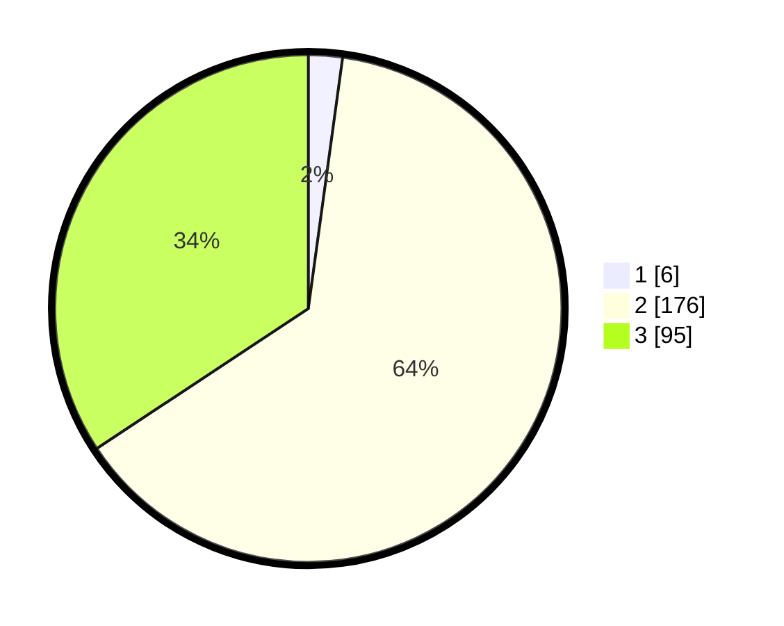

# Hasil

## Grafik

## Tabel

| No. | Nama Paslon    | Suara | Suara (raw) | Persentase |
|:--- |:-------------- | -----:| -----------:| ----------:|
| 1   | ANIES MUHAIMIN | 6     | [6][p-1]    | 2,17       |
| 2   | PRABOWO GIBRAN | 176   | [176][p-2]  | 63,54      |
| 3   | GANJAR MAHFUD  | 95    | [95][p-3]   | 34,30      |

[p-1]: https://github.com/gigit-pemilu/pemilu-2024/blob/main/pilpres/hitung-suara/sub/51-bali/sub/03-badung/sub/06-kuta-utara/sub/1001-kerobokan-kelod/sub/025-tps/sub/paslon-1.txt
[p-2]: https://github.com/gigit-pemilu/pemilu-2024/blob/main/pilpres/hitung-suara/sub/51-bali/sub/03-badung/sub/06-kuta-utara/sub/1001-kerobokan-kelod/sub/025-tps/sub/paslon-2.txt
[p-3]: https://github.com/gigit-pemilu/pemilu-2024/blob/main/pilpres/hitung-suara/sub/51-bali/sub/03-badung/sub/06-kuta-utara/sub/1001-kerobokan-kelod/sub/025-tps/sub/paslon-3.txt

## Foto C Plano

https://sirekap-obj-formc.kpu.go.id/cab5/pemilu/ppwp/51/03/06/10/01/5103061001025-20240215-213216--43d8bd11-17b5-465e-bb41-2d8853004b8e.jpg

https://sirekap-obj-formc.kpu.go.id/cab5/pemilu/ppwp/51/03/06/10/01/5103061001025-20240215-213218--d6e3d586-993c-4221-b242-ffb1aabfc040.jpg

https://sirekap-obj-formc.kpu.go.id/cab5/pemilu/ppwp/51/03/06/10/01/5103061001025-20240215-213216--35c56285-8b7f-431c-a694-514100c537f9.jpg

## Metadata

| Key        | Value               |
| ---------- | ------------------- |
| Time Stamp | 2024-02-21 21:00:04 |

## DATA PEMILIH TETAP

Jumlah pemilih dalam DPT: **281**.
 * L: **138**.
 * P: **143**.

## DATA PENGGUNA HAK PILIH

Jumlah pengguna hak pilih dalam DPT: **262**.
 * L: **128**.
 * P: **134**.

Jumlah pengguna hak pilih dalam DPTb: **14**.
 * L: **13**.
 * P: **1**.

Jumlah pengguna hak pilih dalam DPK: **3**.
 * L: **1**.
 * P: **2**.

Jumlah pengguna hak pilih: **279**.
 * L: **142**.
 * P: **137**.

## JUMLAH SUARA SAH DAN TIDAK SAH

JUMLAH SELURUH SUARA SAH: **277**.

JUMLAH SUARA TIDAK SAH: **2**.

JUMLAH SELURUH SUARA SAH DAN SUARA TIDAK SAH: **279**.

