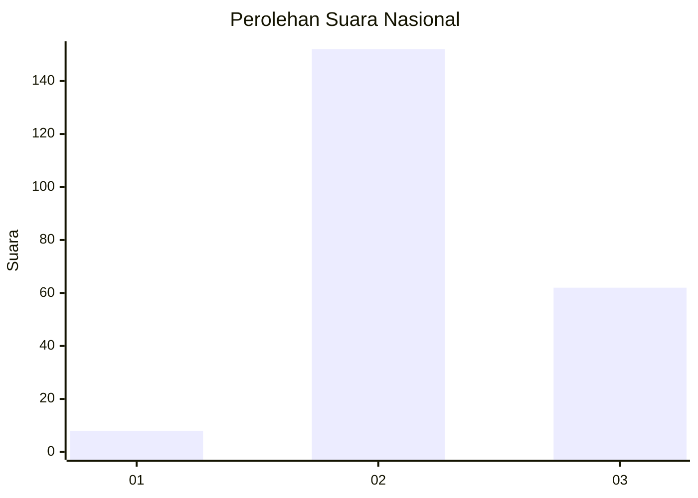
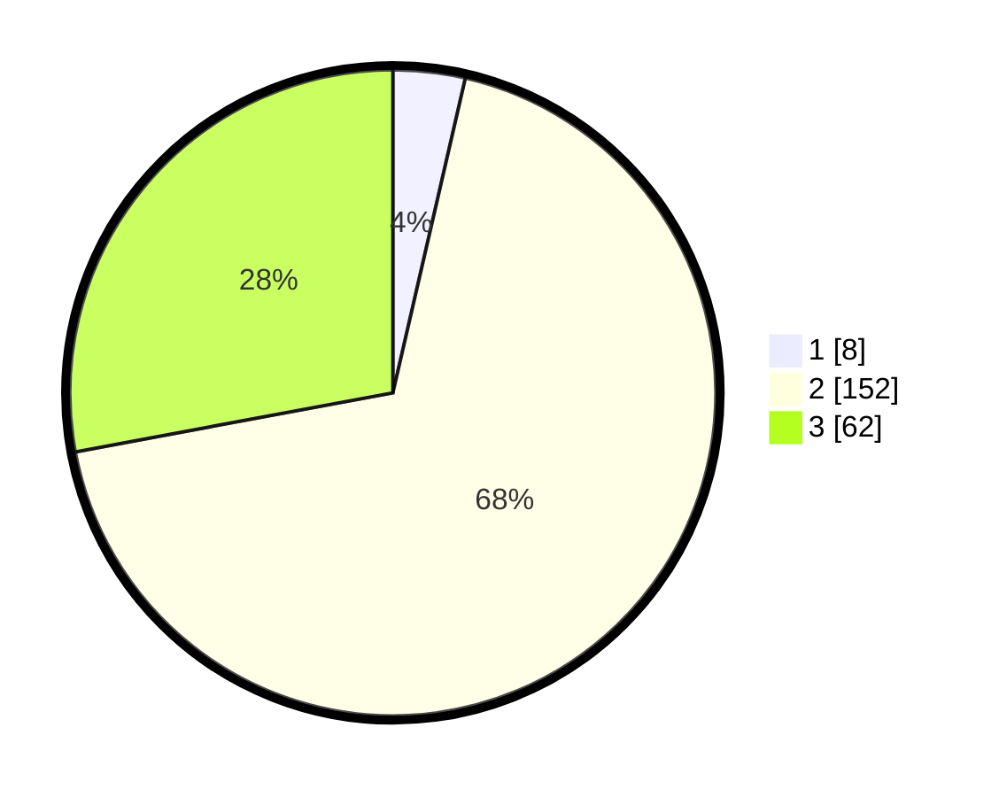

# Hasil

## Grafik

## Tabel

| No. | Nama Paslon    | Suara | Suara (raw) | Persentase |
|:--- |:-------------- | -----:| -----------:| ----------:|
| 1   | ANIES MUHAIMIN | 8     | [8][p-1]    | 3,60       |
| 2   | PRABOWO GIBRAN | 152   | [152][p-2]  | 68,47      |
| 3   | GANJAR MAHFUD  | 62    | [62][p-3]   | 27,93      |

[p-1]: https://github.com/gigit-pemilu/pemilu-2024/blob/main/pilpres/hitung-suara/sub/51-bali/sub/03-badung/sub/06-kuta-utara/sub/1001-kerobokan-kelod/sub/028-tps/sub/paslon-1.txt
[p-2]: https://github.com/gigit-pemilu/pemilu-2024/blob/main/pilpres/hitung-suara/sub/51-bali/sub/03-badung/sub/06-kuta-utara/sub/1001-kerobokan-kelod/sub/028-tps/sub/paslon-2.txt
[p-3]: https://github.com/gigit-pemilu/pemilu-2024/blob/main/pilpres/hitung-suara/sub/51-bali/sub/03-badung/sub/06-kuta-utara/sub/1001-kerobokan-kelod/sub/028-tps/sub/paslon-3.txt

## Foto C Plano

https://sirekap-obj-formc.kpu.go.id/15e4/pemilu/ppwp/51/03/06/10/01/5103061001028-20240216-175817--bcc11ac8-9a90-4c5a-80c1-774954e56d40.jpg

https://sirekap-obj-formc.kpu.go.id/15e4/pemilu/ppwp/51/03/06/10/01/5103061001028-20240216-175819--c1b541de-4953-482f-b5d7-8446e271b1d4.jpg

https://sirekap-obj-formc.kpu.go.id/15e4/pemilu/ppwp/51/03/06/10/01/5103061001028-20240216-175818--ef3a9592-8dc1-42c7-85bf-e6e6bab20532.jpg

## Metadata

| Key        | Value               |
| ---------- | ------------------- |
| Time Stamp | 2024-02-21 12:00:00 |

## DATA PEMILIH TETAP

Jumlah pemilih dalam DPT: **270**.
 * L: **135**.
 * P: **135**.

## DATA PENGGUNA HAK PILIH

Jumlah pengguna hak pilih dalam DPT: **203**.
 * L: **96**.
 * P: **107**.

Jumlah pengguna hak pilih dalam DPTb: **15**.
 * L: **13**.
 * P: **2**.

Jumlah pengguna hak pilih dalam DPK: **7**.
 * L: **6**.
 * P: **1**.

Jumlah pengguna hak pilih: **225**.
 * L: **115**.
 * P: **110**.

## JUMLAH SUARA SAH DAN TIDAK SAH

JUMLAH SELURUH SUARA SAH: **222**.

JUMLAH SUARA TIDAK SAH: **3**.

JUMLAH SELURUH SUARA SAH DAN SUARA TIDAK SAH: **225**.

