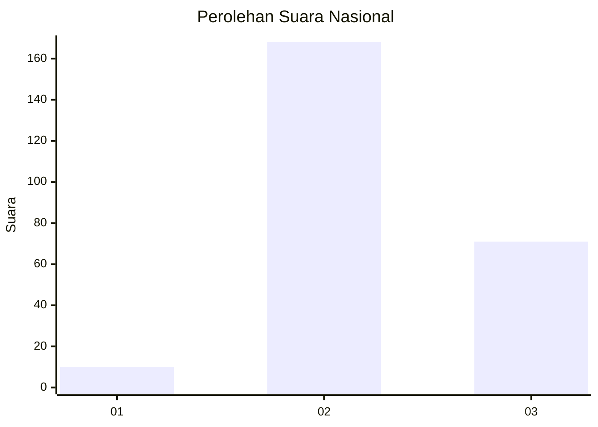
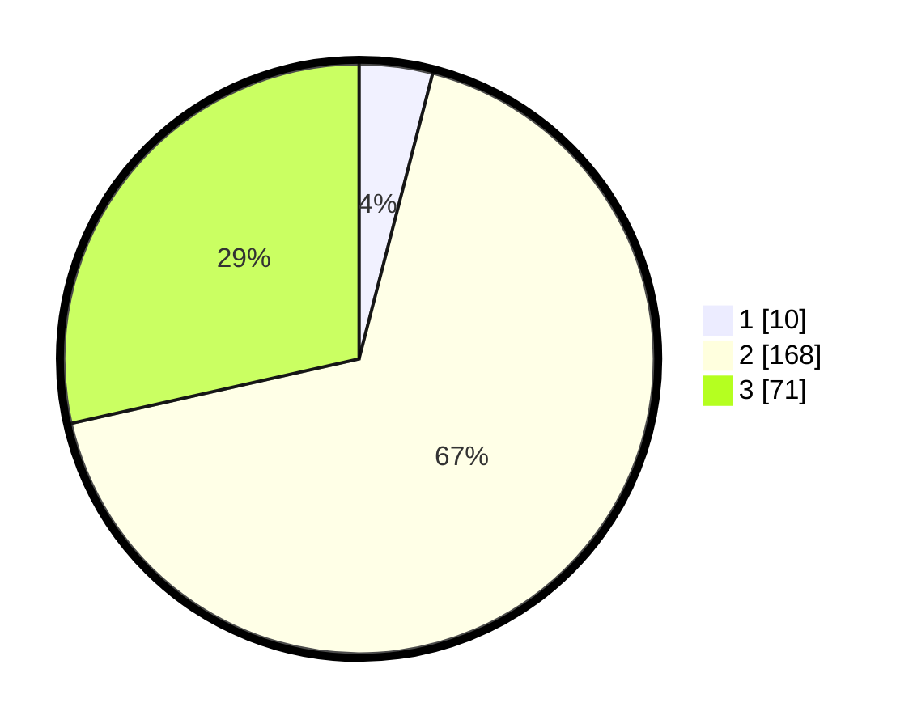

# Hasil

## Grafik

## Tabel

| No. | Nama Paslon    | Suara | Suara (raw) | Persentase |
|:--- |:-------------- | -----:| -----------:| ----------:|
| 1   | ANIES MUHAIMIN | 10    | [10][p-1]   | 4,02       |
| 2   | PRABOWO GIBRAN | 168   | [168][p-2]  | 67,47      |
| 3   | GANJAR MAHFUD  | 71    | [71][p-3]   | 28,51      |

[p-1]: https://github.com/gigit-pemilu/pemilu-2024/blob/main/pilpres/hitung-suara/sub/51-bali/sub/03-badung/sub/06-kuta-utara/sub/1001-kerobokan-kelod/sub/029-tps/sub/paslon-1.txt
[p-2]: https://github.com/gigit-pemilu/pemilu-2024/blob/main/pilpres/hitung-suara/sub/51-bali/sub/03-badung/sub/06-kuta-utara/sub/1001-kerobokan-kelod/sub/029-tps/sub/paslon-2.txt
[p-3]: https://github.com/gigit-pemilu/pemilu-2024/blob/main/pilpres/hitung-suara/sub/51-bali/sub/03-badung/sub/06-kuta-utara/sub/1001-kerobokan-kelod/sub/029-tps/sub/paslon-3.txt

## Foto C Plano

https://sirekap-obj-formc.kpu.go.id/17bd/pemilu/ppwp/51/03/06/10/01/5103061001029-20240214-230148--0e9ed422-379e-4335-af08-06f10d218f02.jpg

https://sirekap-obj-formc.kpu.go.id/17bd/pemilu/ppwp/51/03/06/10/01/5103061001029-20240214-230119--aaac0fc3-d354-4eea-a0f7-2041a5106425.jpg

https://sirekap-obj-formc.kpu.go.id/17bd/pemilu/ppwp/51/03/06/10/01/5103061001029-20240214-230041--863d47dd-c4d8-45c8-980f-3dfc81408c27.jpg

## Metadata

| Key        | Value               |
| ---------- | ------------------- |
| Time Stamp | 2024-02-24 22:31:28 |

