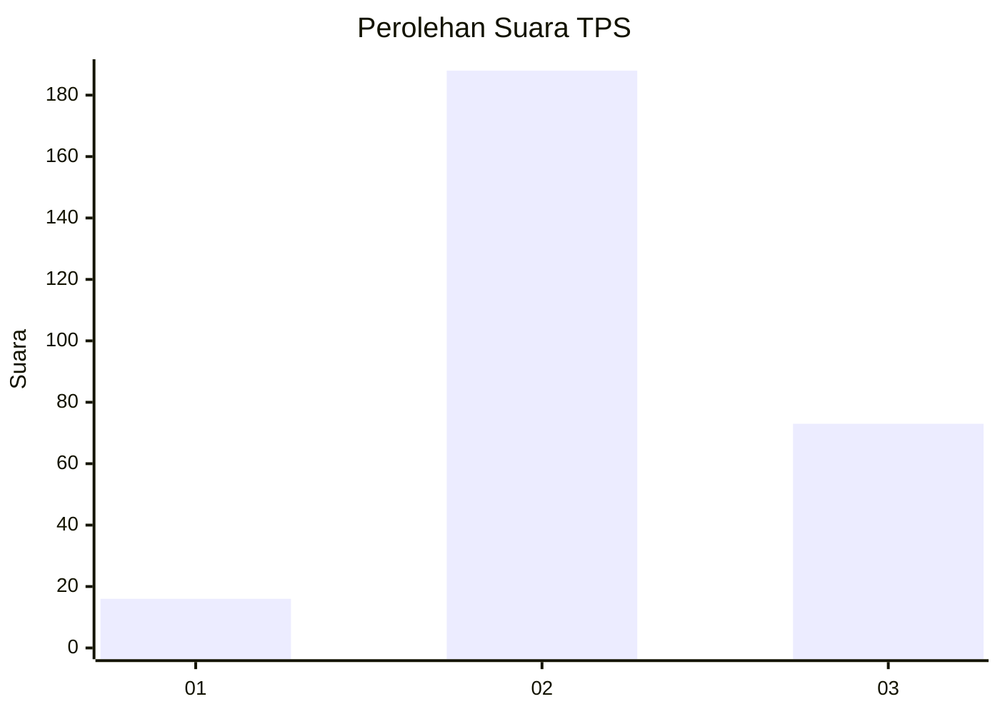

# Hasil

## Grafik

## Tabel

| No. | Nama Paslon    | Suara | Suara (raw) | Persentase |
|:--- |:-------------- | -----:| -----------:| ----------:|
| 1   | ANIES MUHAIMIN | 16    | [16][p-1]   | 5,78       |
| 2   | PRABOWO GIBRAN | 188   | [188][p-2]  | 67,87      |
| 3   | GANJAR MAHFUD  | 73    | [73][p-3]   | 26,35      |

[p-1]: https://github.com/gigit-pemilu/pemilu-2024-51-bali/blob/main/pilpres/hitung-suara/sub/51-bali/sub/03-badung/sub/06-kuta-utara/sub/1001-kerobokan-kelod/sub/902-tps/sub/paslon-1.txt
[p-2]: https://github.com/gigit-pemilu/pemilu-2024-51-bali/blob/main/pilpres/hitung-suara/sub/51-bali/sub/03-badung/sub/06-kuta-utara/sub/1001-kerobokan-kelod/sub/902-tps/sub/paslon-2.txt
[p-3]: https://github.com/gigit-pemilu/pemilu-2024-51-bali/blob/main/pilpres/hitung-suara/sub/51-bali/sub/03-badung/sub/06-kuta-utara/sub/1001-kerobokan-kelod/sub/902-tps/sub/paslon-3.txt

## Foto C Plano

https://sirekap-obj-formc.kpu.go.id/21e3/pemilu/ppwp/51/03/06/10/01/5103061001902-20240216-000824--56cf3452-0f83-4ab3-ae1d-c88f5eea5c7b.jpg

https://sirekap-obj-formc.kpu.go.id/21e3/pemilu/ppwp/51/03/06/10/01/5103061001902-20240216-000825--89b5bc17-309b-40fd-9a14-de183beac6d8.jpg

https://sirekap-obj-formc.kpu.go.id/21e3/pemilu/ppwp/51/03/06/10/01/5103061001902-20240216-000824--df1ff5c7-99e6-46a3-af25-ee4c0fcfa3ee.jpg

## Metadata

| Key        | Value               |
| ---------- | ------------------- |
| Time Stamp | 2024-02-21 23:00:00 |

## DATA PEMILIH TETAP

Jumlah pemilih dalam DPT: **296**.
 * L: **289**.
 * P: **7**.

## DATA PENGGUNA HAK PILIH

Jumlah pengguna hak pilih dalam DPT: **157**.
 * L: **157**.
 * P: **0**.

Jumlah pengguna hak pilih dalam DPTb: **131**.
 * L: **124**.
 * P: **7**.

Jumlah pengguna hak pilih dalam DPK: **0**.
 * L: **0**.
 * P: **0**.

Jumlah pengguna hak pilih: **288**.
 * L: **281**.
 * P: **7**.

## JUMLAH SUARA SAH DAN TIDAK SAH

JUMLAH SELURUH SUARA SAH: **277**.

JUMLAH SUARA TIDAK SAH: **11**.

JUMLAH SELURUH SUARA SAH DAN SUARA TIDAK SAH: **288**.

