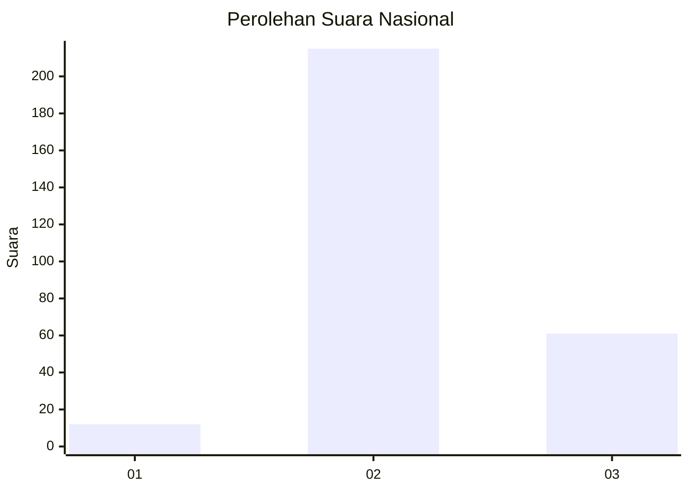

# Hasil

## Grafik

## Tabel

| No. | Nama Paslon    | Suara | Suara (raw) | Persentase |
|:--- |:-------------- | -----:| -----------:| ----------:|
| 1   | ANIES MUHAIMIN | 12    | [12][p-1]   | 4,17       |
| 2   | PRABOWO GIBRAN | 215   | [215][p-2]  | 74,65      |
| 3   | GANJAR MAHFUD  | 61    | [61][p-3]   | 21,18      |

[p-1]: https://github.com/gigit-pemilu/pemilu-2024/blob/main/pilpres/hitung-suara/sub/51-bali/sub/03-badung/sub/06-kuta-utara/sub/1001-kerobokan-kelod/sub/904-tps/sub/paslon-1.txt
[p-2]: https://github.com/gigit-pemilu/pemilu-2024/blob/main/pilpres/hitung-suara/sub/51-bali/sub/03-badung/sub/06-kuta-utara/sub/1001-kerobokan-kelod/sub/904-tps/sub/paslon-2.txt
[p-3]: https://github.com/gigit-pemilu/pemilu-2024/blob/main/pilpres/hitung-suara/sub/51-bali/sub/03-badung/sub/06-kuta-utara/sub/1001-kerobokan-kelod/sub/904-tps/sub/paslon-3.txt

## Foto C Plano

https://sirekap-obj-formc.kpu.go.id/e0b4/pemilu/ppwp/51/03/06/10/01/5103061001904-20240215-224851--94b22641-c3ed-49cc-b979-54dbed623bca.jpg

https://sirekap-obj-formc.kpu.go.id/e0b4/pemilu/ppwp/51/03/06/10/01/5103061001904-20240215-224855--535ad04c-fe12-4510-90e4-006efab7cba6.jpg

https://sirekap-obj-formc.kpu.go.id/e0b4/pemilu/ppwp/51/03/06/10/01/5103061001904-20240215-224852--23c74a10-eb8d-4418-8da5-03bc23060555.jpg

## Metadata

| Key        | Value               |
| ---------- | ------------------- |
| Time Stamp | 2024-02-21 20:00:00 |

## DATA PEMILIH TETAP

Jumlah pemilih dalam DPT: **167**.
 * L: **167**.
 * P: **0**.

## DATA PENGGUNA HAK PILIH

Jumlah pengguna hak pilih dalam DPT: **167**.
 * L: **167**.
 * P: **0**.

Jumlah pengguna hak pilih dalam DPTb: **123**.
 * L: **120**.
 * P: **3**.

Jumlah pengguna hak pilih dalam DPK: **0**.
 * L: **0**.
 * P: **0**.

Jumlah pengguna hak pilih: **290**.
 * L: **287**.
 * P: **3**.

## JUMLAH SUARA SAH DAN TIDAK SAH

JUMLAH SELURUH SUARA SAH: **288**.

JUMLAH SUARA TIDAK SAH: **2**.

JUMLAH SELURUH SUARA SAH DAN SUARA TIDAK SAH: **290**.

