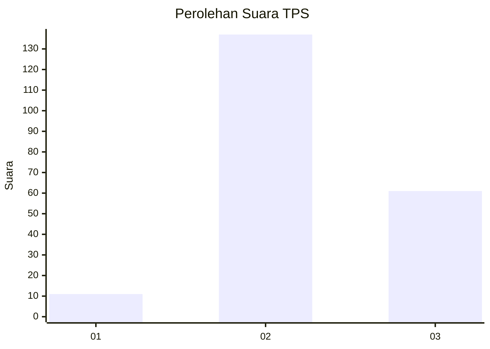

# Hasil

## Grafik

## Tabel

| No. | Nama Paslon    | Suara | Suara (raw) | Persentase |
|:--- |:-------------- | -----:| -----------:| ----------:|
| 1   | ANIES MUHAIMIN | 11    | [11][p-1]   | 5,26       |
| 2   | PRABOWO GIBRAN | 137   | [137][p-2]  | 65,55      |
| 3   | GANJAR MAHFUD  | 61    | [61][p-3]   | 29,19      |

[p-1]: https://github.com/gigit-pemilu/pemilu-2024-51-bali/blob/main/pilpres/hitung-suara/sub/51-bali/sub/03-badung/sub/06-kuta-utara/sub/1002-kerobokan/sub/003-tps/sub/paslon-1.txt
[p-2]: https://github.com/gigit-pemilu/pemilu-2024-51-bali/blob/main/pilpres/hitung-suara/sub/51-bali/sub/03-badung/sub/06-kuta-utara/sub/1002-kerobokan/sub/003-tps/sub/paslon-2.txt
[p-3]: https://github.com/gigit-pemilu/pemilu-2024-51-bali/blob/main/pilpres/hitung-suara/sub/51-bali/sub/03-badung/sub/06-kuta-utara/sub/1002-kerobokan/sub/003-tps/sub/paslon-3.txt

## Foto C Plano

https://sirekap-obj-formc.kpu.go.id/ff9b/pemilu/ppwp/51/03/06/10/02/5103061002003-20240216-151613--5e2dfcb2-d9fe-44d5-8233-c524ce8a013e.jpg

https://sirekap-obj-formc.kpu.go.id/ff9b/pemilu/ppwp/51/03/06/10/02/5103061002003-20240216-151614--278039b0-fd82-4288-a2fd-476c78176587.jpg

https://sirekap-obj-formc.kpu.go.id/ff9b/pemilu/ppwp/51/03/06/10/02/5103061002003-20240216-151613--ac4ac305-5586-4c81-9cdc-c533a110427f.jpg

## Metadata

| Key        | Value               |
| ---------- | ------------------- |
| Time Stamp | 2024-02-21 16:00:00 |

## DATA PEMILIH TETAP

Jumlah pemilih dalam DPT: **196**.
 * L: **89**.
 * P: **107**.

## DATA PENGGUNA HAK PILIH

Jumlah pengguna hak pilih dalam DPT: **196**.
 * L: **89**.
 * P: **107**.

Jumlah pengguna hak pilih dalam DPTb: **13**.
 * L: **7**.
 * P: **6**.

Jumlah pengguna hak pilih dalam DPK: **3**.
 * L: **1**.
 * P: **2**.

Jumlah pengguna hak pilih: **212**.
 * L: **97**.
 * P: **115**.

## JUMLAH SUARA SAH DAN TIDAK SAH

JUMLAH SELURUH SUARA SAH: **209**.

JUMLAH SUARA TIDAK SAH: **3**.

JUMLAH SELURUH SUARA SAH DAN SUARA TIDAK SAH: **212**.

