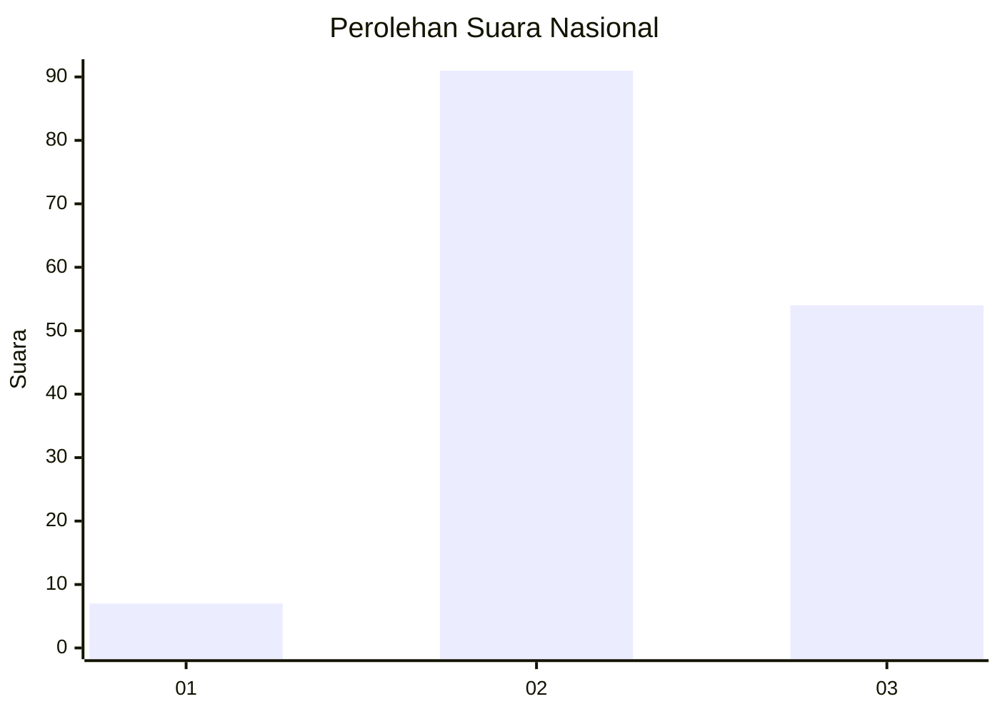
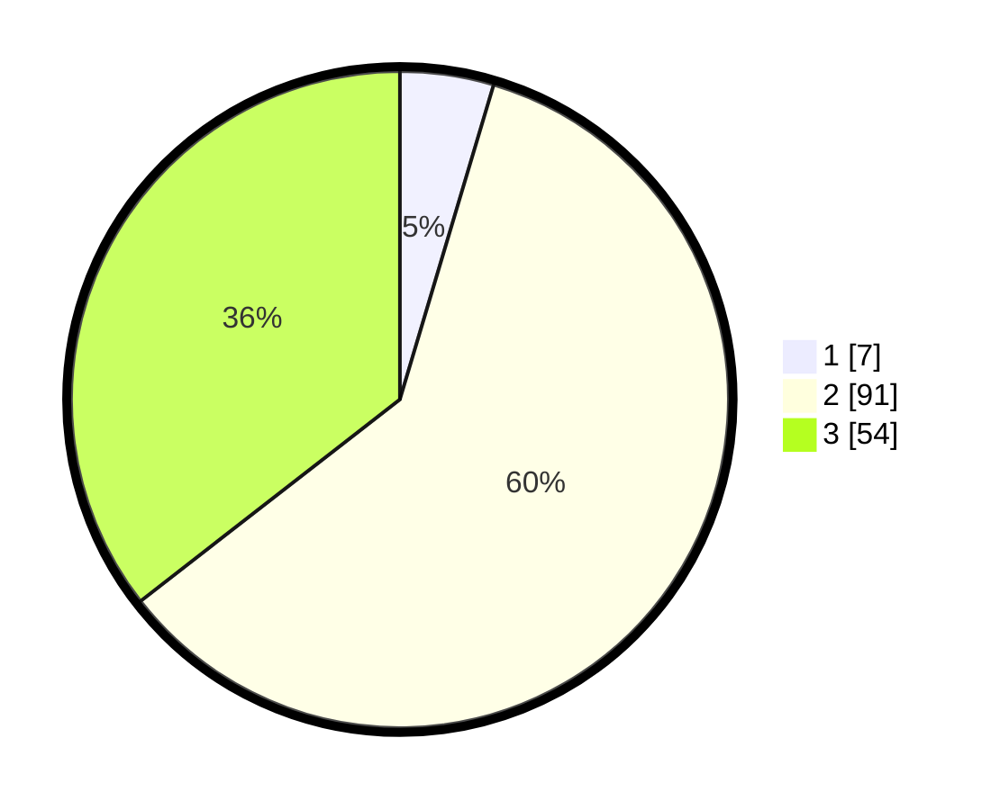

# Hasil

## Grafik

## Tabel

| No. | Nama Paslon    | Suara | Suara (raw) | Persentase |
|:--- |:-------------- | -----:| -----------:| ----------:|
| 1   | ANIES MUHAIMIN | 7     | [7][p-1]    | 4,61       |
| 2   | PRABOWO GIBRAN | 91    | [91][p-2]   | 59,87      |
| 3   | GANJAR MAHFUD  | 54    | [54][p-3]   | 35,53      |

[p-1]: https://github.com/gigit-pemilu/pemilu-2024/blob/main/pilpres/hitung-suara/sub/51-bali/sub/03-badung/sub/06-kuta-utara/sub/1002-kerobokan/sub/005-tps/sub/paslon-1.txt
[p-2]: https://github.com/gigit-pemilu/pemilu-2024/blob/main/pilpres/hitung-suara/sub/51-bali/sub/03-badung/sub/06-kuta-utara/sub/1002-kerobokan/sub/005-tps/sub/paslon-2.txt
[p-3]: https://github.com/gigit-pemilu/pemilu-2024/blob/main/pilpres/hitung-suara/sub/51-bali/sub/03-badung/sub/06-kuta-utara/sub/1002-kerobokan/sub/005-tps/sub/paslon-3.txt

## Foto C Plano

https://sirekap-obj-formc.kpu.go.id/7d06/pemilu/ppwp/51/03/06/10/02/5103061002005-20240216-145347--8eb50b7c-21ae-45b8-8661-02d9a04f58bb.jpg

https://sirekap-obj-formc.kpu.go.id/7d06/pemilu/ppwp/51/03/06/10/02/5103061002005-20240217-010404--19910437-9189-42f0-8f56-9f919e0bf086.jpg

https://sirekap-obj-formc.kpu.go.id/7d06/pemilu/ppwp/51/03/06/10/02/5103061002005-20240216-145348--634dac12-a8d4-4a38-b229-8560839a534f.jpg

## Metadata

| Key        | Value               |
| ---------- | ------------------- |
| Time Stamp | 2024-02-21 18:00:00 |

## DATA PEMILIH TETAP

Jumlah pemilih dalam DPT: **218**.
 * L: **106**.
 * P: **112**.

## DATA PENGGUNA HAK PILIH

Jumlah pengguna hak pilih dalam DPT: **145**.
 * L: **73**.
 * P: **72**.

Jumlah pengguna hak pilih dalam DPTb: **8**.
 * L: **2**.
 * P: **6**.

Jumlah pengguna hak pilih dalam DPK: **0**.
 * L: **0**.
 * P: **0**.

Jumlah pengguna hak pilih: **153**.
 * L: **75**.
 * P: **78**.

## JUMLAH SUARA SAH DAN TIDAK SAH

JUMLAH SELURUH SUARA SAH: **152**.

JUMLAH SUARA TIDAK SAH: **1**.

JUMLAH SELURUH SUARA SAH DAN SUARA TIDAK SAH: **153**.

