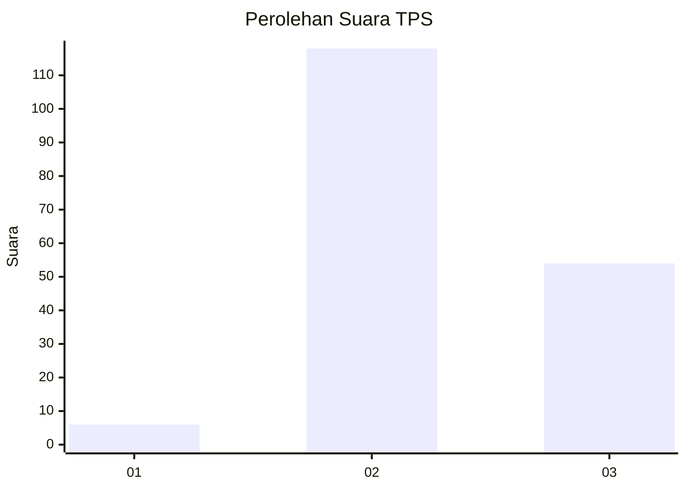

# Hasil

## Grafik

## Tabel

| No. | Nama Paslon    | Suara | Suara (raw) | Persentase |
|:--- |:-------------- | -----:| -----------:| ----------:|
| 1   | ANIES MUHAIMIN | 6     | [6][p-1]    | 3,37       |
| 2   | PRABOWO GIBRAN | 118   | [118][p-2]  | 66,29      |
| 3   | GANJAR MAHFUD  | 54    | [54][p-3]   | 30,34      |

[p-1]: https://github.com/gigit-pemilu/pemilu-2024-51-bali/blob/main/pilpres/hitung-suara/sub/51-bali/sub/03-badung/sub/06-kuta-utara/sub/1002-kerobokan/sub/006-tps/sub/paslon-1.txt
[p-2]: https://github.com/gigit-pemilu/pemilu-2024-51-bali/blob/main/pilpres/hitung-suara/sub/51-bali/sub/03-badung/sub/06-kuta-utara/sub/1002-kerobokan/sub/006-tps/sub/paslon-2.txt
[p-3]: https://github.com/gigit-pemilu/pemilu-2024-51-bali/blob/main/pilpres/hitung-suara/sub/51-bali/sub/03-badung/sub/06-kuta-utara/sub/1002-kerobokan/sub/006-tps/sub/paslon-3.txt

## Foto C Plano

https://sirekap-obj-formc.kpu.go.id/4bf5/pemilu/ppwp/51/03/06/10/02/5103061002006-20240214-141412--15a4a1d4-2d3b-4619-89cb-d8268f5c56f0.jpg

https://sirekap-obj-formc.kpu.go.id/4bf5/pemilu/ppwp/51/03/06/10/02/5103061002006-20240214-190927--c228820e-e8e6-4a39-b1f6-f2b8b8f62846.jpg

https://sirekap-obj-formc.kpu.go.id/4bf5/pemilu/ppwp/51/03/06/10/02/5103061002006-20240216-144458--54768c3e-eabf-40b7-aaf1-ddbd4a04ebe3.jpg

## Metadata

| Key        | Value               |
| ---------- | ------------------- |
| Time Stamp | 2024-02-21 23:00:00 |

## DATA PEMILIH TETAP

Jumlah pemilih dalam DPT: **224**.
 * L: **100**.
 * P: **124**.

## DATA PENGGUNA HAK PILIH

Jumlah pengguna hak pilih dalam DPT: **173**.
 * L: **75**.
 * P: **98**.

Jumlah pengguna hak pilih dalam DPTb: **6**.
 * L: **2**.
 * P: **4**.

Jumlah pengguna hak pilih dalam DPK: **1**.
 * L: **0**.
 * P: **1**.

Jumlah pengguna hak pilih: **180**.
 * L: **77**.
 * P: **103**.

## JUMLAH SUARA SAH DAN TIDAK SAH

JUMLAH SELURUH SUARA SAH: **178**.

JUMLAH SUARA TIDAK SAH: **2**.

JUMLAH SELURUH SUARA SAH DAN SUARA TIDAK SAH: **180**.

