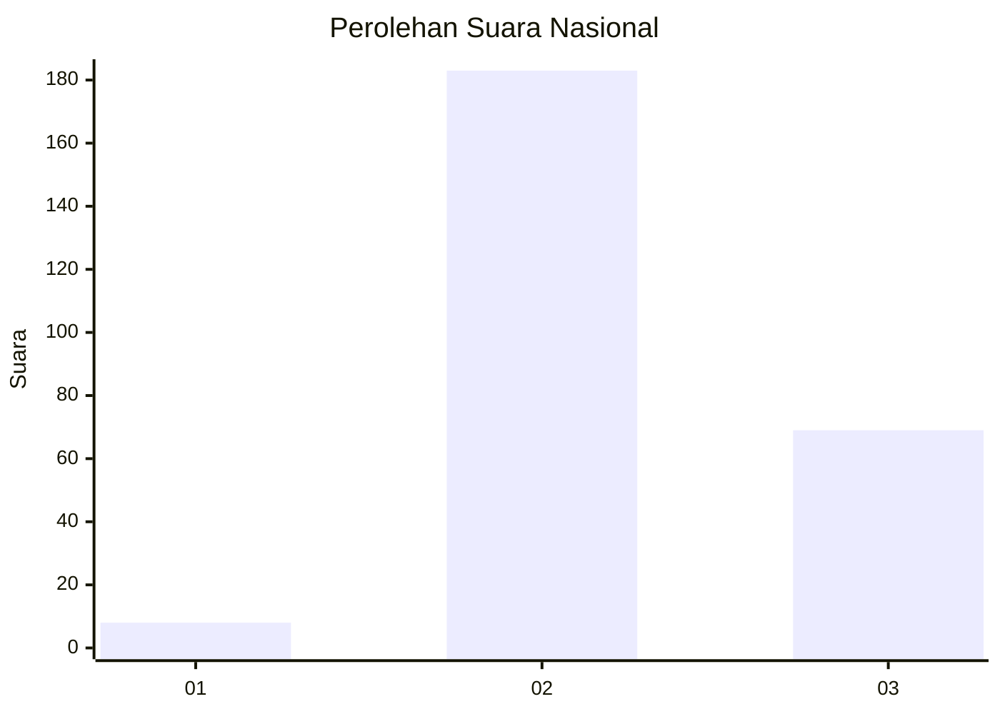
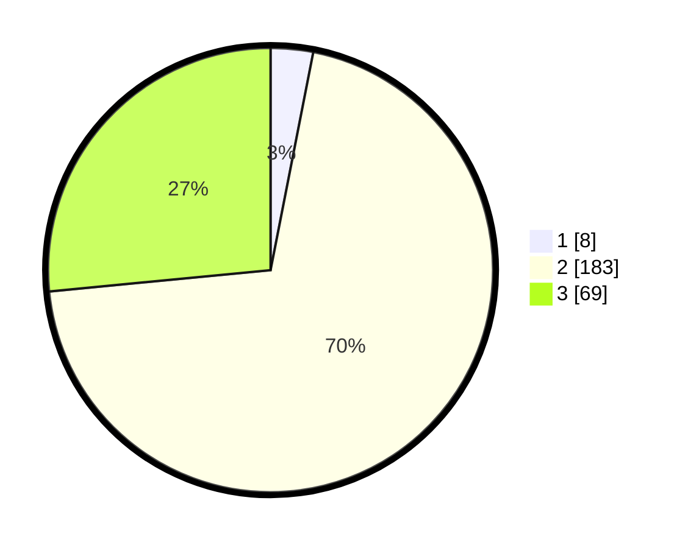

# Hasil

## Grafik

## Tabel

| No. | Nama Paslon    | Suara | Suara (raw) | Persentase |
|:--- |:-------------- | -----:| -----------:| ----------:|
| 1   | ANIES MUHAIMIN | 8     | [8][p-1]    | 3,08       |
| 2   | PRABOWO GIBRAN | 183   | [183][p-2]  | 70,38      |
| 3   | GANJAR MAHFUD  | 69    | [69][p-3]   | 26,54      |

[p-1]: https://github.com/gigit-pemilu/pemilu-2024/blob/main/pilpres/hitung-suara/sub/51-bali/sub/03-badung/sub/06-kuta-utara/sub/1002-kerobokan/sub/011-tps/sub/paslon-1.txt
[p-2]: https://github.com/gigit-pemilu/pemilu-2024/blob/main/pilpres/hitung-suara/sub/51-bali/sub/03-badung/sub/06-kuta-utara/sub/1002-kerobokan/sub/011-tps/sub/paslon-2.txt
[p-3]: https://github.com/gigit-pemilu/pemilu-2024/blob/main/pilpres/hitung-suara/sub/51-bali/sub/03-badung/sub/06-kuta-utara/sub/1002-kerobokan/sub/011-tps/sub/paslon-3.txt

## Foto C Plano

https://sirekap-obj-formc.kpu.go.id/2fed/pemilu/ppwp/51/03/06/10/02/5103061002011-20240216-020230--6a42ff4d-f6b2-4efb-a8e2-7272ed24cdcf.jpg

https://sirekap-obj-formc.kpu.go.id/2fed/pemilu/ppwp/51/03/06/10/02/5103061002011-20240216-020250--c1412140-7eb0-47c0-9834-9996b7644399.jpg

https://sirekap-obj-formc.kpu.go.id/2fed/pemilu/ppwp/51/03/06/10/02/5103061002011-20240216-022148--2a887e0d-d685-411e-97aa-4da697fc0f37.jpg

## Metadata

| Key        | Value               |
| ---------- | ------------------- |
| Time Stamp | 2024-02-21 21:00:04 |

## DATA PEMILIH TETAP

Jumlah pemilih dalam DPT: **276**.
 * L: **134**.
 * P: **142**.

## DATA PENGGUNA HAK PILIH

Jumlah pengguna hak pilih dalam DPT: **257**.
 * L: **125**.
 * P: **132**.

Jumlah pengguna hak pilih dalam DPTb: **4**.
 * L: **2**.
 * P: **2**.

Jumlah pengguna hak pilih dalam DPK: **1**.
 * L: **1**.
 * P: **0**.

Jumlah pengguna hak pilih: **262**.
 * L: **128**.
 * P: **134**.

## JUMLAH SUARA SAH DAN TIDAK SAH

JUMLAH SELURUH SUARA SAH: **260**.

JUMLAH SUARA TIDAK SAH: **2**.

JUMLAH SELURUH SUARA SAH DAN SUARA TIDAK SAH: **262**.

