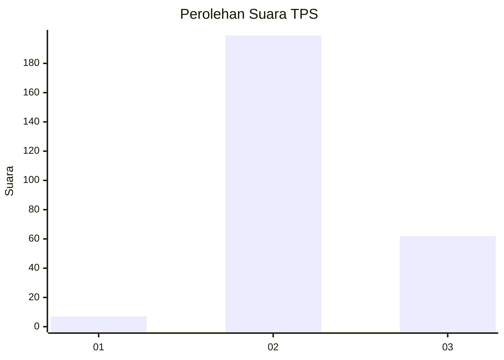
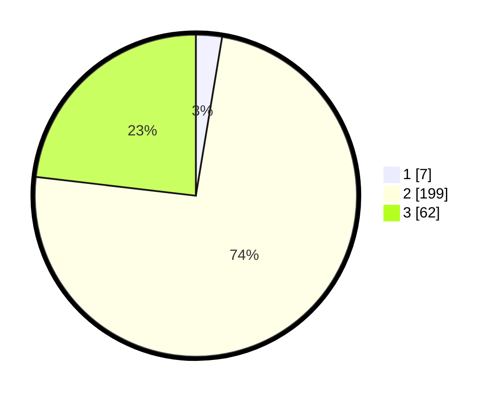

# Hasil

## Grafik

## Tabel

| No. | Nama Paslon    | Suara | Suara (raw) | Persentase |
|:--- |:-------------- | -----:| -----------:| ----------:|
| 1   | ANIES MUHAIMIN | 7     | [7][p-1]    | 2,61       |
| 2   | PRABOWO GIBRAN | 199   | [199][p-2]  | 74,25      |
| 3   | GANJAR MAHFUD  | 62    | [62][p-3]   | 23,13      |

[p-1]: https://github.com/gigit-pemilu/pemilu-2024-51-bali/blob/main/pilpres/hitung-suara/sub/51-bali/sub/03-badung/sub/06-kuta-utara/sub/1002-kerobokan/sub/012-tps/sub/paslon-1.txt
[p-2]: https://github.com/gigit-pemilu/pemilu-2024-51-bali/blob/main/pilpres/hitung-suara/sub/51-bali/sub/03-badung/sub/06-kuta-utara/sub/1002-kerobokan/sub/012-tps/sub/paslon-2.txt
[p-3]: https://github.com/gigit-pemilu/pemilu-2024-51-bali/blob/main/pilpres/hitung-suara/sub/51-bali/sub/03-badung/sub/06-kuta-utara/sub/1002-kerobokan/sub/012-tps/sub/paslon-3.txt

## Foto C Plano

https://sirekap-obj-formc.kpu.go.id/214d/pemilu/ppwp/51/03/06/10/02/5103061002012-20240215-230157--3fd5bd36-6369-43c0-b075-2fdd2b56cedb.jpg

https://sirekap-obj-formc.kpu.go.id/214d/pemilu/ppwp/51/03/06/10/02/5103061002012-20240215-230200--0da8bae1-d001-435a-a2ab-c71b95339aef.jpg

https://sirekap-obj-formc.kpu.go.id/214d/pemilu/ppwp/51/03/06/10/02/5103061002012-20240215-230158--434d28ba-be99-41bd-9b4a-12e47dcfe73c.jpg

## Metadata

| Key        | Value               |
| ---------- | ------------------- |
| Time Stamp | 2024-02-21 16:00:00 |

## DATA PEMILIH TETAP

Jumlah pemilih dalam DPT: **283**.
 * L: **138**.
 * P: **145**.

## DATA PENGGUNA HAK PILIH

Jumlah pengguna hak pilih dalam DPT: **267**.
 * L: **129**.
 * P: **138**.

Jumlah pengguna hak pilih dalam DPTb: **5**.
 * L: **4**.
 * P: **1**.

Jumlah pengguna hak pilih dalam DPK: **1**.
 * L: **1**.
 * P: **0**.

Jumlah pengguna hak pilih: **273**.
 * L: **134**.
 * P: **139**.

## JUMLAH SUARA SAH DAN TIDAK SAH

JUMLAH SELURUH SUARA SAH: **268**.

JUMLAH SUARA TIDAK SAH: **5**.

JUMLAH SELURUH SUARA SAH DAN SUARA TIDAK SAH: **273**.

