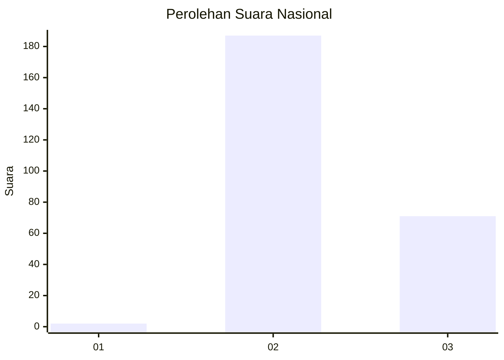
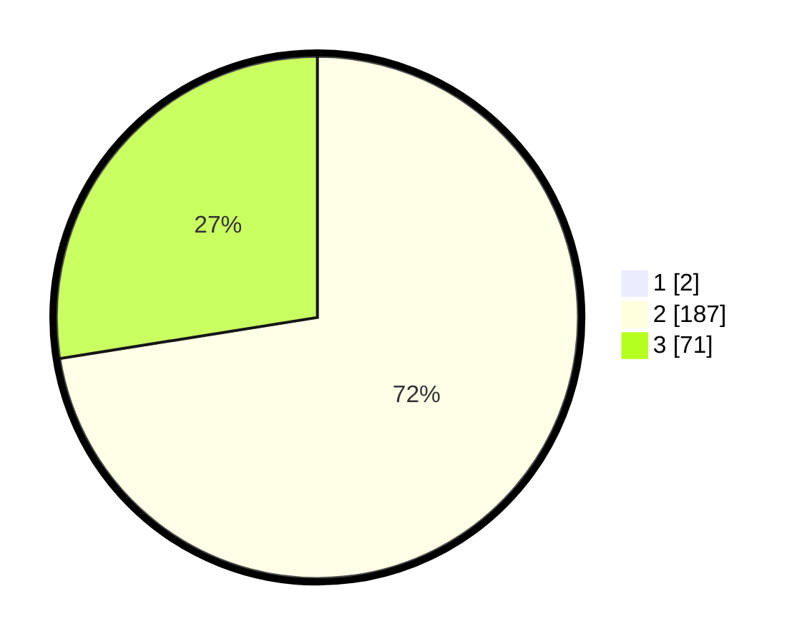

# Hasil

## Grafik

## Tabel

| No. | Nama Paslon    | Suara | Suara (raw) | Persentase |
|:--- |:-------------- | -----:| -----------:| ----------:|
| 1   | ANIES MUHAIMIN | 2     | [2][p-1]    | 0,77       |
| 2   | PRABOWO GIBRAN | 187   | [187][p-2]  | 71,92      |
| 3   | GANJAR MAHFUD  | 71    | [71][p-3]   | 27,31      |

[p-1]: https://github.com/gigit-pemilu/pemilu-2024/blob/main/pilpres/hitung-suara/sub/51-bali/sub/03-badung/sub/06-kuta-utara/sub/1002-kerobokan/sub/014-tps/sub/paslon-1.txt
[p-2]: https://github.com/gigit-pemilu/pemilu-2024/blob/main/pilpres/hitung-suara/sub/51-bali/sub/03-badung/sub/06-kuta-utara/sub/1002-kerobokan/sub/014-tps/sub/paslon-2.txt
[p-3]: https://github.com/gigit-pemilu/pemilu-2024/blob/main/pilpres/hitung-suara/sub/51-bali/sub/03-badung/sub/06-kuta-utara/sub/1002-kerobokan/sub/014-tps/sub/paslon-3.txt

## Foto C Plano

https://sirekap-obj-formc.kpu.go.id/f942/pemilu/ppwp/51/03/06/10/02/5103061002014-20240216-224748--9044dd75-3b0a-44af-9a28-7aed7e29df5d.jpg

https://sirekap-obj-formc.kpu.go.id/f942/pemilu/ppwp/51/03/06/10/02/5103061002014-20240216-224756--6854ca8e-5ddc-405f-b422-6fdfd35684d0.jpg

https://sirekap-obj-formc.kpu.go.id/f942/pemilu/ppwp/51/03/06/10/02/5103061002014-20240216-224801--97db3728-cf46-47f1-a374-9583e8b281ca.jpg

## Metadata

| Key        | Value               |
| ---------- | ------------------- |
| Time Stamp | 2024-02-24 22:31:28 |

