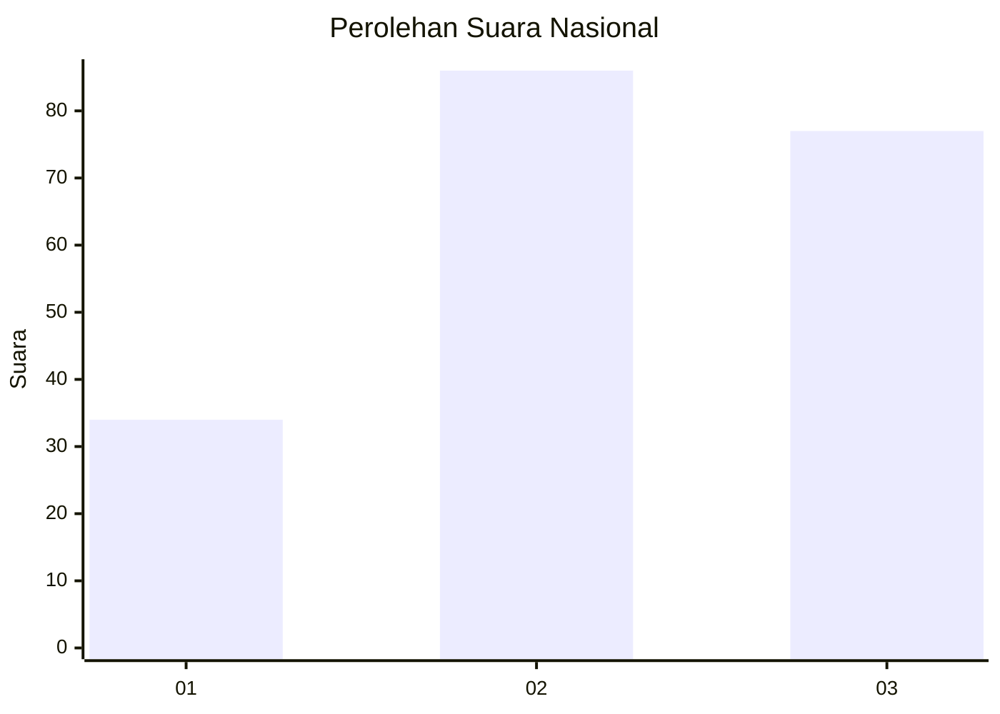
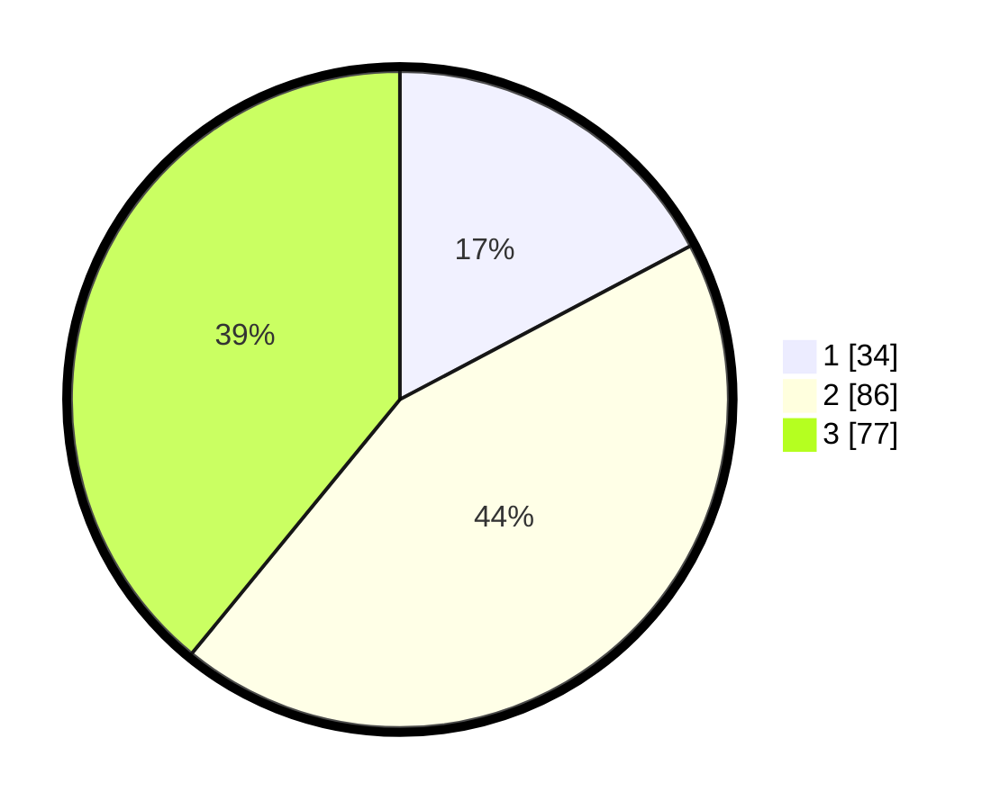

# Hasil

## Grafik

## Tabel

| No. | Nama Paslon    | Suara | Suara (raw) | Persentase |
|:--- |:-------------- | -----:| -----------:| ----------:|
| 1   | ANIES MUHAIMIN | 34    | [34][p-1]   | 17,26      |
| 2   | PRABOWO GIBRAN | 86    | [86][p-2]   | 43,65      |
| 3   | GANJAR MAHFUD  | 77    | [77][p-3]   | 39,09      |

[p-1]: https://github.com/gigit-pemilu/pemilu-2024/blob/main/pilpres/hitung-suara/sub/51-bali/sub/03-badung/sub/06-kuta-utara/sub/1002-kerobokan/sub/020-tps/sub/paslon-1.txt
[p-2]: https://github.com/gigit-pemilu/pemilu-2024/blob/main/pilpres/hitung-suara/sub/51-bali/sub/03-badung/sub/06-kuta-utara/sub/1002-kerobokan/sub/020-tps/sub/paslon-2.txt
[p-3]: https://github.com/gigit-pemilu/pemilu-2024/blob/main/pilpres/hitung-suara/sub/51-bali/sub/03-badung/sub/06-kuta-utara/sub/1002-kerobokan/sub/020-tps/sub/paslon-3.txt

## Foto C Plano

https://sirekap-obj-formc.kpu.go.id/586f/pemilu/ppwp/51/03/06/10/02/5103061002020-20240216-150809--68d43bfc-d7d4-494a-a8a3-15a5238a2ea2.jpg

https://sirekap-obj-formc.kpu.go.id/586f/pemilu/ppwp/51/03/06/10/02/5103061002020-20240216-150810--cd29bcb9-cbd8-46f6-ac12-4ffeb4d23ba7.jpg

https://sirekap-obj-formc.kpu.go.id/586f/pemilu/ppwp/51/03/06/10/02/5103061002020-20240216-150809--531f5a5e-0afc-4c44-a53e-3669ff1f75db.jpg

## Metadata

| Key        | Value               |
| ---------- | ------------------- |
| Time Stamp | 2024-02-21 15:00:00 |

## DATA PEMILIH TETAP

Jumlah pemilih dalam DPT: **290**.
 * L: **126**.
 * P: **164**.

## DATA PENGGUNA HAK PILIH

Jumlah pengguna hak pilih dalam DPT: **188**.
 * L: **86**.
 * P: **102**.

Jumlah pengguna hak pilih dalam DPTb: **10**.
 * L: **6**.
 * P: **4**.

Jumlah pengguna hak pilih dalam DPK: **1**.
 * L: **0**.
 * P: **1**.

Jumlah pengguna hak pilih: **199**.
 * L: **92**.
 * P: **107**.

## JUMLAH SUARA SAH DAN TIDAK SAH

JUMLAH SELURUH SUARA SAH: **197**.

JUMLAH SUARA TIDAK SAH: **2**.

JUMLAH SELURUH SUARA SAH DAN SUARA TIDAK SAH: **199**.

