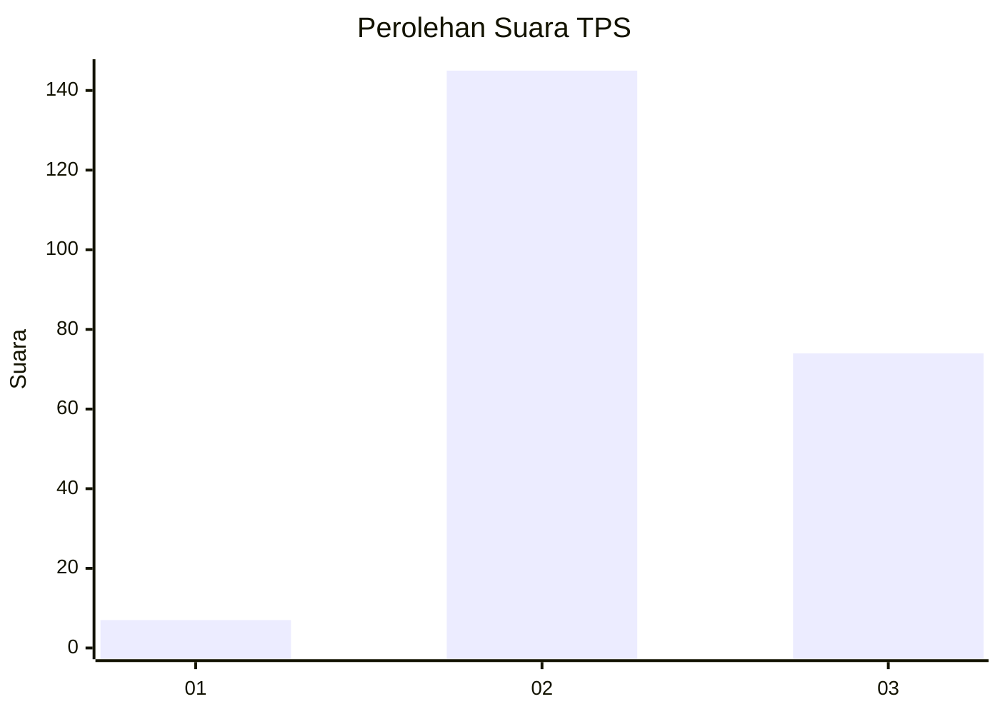
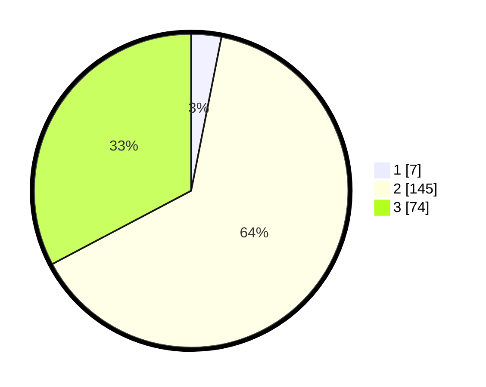

# Hasil

## Grafik

## Tabel

| No. | Nama Paslon    | Suara | Suara (raw) | Persentase |
|:--- |:-------------- | -----:| -----------:| ----------:|
| 1   | ANIES MUHAIMIN | 7     | [7][p-1]    | 3,10       |
| 2   | PRABOWO GIBRAN | 145   | [145][p-2]  | 64,16      |
| 3   | GANJAR MAHFUD  | 74    | [74][p-3]   | 32,74      |

[p-1]: https://github.com/gigit-pemilu/pemilu-2024-51-bali/blob/main/pilpres/hitung-suara/sub/51-bali/sub/03-badung/sub/06-kuta-utara/sub/1002-kerobokan/sub/025-tps/sub/paslon-1.txt
[p-2]: https://github.com/gigit-pemilu/pemilu-2024-51-bali/blob/main/pilpres/hitung-suara/sub/51-bali/sub/03-badung/sub/06-kuta-utara/sub/1002-kerobokan/sub/025-tps/sub/paslon-2.txt
[p-3]: https://github.com/gigit-pemilu/pemilu-2024-51-bali/blob/main/pilpres/hitung-suara/sub/51-bali/sub/03-badung/sub/06-kuta-utara/sub/1002-kerobokan/sub/025-tps/sub/paslon-3.txt

## Foto C Plano

https://sirekap-obj-formc.kpu.go.id/fd17/pemilu/ppwp/51/03/06/10/02/5103061002025-20240214-193059--4f12141f-164c-481f-93fe-c82a89b71c7f.jpg

https://sirekap-obj-formc.kpu.go.id/fd17/pemilu/ppwp/51/03/06/10/02/5103061002025-20240214-201249--51223c29-1e70-4b0f-b196-b4a0f2497ac0.jpg

https://sirekap-obj-formc.kpu.go.id/fd17/pemilu/ppwp/51/03/06/10/02/5103061002025-20240214-193131--be45337a-e928-4e81-8ea3-1a99a5b1cb89.jpg

## Metadata

| Key        | Value               |
| ---------- | ------------------- |
| Time Stamp | 2024-02-14 21:46:01 |

## DATA PEMILIH TETAP

Jumlah pemilih dalam DPT: **275**.
 * L: **135**.
 * P: **140**.

## DATA PENGGUNA HAK PILIH

Jumlah pengguna hak pilih dalam DPT: **215**.
 * L: **102**.
 * P: **113**.

Jumlah pengguna hak pilih dalam DPTb: **5**.
 * L: **0**.
 * P: **5**.

Jumlah pengguna hak pilih dalam DPK: **8**.
 * L: **5**.
 * P: **3**.

Jumlah pengguna hak pilih: **228**.
 * L: **107**.
 * P: **121**.

## JUMLAH SUARA SAH DAN TIDAK SAH

JUMLAH SELURUH SUARA SAH: **226**.

JUMLAH SUARA TIDAK SAH: **2**.

JUMLAH SELURUH SUARA SAH DAN SUARA TIDAK SAH: **228**.

