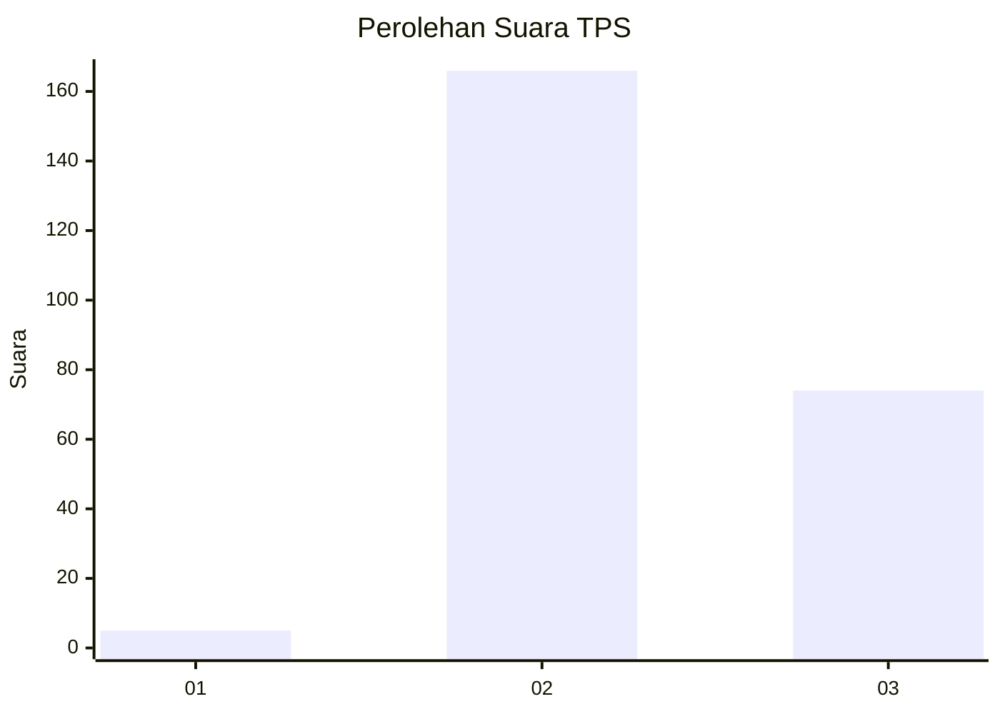

# Hasil

## Grafik

## Tabel

| No. | Nama Paslon    | Suara | Suara (raw) | Persentase |
|:--- |:-------------- | -----:| -----------:| ----------:|
| 1   | ANIES MUHAIMIN | 5     | [5][p-1]    | 2,04       |
| 2   | PRABOWO GIBRAN | 166   | [166][p-2]  | 67,76      |
| 3   | GANJAR MAHFUD  | 74    | [74][p-3]   | 30,20      |

[p-1]: https://github.com/gigit-pemilu/pemilu-2024-51-bali/blob/main/pilpres/hitung-suara/sub/51-bali/sub/03-badung/sub/06-kuta-utara/sub/1002-kerobokan/sub/027-tps/sub/paslon-1.txt
[p-2]: https://github.com/gigit-pemilu/pemilu-2024-51-bali/blob/main/pilpres/hitung-suara/sub/51-bali/sub/03-badung/sub/06-kuta-utara/sub/1002-kerobokan/sub/027-tps/sub/paslon-2.txt
[p-3]: https://github.com/gigit-pemilu/pemilu-2024-51-bali/blob/main/pilpres/hitung-suara/sub/51-bali/sub/03-badung/sub/06-kuta-utara/sub/1002-kerobokan/sub/027-tps/sub/paslon-3.txt

## Foto C Plano

https://sirekap-obj-formc.kpu.go.id/a3bb/pemilu/ppwp/51/03/06/10/02/5103061002027-20240216-214002--3a7dd669-f379-4d5e-97f0-652d186b4a5e.jpg

https://sirekap-obj-formc.kpu.go.id/a3bb/pemilu/ppwp/51/03/06/10/02/5103061002027-20240214-211912--b8c92c50-6eb5-475a-aa5d-caff3f6ff447.jpg

https://sirekap-obj-formc.kpu.go.id/a3bb/pemilu/ppwp/51/03/06/10/02/5103061002027-20240214-211921--78fb727a-84f5-40df-ad3b-01698f2246c2.jpg

## Metadata

| Key        | Value               |
| ---------- | ------------------- |
| Time Stamp | 2024-02-16 22:01:00 |

## DATA PEMILIH TETAP

Jumlah pemilih dalam DPT: **276**.
 * L: **137**.
 * P: **139**.

## DATA PENGGUNA HAK PILIH

Jumlah pengguna hak pilih dalam DPT: **238**.
 * L: **120**.
 * P: **118**.

Jumlah pengguna hak pilih dalam DPTb: **6**.
 * L: **2**.
 * P: **4**.

Jumlah pengguna hak pilih dalam DPK: **5**.
 * L: **0**.
 * P: **5**.

Jumlah pengguna hak pilih: **249**.
 * L: **122**.
 * P: **127**.

## JUMLAH SUARA SAH DAN TIDAK SAH

JUMLAH SELURUH SUARA SAH: **245**.

JUMLAH SUARA TIDAK SAH: **4**.

JUMLAH SELURUH SUARA SAH DAN SUARA TIDAK SAH: **249**.

