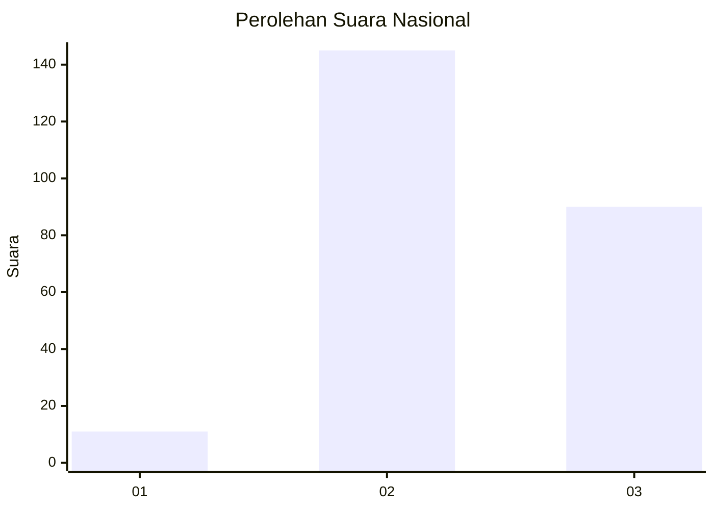
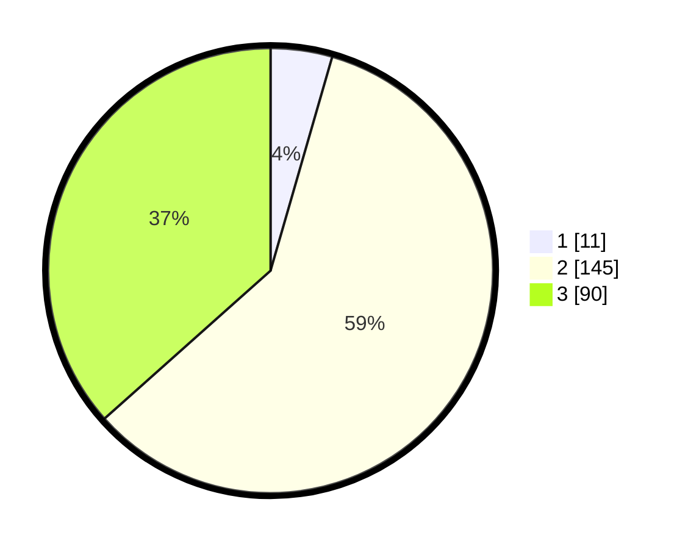

# Hasil

## Grafik

## Tabel

| No. | Nama Paslon    | Suara | Suara (raw) | Persentase |
|:--- |:-------------- | -----:| -----------:| ----------:|
| 1   | ANIES MUHAIMIN | 11    | [11][p-1]   | 4,47       |
| 2   | PRABOWO GIBRAN | 145   | [145][p-2]  | 58,94      |
| 3   | GANJAR MAHFUD  | 90    | [90][p-3]   | 36,59      |

[p-1]: https://github.com/gigit-pemilu/pemilu-2024/blob/main/pilpres/hitung-suara/sub/51-bali/sub/03-badung/sub/06-kuta-utara/sub/1002-kerobokan/sub/028-tps/sub/paslon-1.txt
[p-2]: https://github.com/gigit-pemilu/pemilu-2024/blob/main/pilpres/hitung-suara/sub/51-bali/sub/03-badung/sub/06-kuta-utara/sub/1002-kerobokan/sub/028-tps/sub/paslon-2.txt
[p-3]: https://github.com/gigit-pemilu/pemilu-2024/blob/main/pilpres/hitung-suara/sub/51-bali/sub/03-badung/sub/06-kuta-utara/sub/1002-kerobokan/sub/028-tps/sub/paslon-3.txt

## Foto C Plano

https://sirekap-obj-formc.kpu.go.id/14dd/pemilu/ppwp/51/03/06/10/02/5103061002028-20240214-235841--c3c073b2-0fa6-499b-bd0f-8b336bfa44fa.jpg

https://sirekap-obj-formc.kpu.go.id/14dd/pemilu/ppwp/51/03/06/10/02/5103061002028-20240214-235923--52698a72-cd4d-4dc1-923d-22c80a4bb2ea.jpg

https://sirekap-obj-formc.kpu.go.id/14dd/pemilu/ppwp/51/03/06/10/02/5103061002028-20240215-000000--a4205cdf-f9bd-46aa-8882-494d33e0553c.jpg

## Metadata

| Key        | Value               |
| ---------- | ------------------- |
| Time Stamp | 2024-02-24 22:31:28 |

