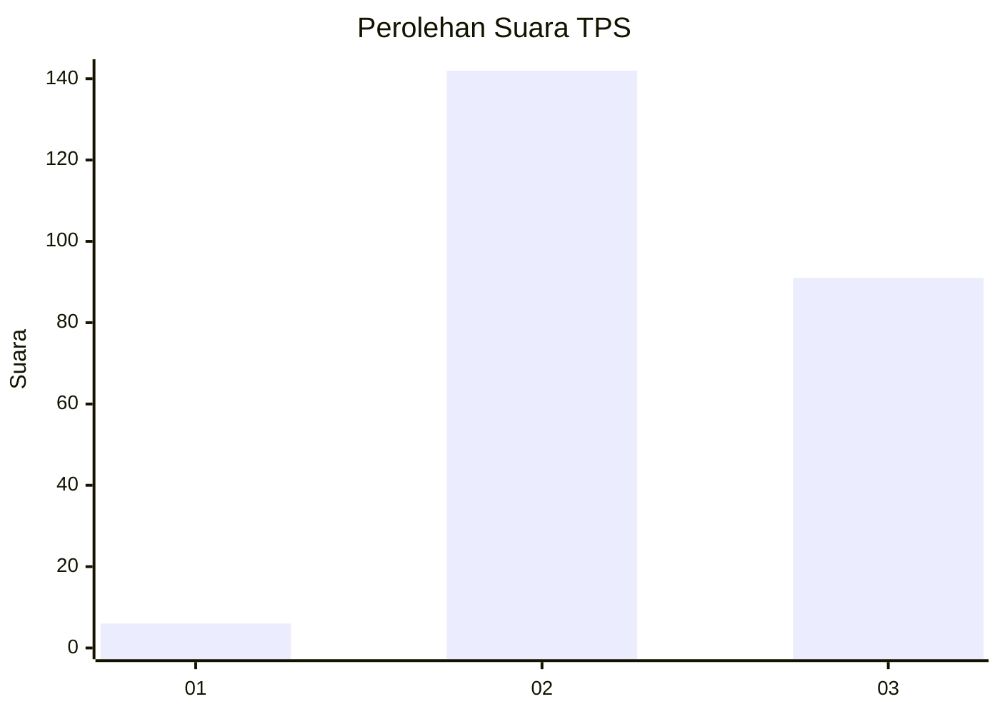
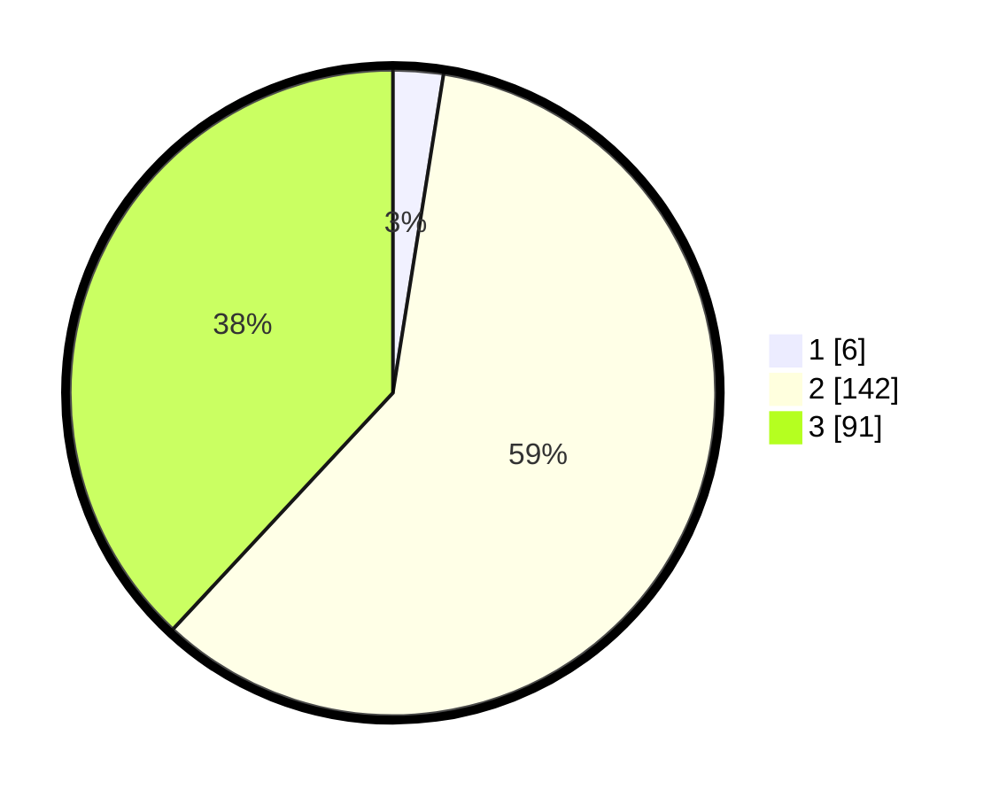

# Hasil

## Grafik

## Tabel

| No. | Nama Paslon    | Suara | Suara (raw) | Persentase |
|:--- |:-------------- | -----:| -----------:| ----------:|
| 1   | ANIES MUHAIMIN | 6     | [6][p-1]    | 2,51       |
| 2   | PRABOWO GIBRAN | 142   | [142][p-2]  | 59,41      |
| 3   | GANJAR MAHFUD  | 91    | [91][p-3]   | 38,08      |

[p-1]: https://github.com/gigit-pemilu/pemilu-2024-51-bali/blob/main/pilpres/hitung-suara/sub/51-bali/sub/03-badung/sub/06-kuta-utara/sub/1002-kerobokan/sub/030-tps/sub/paslon-1.txt
[p-2]: https://github.com/gigit-pemilu/pemilu-2024-51-bali/blob/main/pilpres/hitung-suara/sub/51-bali/sub/03-badung/sub/06-kuta-utara/sub/1002-kerobokan/sub/030-tps/sub/paslon-2.txt
[p-3]: https://github.com/gigit-pemilu/pemilu-2024-51-bali/blob/main/pilpres/hitung-suara/sub/51-bali/sub/03-badung/sub/06-kuta-utara/sub/1002-kerobokan/sub/030-tps/sub/paslon-3.txt

## Foto C Plano

https://sirekap-obj-formc.kpu.go.id/24eb/pemilu/ppwp/51/03/06/10/02/5103061002030-20240216-173901--adaf59d9-bed0-47f7-b77b-b16136cae40a.jpg

https://sirekap-obj-formc.kpu.go.id/24eb/pemilu/ppwp/51/03/06/10/02/5103061002030-20240216-173902--34f9bbcc-3c45-4de8-8e5c-24ddd0788ed3.jpg

https://sirekap-obj-formc.kpu.go.id/24eb/pemilu/ppwp/51/03/06/10/02/5103061002030-20240216-173902--d6ec58b5-8a3c-4c1e-8eb0-f510b74ecc7b.jpg

## Metadata

| Key        | Value               |
| ---------- | ------------------- |
| Time Stamp | 2024-02-21 20:00:00 |

## DATA PEMILIH TETAP

Jumlah pemilih dalam DPT: **260**.
 * L: **119**.
 * P: **141**.

## DATA PENGGUNA HAK PILIH

Jumlah pengguna hak pilih dalam DPT: **230**.
 * L: **104**.
 * P: **126**.

Jumlah pengguna hak pilih dalam DPTb: **8**.
 * L: **5**.
 * P: **3**.

Jumlah pengguna hak pilih dalam DPK: **3**.
 * L: **1**.
 * P: **2**.

Jumlah pengguna hak pilih: **241**.
 * L: **110**.
 * P: **131**.

## JUMLAH SUARA SAH DAN TIDAK SAH

JUMLAH SELURUH SUARA SAH: **239**.

JUMLAH SUARA TIDAK SAH: **2**.

JUMLAH SELURUH SUARA SAH DAN SUARA TIDAK SAH: **241**.

